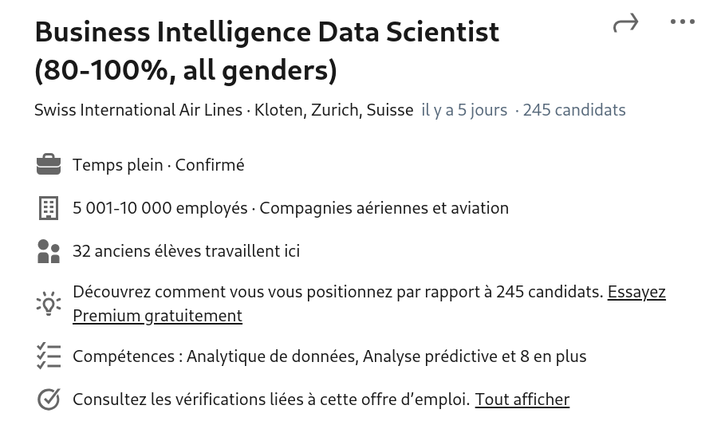
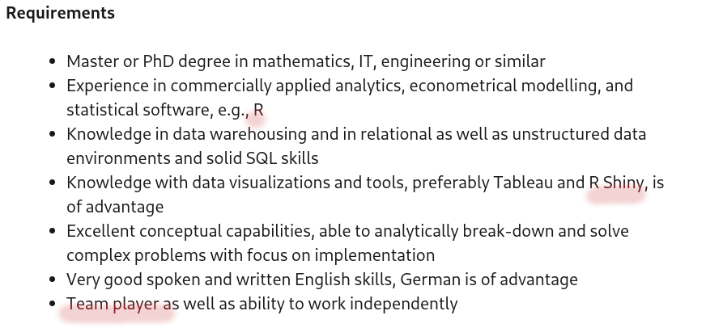
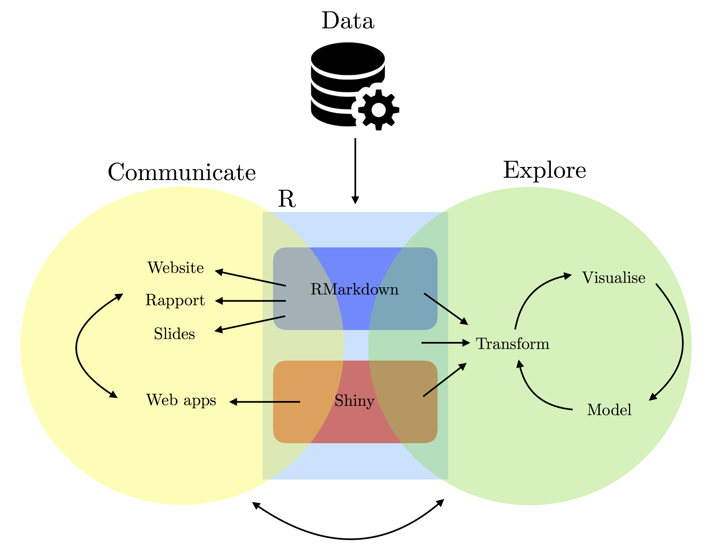

# Motivation

* "Data Science" hits >900 of job offers on jobup.ch.
* More than 3500 job offers for Switzerland on LinkedIn.
* "_Job applicants with computer skills are highly sought-after due to the increase of technology in the workplace._", [Indeed](https://www.indeed.com/career-advice/resumes-cover-letters/computer-skills), August 2023.




---
# Motivation 

* Computer skills help in solving problems.

<center><iframe width="640" height="480"
src="https://www.youtube.com/embed/Tzin1DgexlE">
</iframe></center>

---
# General goals

* Introduce tools and workflows for reproducible research (R/RStudio, Git/GitHub, etc.); 
* Introduce principles of tidy data and tools for data wrangling; 
* Exploit data structures to appropriately manage data, computer memory and computations;
* Data manipulation through controls, instructions, and tailored functions;
* Develop new software tools including functions, Shiny applications, and packages;
* Manage the software development process including version control, documentation (with embed code), and dissemination for other users.

---
# General goals
```{r echo=FALSE, fig.align='center', out.width=593, out.height=459}

```

---
class: sydney-blue, center, middle
# Course logistic and expectation

---
# Course logistic and expectation
## Location and time
.pull-left[
.scroll-box-5[
```{r, echo = FALSE}
library(leaflet)
leaflet() %>% addTiles() %>% setView(6.58455, 46.52356, zoom = 17)
```
]]

.pull-right[
.scroll-box-5[
* Anthropole 3032
* Every Thursday morning from 9 to 12. Either class or practical.
* Verify the schedule on the course website.
]]

---
## Ideal schedule (every Thursday 9 to 12)    
| Week | Date | Topic | Instructor |   
|---|---|---|---|   
| 2 | 28 Sept | Introduction, RMarkdown, Github | Samuel |
| 3 | 5 Oct | Exercise and Homework 1, Project-oriented workflow | Aleksandr |
| 4 | 12 Oct | Data structures, Control structures | Samuel |
| 5 | 19 Oct | Exercise and Homework 2, R coding style guide | Aleksandr |
| 6 | 26 Oct | Function I, Project Proposal, Webscraping | Samuel | 
| 7 | 2 Nov | Exercise and Homework 3 | Aleksandr |
| 8 | 9 Nov| Function II, Shiny App I | Samuel |
| 9 | 16 Nov | Exercise and Homework 4 | Aleksandr |
| 10 | 23 Nov | R-pkg | Samuel |
| 11 | 30 Nov | Group Project | Aleksandr | 
| 12 | 7 Dec |  Shiny app II, Project | Samuel |
| 13 | 14 Dec | Group project | Aleksandr | 
| 14 | 21 Dec | Project Presentations | Samuel and Aleksandr | 

---
# Course logistic and expectation
## Requirements

* No IT background is assumed from the students but a strong will to learn useful and practical programming skills (Data Science in Business Analytics)
* Willing to work and collaborate in groups (4~6 people)
* Be ready to struggle with your computer!
<center></center>


---
## Grading

* Learning outcomes will be assessed based on the performances within each of the following categories:

Type | Points 
:-- | :--  
Semester project | 30 
Homeworks | 30 

* 4 homeworks in groups of 7.5 points (**penalty for late submission**).
* The first homework is with your group.
* Homeworks 2, 3, 4 are individuals (we verify for code duplicates!).
* No final examination for this class.
* Final presentation of project last day of class (21st Dec).

---
# Course logistic and expectation
## Project

The group project comprises:
- **Presentation**
- **Screencast**
- **Shiny app**
- **R package**
- **GitHub repository**
- **Website**

---
# Course logistic and expectation
## Communication

* We use  to communicate and many more
* We use the **NEIN rule**! (No Email, only If Necessary)
* More info at [https://ptds.samorso.ch/](https://ptds.samorso.ch/)
* To access slack: register at [https://tinyurl.com/ptds2023](https://forms.gle/9EzB7J5mzNkYgCtv7) and wait your invitation.

---
## Take 3 minutes to complete the form
```{r echo=FALSE, fig.align='center'}
knitr::include_url("https://docs.google.com/forms/d/e/1FAIpQLScQEYxeMdRYxHnvFHbRcJhtSRZeviKehI0vKjDO0WjhxEuW1Q/viewform")
```

---
class: sydney-blue, center, middle

# Question ?

.pull-down[
<a href="https://ptds.samorso.ch/">
.white[`r icons::fontawesome("file")` website]
</a>

<a href="https://github.com/ptds2023/">
.white[`r icons::fontawesome("github")` GitHub]
</a>
]

---
# Everything's done? Follow your first tutorial (10 minutes)
## Make sure you have `R` and `RStudio` installed and follow the 
## "R/RStudio installation and setup" tutorial
