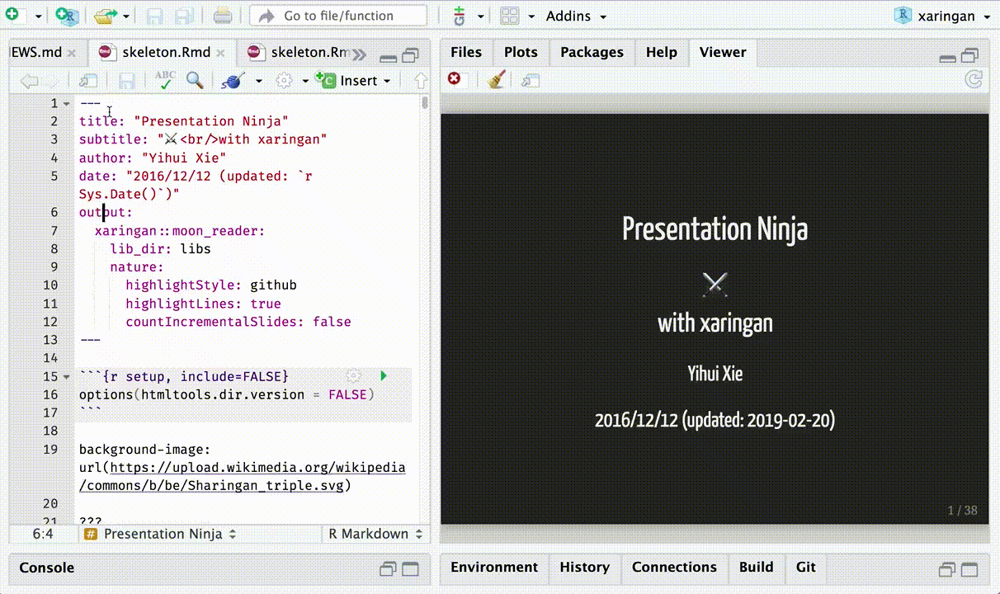

# What is RMarkdown? 
 

* RMarkdown: `R` + `markdown`
* `markdown` contrasts `markup` languages (e.g. HTML) which require syntax that can be quite difficult to decipher for the uninitiated
* RMarkdown is a framework that provides a literate programming format for data science.
* **Literate programming**: programmers add narrative context with code to produce documentation for the program simultaneously.
* **Reproducible research**: the whole process (collecting data, performing analysis, producing output,...) can be reproduced the same way by someone else.  

---
# Is there a reproducibility crisis?
```{r echo=FALSE, fig.align='center', out.width=453, out.height=385}

```

---
# What is RMarkdown? 

> In a nutshell, R Markdown stands on the shoulders of knitr and Pandoc. The former executes the computer code embedded in Markdown, and converts R Markdown to Markdown. The latter renders Markdown to the output format you want (such as PDF, HTML, Word, and so on).
.right[-- <cite>R Markdown: The Definitive Guide</cite>]

```{r echo=FALSE, fig.align='center', out.width=631, out.height=300}
knitr::include_graphics("images/workflow.png")
```


---
# Create a RMarkdown document

Within RStudio, click `File` → `New File` → `R Markdown`. 
```{r echo=FALSE, fig.align='center', out.width=750, out.height=450}
knitr::include_graphics("images/rmd_new.png")
```

---
# Important features of `markdown`

* Three aspect: YAML metadata, text, code chunks

---
# Important features of `markdown`
## 1. YAML Ain't Markup Language

* Head of the document where options are defined.
* Surrounded by `---`
* Options comprises: author, date, output format, table of content, themes, code folding, ...

---
# Important features of `markdown`
## 2. Text

* Core body, essential for explaining your analysis. 
* Markdown syntax comprises:  
  * emphasis (*&ast;italics&ast;*, **&ast;&ast;bold&ast;&ast;**, or &grave;`code style`&grave;)  
  * headers (# ## ###)
  * lists (* - + for unnumbered and 1. for numbered)   
  * hyperlinks (<> ()[])
  * blockquotes (>)
  * picture/gif ( !()[])
  * tables (usually better to use `knitr::kable()`)
  
---
# Important features of `markdown`
## 2. Text
* $\LaTeX$ in RMarkdown using the syntax `$math expression$`
* Cross-referencing sections using syntax `\@ref(label)`
* Citations and bibliographies can automatically be generated with RMarkdown
* **You can always use HTML**

---
# Important features of `RMarkdown`
## 3. Code Chunks 

Code chunks are specific to `RMarkdown`. It allows to embed `R` code within your document.

To insert these chunks within your RMarkdown file, use either:
- the keyboard shortcut Ctrl + Alt + I (OS X: Cmd + Option + I)
- the Add Chunk command in the editor toolbar
- by typing the chunk delimiters ` ```{r label, some option}` and ` ``` `   

---
# Important features of `RMarkdown`
## 3. Code Chunks 
Most common chunk options: 

- `eval`: (TRUE; logical) whether to evaluate the code chunk;
- `echo`: (TRUE; logical or numeric) whether to include R source code in the output file;
- `warning`: (TRUE; logical) whether to preserve warnings (produced by warning()) in the output like we run R code in a terminal (if FALSE, all warnings will be printed in the console instead of the output document);
- `cache`: (FALSE; logical) whether to "*cache*" a code chunk. It may be convenient to avoid re-running the computations and save time.
- `dependson`: (label) allows to refer to objects in other chunk.

---
# Important features of `RMarkdown`
## 3. Code Chunks 
Plot figure options: 

- `fig.path`: ('figure/'; character) prefix to be used for figure filenames (fig.path and chunk labels are concatenated to make filenames);
- `fig.show`: ('asis'; character) how to show/arrange the plots;
- `fig.width`, `fig.height`: (both are 7; numeric) width and height of the plot, to be used in the graphics device (in inches) and have to be numeric;
- `fig.align`: ('default'; character) alignment of figures in the output document (possible values are left, right and center;
- `fig.cap`: (NULL; character) figure caption to be used in a figure environment.

---
class: sydney-blue, center, middle

# Play 5 minutes with `https://tinyurl.com/RMdown`
```{r echo=FALSE, fig.align='center', out.width=300, out.height=300}

```

<!---
```{r echo=FALSE, fig.align='center'}
knitr::include_url("https://data-analytics-lab.shinyapps.io/rmarkdown/")
```
-->

---
# Printing an output as a table with `knitr::kable()`
```{r, fig.height=5}
data("iris")
knitr::kable(iris[1:5,])
```

There are many more options that can be set to have particularly good looking table with the `knitr` and `kableExtra` packages ([click here for a detailled documentation](https://bookdown.org/yihui/rmarkdown-cookbook/kable.html)).

---
# Extended table options with `knitr::kable()` and `kableExtra`
```{r, fig.height=4}
library(kableExtra)
mtcars[1:3, 1:8] %>%
  kbl() %>%
  kable_paper(full_width = F) %>%
  column_spec(2, color = spec_color(mtcars$mpg[1:3]),
              link = "https://haozhu233.github.io/kableExtra/") %>%
  column_spec(6, color = "white",
              background = spec_color(mtcars$drat[1:3], end = 0.7),
              popover = paste("am:", mtcars$am[1:3]))
```

---
# Mathpix to easily insert math equation in $\LaTeX$
<blockquote>
Mathpix Snip digitizes handwritten or printed text, and copies outputs to the clipboard that can be pasted into LaTeX editors like Overleaf, Markdown editors like Typora, Microsoft Word, and more. 
.right[-- <cite>Mathpix Snip</cite>]
</blockquote>
<div align="center">
<iframe width="560" height="315" src="https://www.youtube.com/embed/Pc_6aKPYBwQ" title="YouTube video player" frameborder="0" allow="accelerometer; autoplay; clipboard-write; encrypted-media; gyroscope; picture-in-picture" allowfullscreen></iframe>
</div>
Find more informations [here](https://mathpix.com/).

---
# `xaringan::infinite_moon_reader()` for live preview of your document
Instant preview without fully rebuilding HTML, and the linked navigation

```{r echo=FALSE, fig.align='center', out.width=606, out.height=360}

```

---
# From RMarkdown to Quarto
 
- Similar to RMarkdown, it can render docs that contain code in R, Python, Julia,... 
- It combines functionalities of RMarkdown and other packages into a **single system**, very useful to collaborate with people who write in a different programming language from you (and do not necessarily have R/R Studio).

> Like R Markdown, Quarto uses Knitr to execute R code, and is therefore able to render most existing Rmd files without modification.
> <cite>quarto.org/</cite>

---
class: sydney-blue, center, middle

# Question ?

.pull-down[
<a href="https://ptds.samorso.ch/">
.white[`r icons::fontawesome("file")` website]
</a>

<a href="https://github.com/ptds2023/">
.white[`r icons::fontawesome("github")` GitHub]
</a>
]

---
# In-class exercise (10 minutes)
Basic manipulations:
1. Create a RMarkdown HTML document in `RStudio` and "`knit`" it.
1. Create a new header of type 2.
1. Make a linear regression with "Sepal Length" as a response and 
"Sepal Width" as an explanatory variable from the `iris` dataset and save the result. 
1. Highlight the code with `monochrome` style.
1. Print the summary of the linear regression.
1. Include the QQplot from the linear regression. Change to filled dots.
1. Print the head of the `iris` dataset with `kable`.
1. Remove the `.` from the labels (click [here](https://bookdown.org/yihui/rmarkdown-cookbook/kable.html#change-column-names)).

---
# In-class exercise (10 minutes)
More advanced manipulations:
1. Install `kableExtra`. And perform the examples shown in the slides with `iris` dataset.
1. Using Mathpix, reproduce equation (6.1) of the paper [https://arxiv.org/abs/math/0303109](https://arxiv.org/abs/math/0303109)
1. Add the Reference and cite it in the RMarkdown.
1. Recreate your RMarkdown into a Quarto document.

---
# To go further
- <https://www.markdownguide.org/>
- <https://rmarkdown.rstudio.com/>
- [R Markdown Cookbook](https://bookdown.org/yihui/rmarkdown-cookbook/) by Yihui Xie, Christophe Dervieux, Emily Riederer
- [R Markdown: The Definitive Guide](https://bookdown.org/yihui/rmarkdown/) by Yihui Xie, J. J. Allaire, Garrett Grolemund
- Visit [bookdown.org]()
