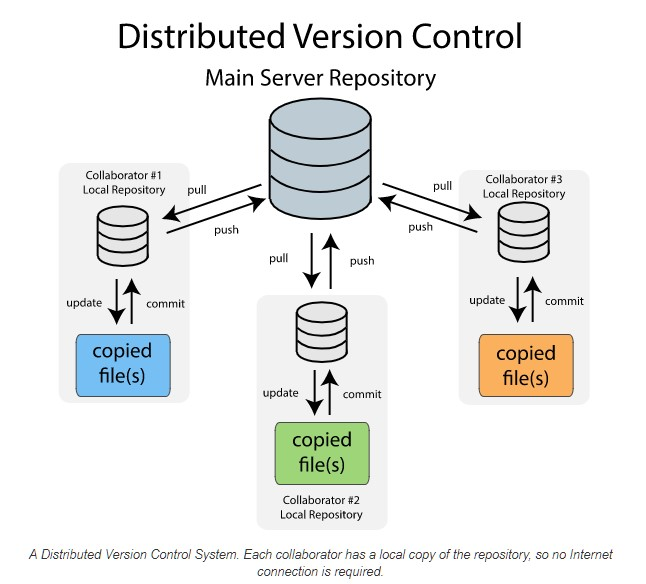

# GitHub
```{r echo=FALSE, fig.align='center', out.width=950, out.height=450}

```

---
# Motivation

* When working on a project, there are usually different people working on the same file/folder
* You want to avoid sending each modification by email
* You could use dropbox/google drive and the likes but it is good practice to keep track of modifications and have a platform to plan and discuss changes

---
# Motivation

GitHub allows you:
- record the entire history of a file;
- revert to a specific version of the file;
- collaborate on the same platform with other people;
- make changes without modifying the main file and add them once you feel comfortable with them.

---
# Motivation

GitHub will be used for:
- work in group on projects and homeworks;
- submit projects/homeworks;
- develop R packages and website;
- ...

---
# Ready ?
<center>
<iframe src="https://giphy.com/embed/h4TdHo3RExSbHd9bOe" width="480" height="425" frameBorder="0" class="giphy-embed" allowFullScreen></iframe><p><a href="https://giphy.com/gifs/cbc-schitts-creek-h4TdHo3RExSbHd9bOe">via GIPHY</a></p>
</center>

---
# In fact, what is Git?
 

Git is a **distributed version control system**.

* **distributed**: whenever you instruct Git to share files, Git does not only share the latest file version, but instead, it distributes **every version** it has recorded for that project.

* **version control system**: many people are used to have *their own version control system* e.g. by having different versions of the same file (`file_v1.R`, `file_v2.R`, ...). This approach is error-prone and ineffective when working in team project. Thus, a version control system keeps track of changes to modification in your project.

---
# Types of VCS
There are three types of version control system (VCS):
* local
* centralized
* distributed

---
# Types of VCS
## Local

.pull-left[
```{r echo=FALSE, fig.align='center', out.width=451, out.height=300}
knitr::include_graphics("images/local_vcs.jpg")
```
]

.pull-right[
* One of the simplest and most commonly used VCS
* It keeps patch sets (modification of a file) locally (on your computer)
* It can recreate the file at any point in time by adding up the patches
]

---
# Types of VCS
## Centralized

.pull-left[
```{r echo=FALSE, fig.align='center', out.width=490, out.height=317}
knitr::include_graphics("images/centralized_vcs.png")
```
]

.pull-right[
* A single server contains all the versioned files
* Risk of failure
* Risk of database corruption
]

---
# Types of VCS
## Distributed
.pull-left[
```{r echo=FALSE, fig.align='center', out.width=460, out.height=416}

```
]

.pull-right[
* Store the entire history of files locally
* Sync local changes back to server
* Allow multiple users and minimize risks of centralized VCS
]

---
# Benefits of VCS
* Allow multiple users to collaborate and communicate while working on a project.
* Keep tracks of the change history of the files (risk mitigation) with possibility to roll back to previous version.
* Different workflows such as branching and merging (not discussed)

```{r echo=FALSE, fig.align='center', out.width=410, out.height=250}

```

---
# So Git and GitHub are the same things?
<center>
<iframe src="https://giphy.com/embed/3o6YglDndxKdCNw7q8" width="480" height="478" frameBorder="0" class="giphy-embed" allowFullScreen></iframe><p><a href="https://giphy.com/gifs/nba-basketball-chicago-bulls-3o6YglDndxKdCNw7q8">via GIPHY</a></p>
</center>

---
# Git vs GitHub
Git is a distributed VCS, so what is GitHub exactly?

* Git is a software...
* ...and GitHub is web-based plateform for software development and version control that uses Git.
* GitHub hosts and shares Git repository.
* GitHub is not the only service provider

---
#BitBucket
```{r echo=FALSE, fig.align='center'}

```

---
#GitLab
```{r echo=FALSE, fig.align='center'}
knitr::include_graphics("images/gitlab.png")
```

---
#SourceForge
```{r echo=FALSE, fig.align='center'}

```

---
# Okay to continue ? 

.center[
<iframe src="https://giphy.com/embed/sG4PBWRjI4GSVCDXEq" width="480" height="480" frameBorder="0" class="giphy-embed" allowFullScreen></iframe><p><a href="https://giphy.com/gifs/nickelodeon-drama-club-sG4PBWRjI4GSVCDXEq">via GIPHY</a></p>
]

---
# Files states in Git
A file can have different states: **untracked**, **modified**, **staged** or **committed**

* **untracked**: a new file that is not tracked by Git (yet);
* **modified**: a tracked file which is modified but not recorded (not committed yet);
* **staged**: a tracked file which is modified and that has been selected to be saved (committed) into the repository during the next commit snapshot;
* **committed**: a file that is successfully recorded into the (local) repository.

---
# Files states in Git
```{r echo=FALSE, fig.align='center'}
knitr::include_graphics("images/git-basic-workflow-codesweetly.png")
```

---
# you can also `.gitignore`
* Some files or folders of your project can be excluded from version control by specifying `.gitignore`
* These files or folders will not be shared to other users

```{r, fig.align="center", echo=FALSE}
knitr::include_graphics(path="images/gitignore.png")
```


---
# GitHub
## Basic workflow

The basic workflow is as follows...

1. Open the RStudio Project connected to your Git(Hub) Repo
2. Work on your computer just like always
3. **Save** your work often just like always
4. When you want to preserve a **snapshot** of your project, you make a "commit"
5. When you have a few commits and want to archive them, you "push" them to the GitHub remote server
6. If you decide to work from a different computer, or want to pick up where a collaborator left off, you can "pull" the most up-to-date version of the files from the GitHub remote to your local computer and go back to step 2.

---
class: sydney-blue, center, middle

# Demo on RStudio

---
# GitHub
## New habits
* When you want to preserve a **snapshot** of your project, you make a "commit."
* When you have a few commits and want to archive them, you "push" them to the GitHub remote server.
* If you decide to work from a different computer, or want to pick up where a collaborator left off, you can "pull" the most up-to-date version of the files from the GitHub remote to your local computer.

---
# GitHub
## Commits
Make your commit message as informative and concise as possible.

```{r echo=FALSE, fig.align='center', out.width=439, out.height=250}
knitr::include_graphics("images/git_commit.png")
```

---
# GitHub
## "pull" before you "push"
Make sure you have the up-to-date version of your project before working on it.

Try to avoid the headaches of "merge conflict".

.center[
<iframe src="https://giphy.com/embed/cFkiFMDg3iFoI" width="480" height="269" frameBorder="0" class="giphy-embed" allowFullScreen></iframe><p><a href="https://giphy.com/gifs/git-merge-cFkiFMDg3iFoI">via GIPHY</a></p>
]

---
# GitHub
## Common mistakes (and how to solve them)

* **Commits in the wrong Repo**. Nothing seems to work? It's a common mistake. Solution: make sure you work on the correct RStudio project that is correctly linked to GitHub.

* **Large files error**. GitHub blocks pushes that exceed 100 MB. Solution: find another solution for large files (Dropbox, ...)

* **Conflict (not merge)**. Conflicts may happen when two collaborators make different changes to part of a program at the same time but on different lines of code. One of them push the modification to the remote. The second one to push will have a conflict as his/her version of the project is "outdated". Solution: `git pull --rebase`

* **Merge conflict**. It happens when two collaborators work on the same lines of code at the same time. It is often a problem of miscommunication within groups and lack of organization. Solution: To resolve these conflicts, we must directly edit the documents making sure potential conflicts are discussed before pushing.

---
# GitHub

> git gets easier once you get the basic idea that branches are homeomorphic endofunctors mapping submanifolds of a Hilbert space.
> <cite> Isaac Wolkerstorfer </cite>

---
class: sydney-blue, center, middle

# Question ?

.pull-down[
<a href="https://ptds.samorso.ch/">
.white[`r icons::fontawesome("file")` website]
</a>

<a href="https://github.com/ptds2023/">
.white[`r icons::fontawesome("github")` GitHub]
</a>
]

---
# In-class exercise (10 minutes)
1. Create a GitHub repo for the RMarkdown file (.Rmd) you created in the last class.
1. Edit the README.md file, push the .Rmd.
1. By two. Invite (person A) someone else (person B) to work on your repo and try:
  - Repo is up-to-date. Person B modifies .Rmd and pushes the changes, person A pulls the changes.
  - Repo is up-to-date. Person A modifies 1st section of .Rmd, person B modifies 2nd section (no conflict) of .Rmd. No push, no pull in between. Now person A commits and pushes. Then person B tries to commit and push. Try to solve until repo is up-to-date.
  - Same as last point, but person B modifies 1st section of .Rmd (conflict).
1. (optional) Complete the exercise "The Basics of Github" (you need to register at https://tinyurl.com/ptds2023 and wait for an invitation).