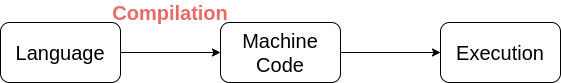
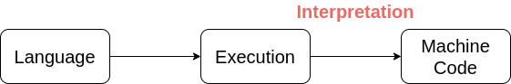
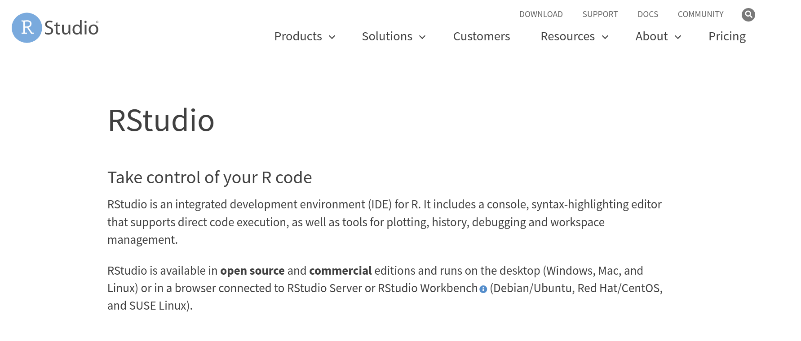
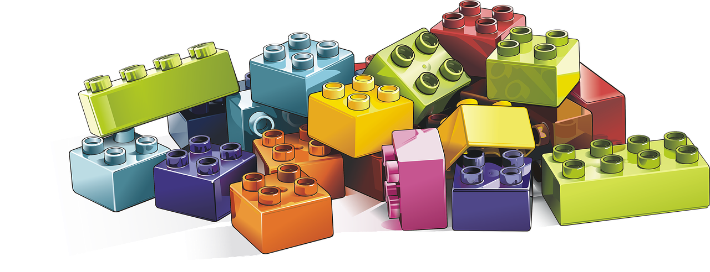

# Let's dive into `R` programming

```{r, echo=FALSE, fig.align="center"}
knitr::include_graphics(path = "images/r_programming.png")
```

---
# Brief histo`R`y
* `R` is a language and environment for statistical computing and graphics;
* It was developed around 1995 by Ross Ihaka and Robert Gentleman at the University of Auckland, as an alternative implementation of the basic `S` language developed by John Chambers and colleagues;
* Oldest release (available) is version 0.49 (1997-04-23)

```{r,echo=FALSE,fig.align='center'}
knitr::include_graphics(path="images/extending_r.png")
```


---
# Main featu`R`es
* Much code written for `S` runs unaltered under `R`;
* `R` provides a variety of statistical and graphical techniques;
* `R` is popular for data science (in competition with Python);
* `R` is open-source;
* `R` is an interpreted language;
* `R` is highly extensible via packages (19885 available on CRAN in September 2023); 
* `R` can be interfaced with other languages (C++, Fortran, ...).

---
# `R` is an interpreted language
```{r, echo=FALSE, fig.align="center"}
knitr::include_graphics(path = "images/cartoon_programming.png")
```

---
# Compiled program

- Program is translated into native machine instruction (compilation)

```{r echo=FALSE, fig.align='center', out.width=750, out.height=111}

```

&nbsp;

&nbsp;

&nbsp;

```{r echo=FALSE, fig.align='center', out.width=750, out.height=117}

```

---
# Interpreted program

- Program is translated into another code (bytecode). An interpreter then performs the required actions.

```{r echo=FALSE, fig.align='center', out.width=750, out.height=111}

```

&nbsp;

&nbsp;

&nbsp;

```{r echo=FALSE, fig.align='center', out.width=750, out.height=117}

```

---
# `R` interfaces to other languages
`R` is basically written in `C` and `Fortran`. Available interfaces to other languages comprise:
- `C` via `.Call()` function
- `Fortran` via `.Fortran()` function
- `C++` via the `Rcpp` package
- `Python` via `reticulate`, `rPython`, `rJython` or `XRPython`
- `Julia` via `XRJulia`
- `JavaScript` via `V8`
- `Excel`, `JSON`, `SQL`, `Perl`, ...


See Chambers, (2017) for a comprehensive discussion on interfacing `R`.

---
# Example: linear regression
How does `R` fit a linear regression? 

```{r, eval=F}
fit <- lm(y ~ x)
```

first layer: `R` function `lm`
```{r, eval=FALSE}
lm <- function(formula, ...){
  ...
  y <- model.response(mf, "numeric")
  ...
  x <- model.matrix(mt, mf, contrasts)
  ...
  lm.fit(x, y, ...) #<<
  ...
}
```

---
# Example: linear regression
How does `R` fit a linear regression?

second layer: `R` function `lm.fit`
```{r, eval=FALSE}
lm.fit <- function(x, y, ...){
  ...
  .Call(C_Cdqrls, x, y, tol, FALSE) #<<
  ...
}
```

third layer: `C` function `Cdqrls`
```{r, eval=FALSE}
SEXP Cdqrls(SEXP x, SEXP y, SEXP tol, SEXP chk)
```

(`SEXP` is the datatype for a generic `R` object).

Source: excellent post [A Deep Dive Into How R Fits a Linear Model](https://madrury.github.io/jekyll/update/statistics/2016/07/20/lm-in-R.html), `Cdqrls` [source code](https://github.com/wch/r-source/blob/trunk/src/library/stats/src/lm.c)

---
# Integrated development environment

```{r,echo=F,fig.align='center'}

```

---
# Let's get started with `R` programming
<center>
<iframe src="https://giphy.com/embed/3oKIPnAiaMCws8nOsE" width="457" height="480" frameBorder="0" class="giphy-embed" allowFullScreen></iframe><p><a href="https://giphy.com/gifs/cat-kitten-computer-3oKIPnAiaMCws8nOsE">via GIPHY</a></p>
</center>

---
# Data structures
```{r,fig.align='center',echo=F}

```

---
# Primary types

- **Double** (or real): these are used to store real numbers. Examples: -4, 12.4532, 6.
- **Integer**: followed by `L`; examples: 2L, 12L.
- **Logical** (or boolean); written in full `TRUE`, `FALSE`, or in short `T`, `F`.
- **Character** (or strings); examples: `"a"`, `"Bonjour"`.
- (**Complex** (complex number) and **Raw**)

Note that:
- Integer and double are of type **numeric**.
- All these types are **atomic vector**, a fundamental data structure.

---
# Reserved words
* **Missing values** `NA` (Not Available) can have primary types:  `NA_real_`, `NA_integer_`, `NA` (logical by default), `NA_complex_`, `NA_character_`.
* For real and complex numbers, `R` has also `Inf` for infinity and `NaN` (Not a Number).
* `NULL` for a null object.
* For control structures: `if`, `else`, `repeat`, `while`, `function`, `for`, `in`, `next`, `break`

---
# `typeof`
typeof determines the (`R` internal) type or storage mode of any object

```{r}
typeof(2)
```

```{r}
typeof("a")
```

```{r}
typeof(NA)
```

```{r}
typeof(Inf)
```


---
# `is.type` primitive functions
* `is.type` allows to test for a type
* There are `is.double`, `is.integer`, `is.numeric`, `is.logical`, `is.character`, `is.complex`, `is.na`, `is.nan`, `is.finite`, `is.infinite`, `is.null`, ...
```{r}
is.double(2L)
```
```{r}
is.double(2)
```
```{r}
is.numeric(2)
```

---
# `as.type` primitive functions
* `as.type` allows to coerce to a type
* There are `as.double`, `as.integer`, `as.numeric`, `as.logical`, `as.character`, `as.complex`, `as.na`, `as.nan`, `as.finite`, `as.infinite`, `as.null`, ...

```{r}
typeof(2L)
```
```{r}
typeof(as.double(2L))
```

---
# Data structures
* A data structure can be **homogenous** (accept only one primary type) or **heterogenous** (accept multiple primary types).

| Dimension | Homogenous | Heterogeneous |   
| --- | --- | --- |   
| 1 | Vector | List |   
| 2 | Matrix | Data Frame |   
| n | Array | |    

---
# Example
| Name | Date of Birth | Place of Birth | Place of Residence | ATP Ranking | Prize Money | Win Percentage | Grand Slam Wins | Pro Since |   
| --- | --- | --- | --- | --- | --- | --- | --- | --- |   
| Novak Djokovic | 22 May 1987 | Belgrade, Serbia | Monte Carlo, Monaco | 1 | 135,259,120 | 82.7 | 16 | 2003 |   
| Rafael Nadal | 3 June 1986 | Manacor, Spain | Manacor, Spain | 2 | 115,178,858 | 83.1 | 19 | 2001 |   
| Roger Federer | 8 August 1981 | Basel, Switzerland | Wollerau, Switzerland | 3 | 126,840,700 | 82.2 | 20 | 1998 |   
| Daniil Medvedev | 11 February 1996 | Moscow, Russia | Monte Carlo, Monaco | 4 | 8,171,483 | 63.6 | 0 | 2014 |   
| Dominic Thiem | 3 September 1993 | Wiener Neustadt, Austria | Lichtenwörth, Austria | 5 | 18,588,662 | 64.3 | 0 | 2011 |  

---
# Vector
A vector has three important properties:

- The **Type** of objects contained in the vector (`typeof`)
- The **Length** of a vector indicates the number of elements in the vector. This information can be obtained using the function `length()`.
- **Attributes** are metadata attached to a vector. The functions `attr()` and `attributes()` can be used to store and retrieve attributes.  

---
# Creating vectors with `c()`
* `c()` is a generic function that combines arguments separated by `,` to form a vector.

```{r}
c(1, 2, 8, 10)
```

* You can assign a value to a name via the `<-` operator
```{r}
grand_slam_win <- c(16, 19, 20, 0, 0)
grand_slam_win
```

```{r}
typeof(grand_slam_win)
```

---
# Creating a vector with `vector()`
* `vector` produces a vector of given length and mode (primary type)

```{r}
grand_slam_win <- vector(mode = "integer", length = 5)
grand_slam_win
```

---
# Subsetting
There are four main ways to subset a vector:
* **Positive Index**: *access* or *subset* the $i$-th element of a vector by simply using `grand_slam_win[i]` where $i$ is a positive number between 1 and the length of the vector.

```{r}
grand_slam_win <- vector(mode = "integer", length = 5)
grand_slam_win[1] <- 16
grand_slam_win[2] <- 19
grand_slam_win[3] <- 20
grand_slam_win
```

or equivalently

```{r}
grand_slam_win <- vector(mode = "integer", length = 5)
grand_slam_win[1:3] <- c(16, 19, 20)
grand_slam_win
```

---
# Subsetting
* **Negative Index**: *remove* elements in a vector using negative indices.
* **Logical Indices**: give a logical vector of same length with `TRUE` to subset the element and `FALSE` otherwise.
```{r}
grand_slam_win <- vector(mode = "integer", length = 5)
grand_slam_win[c(TRUE, TRUE, TRUE, FALSE, FALSE)] <- c(16, 19, 20)
grand_slam_win
```
* **Names Index**: use names (or labels) instead of positive numbers.

---
# Coercion for homogenous data structure
* A vector has a homogeneous data structure meaning that it can only contain a single primary type.
* If multiple primary types is provided, then the following coercion rule applies:

\begin{equation*}
 \text{logical} < \text{integer} < \text{double} < \text{character}
\end{equation*}

```{r}
# Logical + double
(mix_logic_int <- c(TRUE, 12, 0.5))
typeof(mix_logic_int)
```

---
# Attributes
* Attributes are used to store metadata on the object of interest.
* Individual attributes can be accessed and set via `attr()`
```{r}
attr(grand_slam_win, "date") <- "09-30-2019"
attr(grand_slam_win, "type") <- "Men, Singles"
```
* Attributes can be accessed and set all at once with `attributes` and `structure`
```{r}
attributes(grand_slam_win)
```

---
# Adding labels
* You can add labels to a vector using `names`
```{r}
names(grand_slam_win) <- c("Novak Djokovic", "Rafael Nadal", "Roger Federer", "Daniil Medvedev", "Dominic Thiem")
attributes(grand_slam_win)
```
* Avoid using `attr(grand_slam_win, "names")` as it is more error-prone
* You can unname using `unname(grand_slam_win)` or `names(grand_slam_win) <- NULL`

---
# Working with dates
* `as.Date()` function converts character strings into dates. The typical syntax is of the form:

```{r, eval = FALSE}
as.Date(<vector of dates>, format = <your format>)
```

For example
```{r}
(players_dob <- as.Date(c("22 May 1987", "3 Jun 1986", "8 Aug 1981", 
                         "11 Feb 1996", "3 Sep 1993"), 
                       format = "%d %b %Y"))
```

---
# Useful Functions with Vectors

* Common function for vectors are
`length()` `sum()` `mean()` `order()` and `sort()` 

```{r}
length(grand_slam_win)
sum(grand_slam_win)
mean(grand_slam_win)
```

---
```{r}
order(grand_slam_win)
sort(grand_slam_win)
```

---
# Creating sequences

Common ways to create sequences:

- **`from:to`**: This method is quite intuitive and very compact. For example:

```{r}
1:3
(x <- 3:1)
(y <- -1:-4)
```

---

- **`seq_len(n)`**: This function provides a simple way to generate a sequence from 1 to an arbitrary number `n`. Few examples:

```{r}
n <- 3
1:n
seq_len(n)

n <- 0
1:n
seq_len(n)
```

---
- **`seq(a, b, by/length.out = d)`**: This function can be used to create more "complex" sequences. It can either be used to create a sequence from `a` to `b` by increments of `d` (using the option `by`) or of a total length of `d` (using the option `length.out`). 

```{r}
(x <- seq(1, 2.8, by = 0.4))
(y <- seq(1, 2.8, length.out = 6))
```

---
- **`rep()`**: create vectors with repeated values or sequences, for example:

```{r}
rep(c(1,2), times = 3, each = 1)
rep(c(1,2), times = 1, each = 3)
rep(c(1,2), times = 2, each = 2)
```

---
# Exercise
1. Let `x <- 3 * seq_len(4)`. Select the 2nd element of `x` with (a) positive, (b) negative and (c) logical indices.
2. Sort `x` in descending order using (a) a sequence of positive indices and (b) the `sort` function.  

---
# Matrix
<center>
<iframe src="https://giphy.com/embed/sULKEgDMX8LcI" width="480" height="225" frameBorder="0" class="giphy-embed" allowFullScreen></iframe><p><a href="https://giphy.com/gifs/sci-fi-matrix-cyberpunk-sULKEgDMX8LcI">via GIPHY</a></p></center>

---
# Matrix

* Matrix is a common data structure in `R`. It has two dimensions and stores homogeneous primary types.
* The `matrix()` function can be used to create a matrix from a vector:

```{r}
(M <- matrix(1:12, ncol = 4,  nrow = 3))
```

* Several vectors can be combined by row `rbind` or column `cbind`.
* Names can be assigned by column `colnames` and by row `rownames`.
* Subsetting is similar to vector `M[rows, cols]`

---
# Common matrix operations
* Verify `M` is a matrix: `is.matrix(M)`
* Return the dimensions of `M`: `dim(M)` or `nrow(M)` and `ncol(M)`
* Matrix transpose: `t(M)`
* Elementwise multiplication (assume correct dimension): `A * B`
* Matrix multiplication (assume correct dimension): `A %*% B`
* Matrix inverse (assume correct dimension): `solve(M)`
* col/row mean and sum: `colMeans(M), rowMeans(M), colSums(M), rowSums(M)`
* Extract diagonal element: `diag(M)`
* Set diagonal element: `diag(M) <- c(...)`

---
# List
* A list is a flexible and common **heterogeneous** data structure (contains different object types).

```{r list_eg1}
# List elements
num_vec <- c(188, 140)
char_vec <- c("Height", "Weight", "Length")
logic_vec <- rep(TRUE, 8)
my_mat <- matrix(seq_len(10), nrow = 2, ncol = 5)

# List initialization 
(my_list <- list(num_vec, char_vec, logic_vec, my_mat))
```

---
It is possible to add named labels to the elements of your list. For example:

```{r list_eg2}
# List initialization with custom names 
(my_list <- list(number = num_vec, character = char_vec, 
                 logic = logic_vec, matrix = my_mat))
```

---
# Subsetting
Subsetting is very similar to what we have already discussed. Indeed, we have

```{r}
# Extract the first and third element 
my_list[c(1, 3)]

# Compare these two subsets  
my_list[1]
my_list[[1]]
```

---
# Subsetting
```{r}
# Using labels to subset 
my_list$number
my_list$matrix
my_list$matrix[,3] # Extract third column of matrix 
```

---
# Single `[` or double `[[`?
* Single `[` keeps the `list` class
```{r}
# type of object 
typeof(my_list[1])
```

* Double `[[` simplifies to the class of the element
```{r}
is.matrix(my_list[4])
is.matrix(my_list[[4]])
```

---
# Dataframe
* A data frame is a **heterogeneous** data structure used for storing data tables.

```{r}
### Creation
players <- c("Novak Djokovic", "Rafael Nadal", "Roger Federer",
             "Daniil Medvedev", "Dominic Thiem")
grand_slam_win <- c(16, 19, 20, 0, 0) 
date_of_birth <- c("22 May 1987", "3 June 1986", "8 August 1981",
                   "11 February 1996", "3 September 1993")
tennis <- data.frame(date_of_birth, grand_slam_win)
dimnames(tennis)[[1]] <- players
tennis
```

---
# Dataframe
* Each column has its own type. We can check if we have achieved our goal by using:

```{r}
is.data.frame(tennis)
```

* We can also verify the structure
```{r}
str(tennis)
```

---
# Combination

* Data frames can be combined using `cbind()` - column bind and `rbind()` - row bind:

```{r}
height <- c(1.88, 1.85, 1.85, 1.98, 1.85)
hand <- c("R","L","R","R","R")

(tennis <- cbind(tennis, data.frame(height, hand)))
```

---
# Subsetting

* Data frame can be subset like a matrix or like a list.
```{r}
# There are two ways to select columns from a data frame
# Like a list:
tennis[c("height", "date_of_birth")]

# Like a matrix
tennis[, c("height", "date_of_birth")]
```

---
# Tibble
- Tibble is a modern alternative to data frame championed by H. Wickham. He claims it is *lazy and surly* data frame (with a bit of humor).
- Tibble is lazy because it never coerces its input. For instance, it does not transform non-syntactic names:
```{r tibble vs dataframe 1}
library(tibble) # you need to install an extra library (or package)
names(data.frame(`1` = 1:3, `?` = 4:6))
names(tibble(`1` = 1:3, `?` = 4:6))
```
---
- Tibble is surly, for example it does not automatically recycle shorter columns (unless of length 1) whereas data frame do so if columns length are integer multiples:
```{r tibble vs dataframe 2, error=TRUE}
data.frame(a = 1:4, b = 1:2)
tibble(a = 1:4, b = 1:2)
```
---
- Tibble allows you to interact with variables during creation:
```{r tibble vs dataframe 3}
tibble(a = 1:3, b = 2 + 2 * a)
```
---
- A last notable difference, tibble by default prints only the first 10 rows:
```{r tibble vs dataframe 4}
set.seed(1)
tibble(x = rnorm(1e3), y = rexp(1e3))
```


---
# Exercise
Using the following code:
```{r, eval=F}
set.seed(1)
A <- matrix(rnorm(20), ncol = 2)
B <- matrix(rnorm(20), ncol = 2)
```
1. What are the dimensions of $A$ and $B$? Compute $A^TB$ and $AB^T$.
2. Combine $A$ and $B$ row-wise to create $C$.
3. Let $D$ be a copy of $C$ centered around the mean
columnwise.
The unbiased estimator of the covariance matrix of
$C$ is defined as $$\frac{1}{n-1}D^TD,$$
where $n$ is the number of rows of $D$.
Compute this quantity.
Compare with `cov(C)`.

---
# To go further
* More details and examples in the book [An Introduction to Statistical Programming Methods with R](https://smac-group.github.io/ds/section-data.html)
* More advanced remarks in [Advanced R](https://adv-r.hadley.nz/index.html), Chapters 2, 3 and 4.

---
class: sydney-blue, center, middle

# Question ?

.pull-down[
<a href="https://ptds.samorso.ch/">
.white[`r icons::fontawesome("file")` website]
</a>

<a href="https://github.com/ptds2023/">
.white[`r icons::fontawesome("github")` GitHub]
</a>
]
