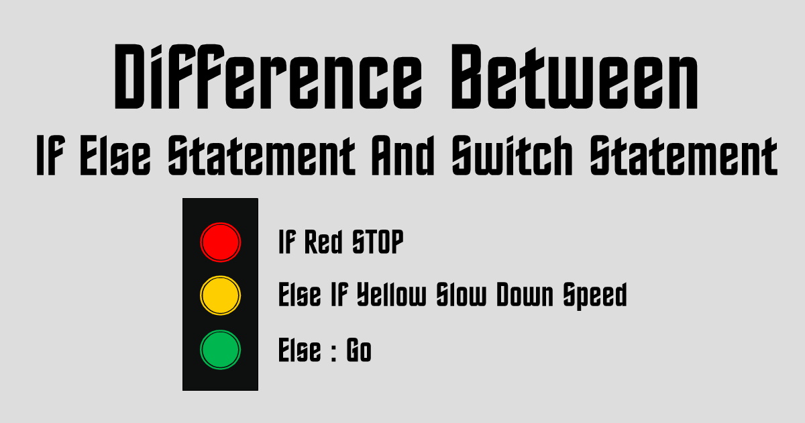
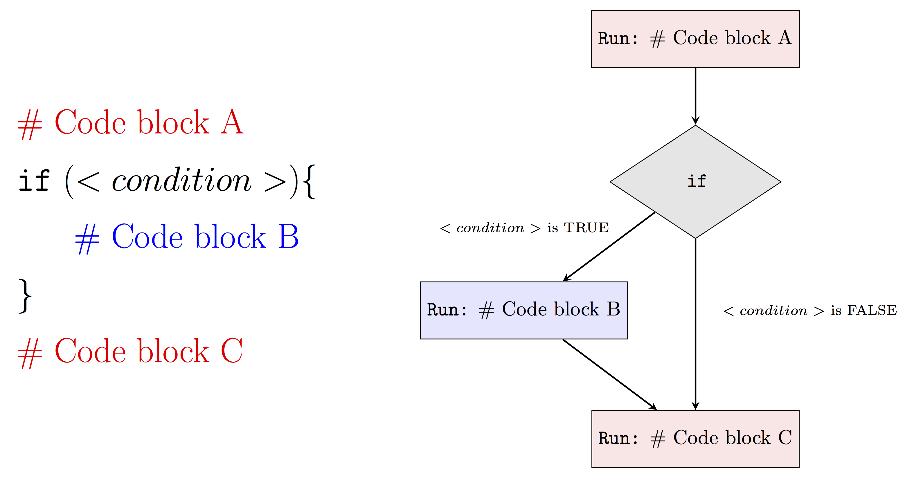
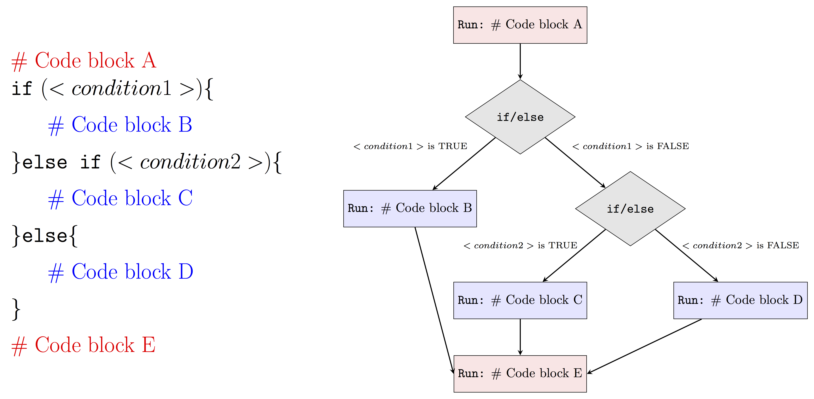
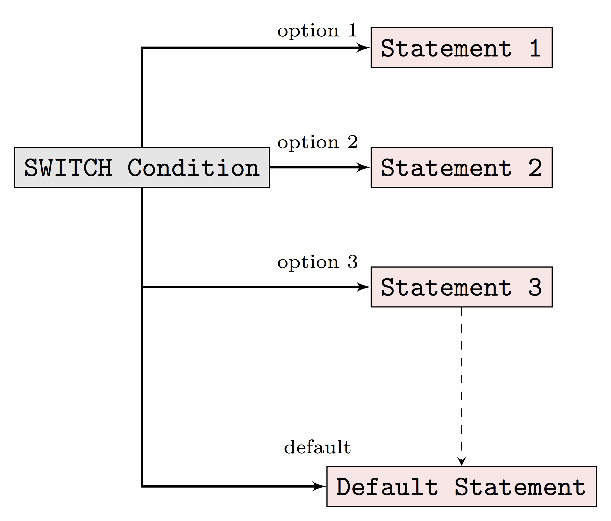
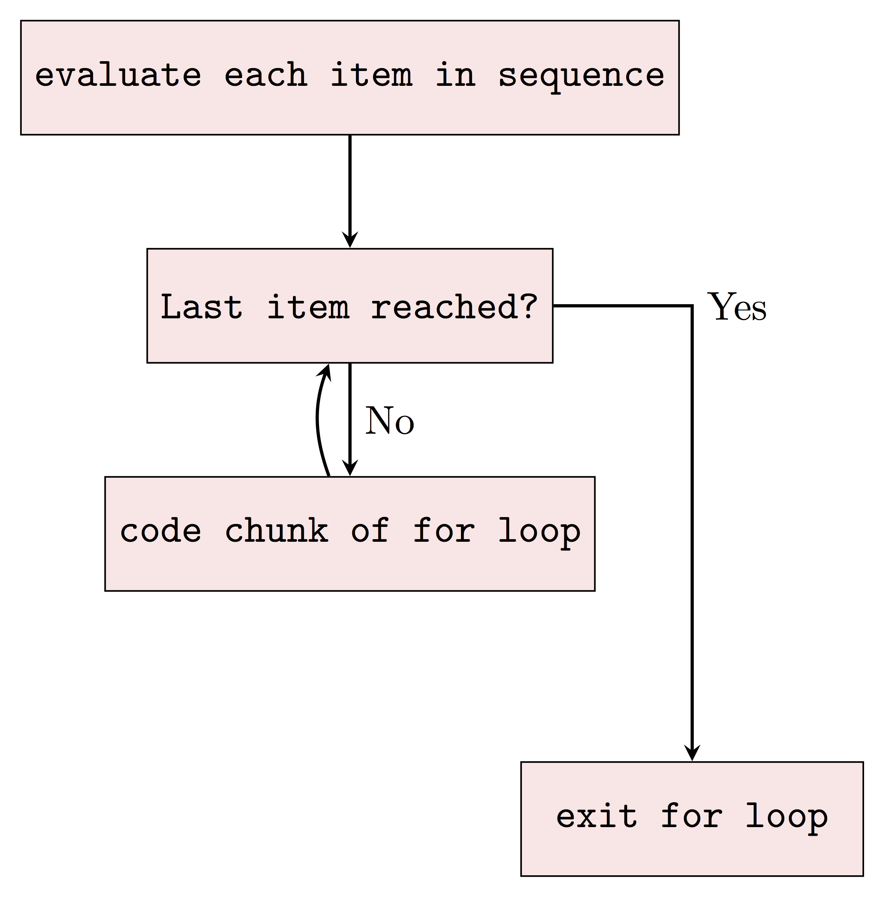
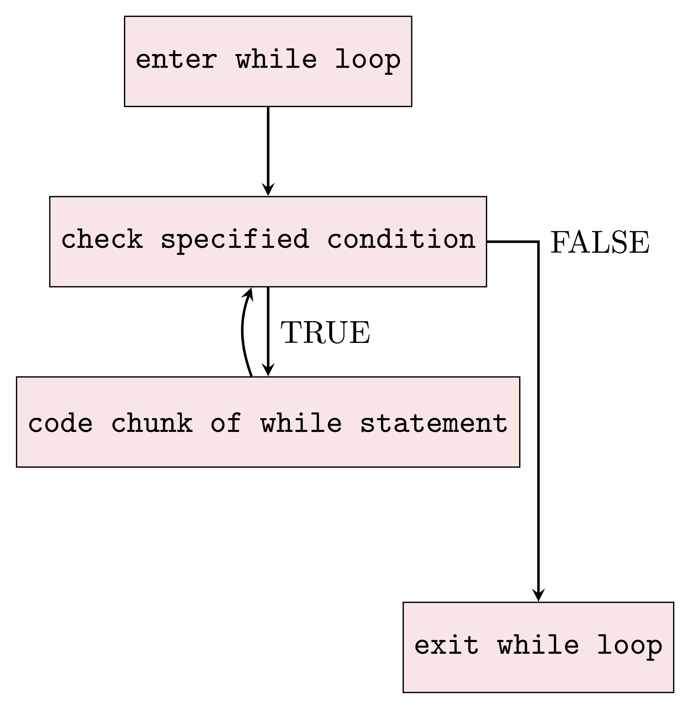

# Control structures
```{r,fig.align='center',echo=F}

```

---
# Control the flow
We distinguish two types of control structures :

* **Choices**: determine whether a given condition is satisfied and select an appropriate response;
* **Loops**: repeat a block of code multiple times.

---
# Choices

<center>
<iframe src="https://giphy.com/embed/MfT85aUkWLt4DkDZfu" width="480" height="480" frameBorder="0" class="giphy-embed" allowFullScreen></iframe><p><a href="https://giphy.com/gifs/FiaOruene-october-september-libra-MfT85aUkWLt4DkDZfu">via GIPHY</a></p>
</center>

---
# Logical operators (scalars)

| Command     | Description                |   Example                           |    Result                             |
|-------------|----------------------------|-------------------------------------|---------------------------------------|
| x `>` y     | x greater than y           | `4 > 3`                             | `r 4 > 3`                             |
| x `>=` y    | x greater or equals to y   | `1 >= 1`                            | `r 1 >= 1`                            |
| x `<` y     | x less than y              | `12 < 20`                 | `r 12 < 20`                 |
| x `<=` y    | x less than or equals to y | `12 <= 1`                           | `r 12 <= 1`                           |
| x `==` y    | x equal to y               | `1 == 2`                 | `r 1 == 2`                 |
| x `!=` y    | x not equal to y           | `F != T`                 | `r FALSE != TRUE`          |
| `!`x        | Not x                      | `!(2 > 1)`               | `r !(2 > 1)`               |
| x &vert;&vert; y    | x or y    | `(1 > 1)` &vert;&vert; `(2 < 3)`                | `r (1 > 1) || (2 < 3)`                |
| x `&&` y    | x and y   | `TRUE && TRUE`                      | `r TRUE && TRUE`                      |

---
# Logical operators (vector/matrix, elementwise)

* logical operators `>`,`<`,`>=`,`<=`,`==`,`!=`,`!` works for vector matrix (elementwise)
* Careful between `&&` vs `&`, `||` vs `|`

| Command     | Description                |   Example                           |    Result                             |
|-------------|----------------------------|-------------------------------------|---------------------------------------|
| x &vert; y     | x or y        | `c(1 > 1, F)` &vert; `c(T, 2 < 3)`        | `r c(1 > 1, F) | c(T, 2 < 3)`        |
| x `&` y     | x and y       | `c(TRUE, T) & c(TRUE, F)`           | `r c(TRUE, T) & c(TRUE, F)`           |
| xor(x,y)    | test if only one is TRUE   | `xor(TRUE, TRUE)`                   | `r xor(TRUE, TRUE)`                   |
| `all`(x)    | test if all are TRUE       |  `all(c(T, F, F))`                  | `r all(c(T, F, F))`                   |
| `any`(x)    | test if one or more is TRUE|  `any(c(T, F, F))`                  | `r any(c(T, F, F))`                   |

* What does `c(T,F) | c(T,F)` and `c(T,F) || c(T,F)` returns? How do you think `||` works with vectors?

---
# Selection operators 
Selection operators govern the flow of code.

```{r,fig.align='center',echo=F,out.width=600,out.height=315}

```

---
# If statement

* `if` statement tells `R` to compute a block of code when a condition is met
* `if` is a reserved word
* The condition in `()` should be either true or false
* The block of code is in `{}`

```{r, eval = FALSE}
if (<this is TRUE>){ #<<
  <do that>
}
```

* Note that for a short block of code, `{}` can be omitted to gain space (but to lose readability!)

```{r, eval = FALSE}
if (<this is TRUE>) <do that> #<<
```

---
```{r,echo=F,fig.align='center'}

```

---
```{r}
x <- -4

if (x < 0){ #<<
  x <- -x
}

if (x %% 2 == 0){ #<<
  print(paste(x, "is an even number"))
}
```

Remarks:
* `%%` is the [modulo operator](https://en.wikipedia.org/wiki/Modulo_operation) (returns the remainder of a division)
* `paste` concatenate vectors after converting to character.
* `print` is a printing method in `R`
* As an alternative, you can use `cat` as shown below

```{r}
if (x %% 2 == 0){ #<<
  cat(x, "is an even number\n")
}
```

---
# If/else statement
Often we want to tell `R` what to do when a condition is `TRUE` and also what to do when it is `FALSE`. We can write

```{r, eval = FALSE}
if (condition){ #<<
  block A
}

if (!condition){ #<<
  block B
}
```

The more compact notation is preferred:
```{r, eval=FALSE}
if (condition){ #<<
  block A
}else{ #<<
  block B
}
```
---
```{r,echo=F,fig.align='center'}
knitr::include_graphics("images/ifelse.png")
```

---
```{r}
x <- 2

if (x %% 2 == 0){
  cat(x, "is an even number\n")
}else{ #<<
  cat(x, "is an odd number\n")
}
```

```{r}
x <- 3

if (x %% 2 == 0){
  cat(x, "is an even number\n")
}else{ #<<
  cat(x, "is an odd number\n")
}
```
---
# `if/else if/else` statements
This idea generalizes by introduction other conditions, for example
```{r}
x <- 3

if (x == 0){
  cat(x, "is zero\n")
} else if (x %% 2 == 0){ #<<
  cat(x, "is an even number\n")
  }else{
  cat(x, "is an odd number\n")
}
```

---
```{r,echo=F,fig.align='center'}

```

---
# Vectorised `if`

* The `ifelse(test, yes, no)` function handles a vector of values
* `test` is a vector that can be coerced to a boolean
* `yes` is the value if the element of `test` is `TRUE`
* `no` is the value if the element of `test` is `FALSE`
* `ifelse` returns a vector of same size as `test`

```{r}
x <- 1:10
ifelse((x %% 2) == 0, 2, 1) #<<
```


---
# `switch` statement

```{r, eval = FALSE}
switch (EXPR, #<<
        "option 1" = Block 1,
        "option 2" = Block 2,
        ...
        "option n" = Block n,
        default statement
)
```

- `EXPR` an expression evaluating to a number or a character string.
- `option` are alternatives to be match with `EXPR`.
- `R` allows for a `default statement`, which will be returned when none of the listed options are matched.

---
&nbsp;

&nbsp;

&nbsp;

```{r,echo=F,fig.align='center',out.height=412,out.width=482}

```

---
# Example
```{r, eval = TRUE}
number1 <- 20
number2 <- 5
operator <- readline(prompt="Please enter any ARITHMETIC OPERATOR: ")
```

```{r,echo=F}
operator <- "+"
```

suppose we enter the addition `"+"`

```{r,eval=TRUE}
switch(operator,
       "+" = cat("Addition of two numbers is: ", number1 + number2),
       "-" = cat("Subtraction of two numbers is: ", number1 - number2),
       "*" = cat("Multiplication of two numbers is: ", number1 * number2),
       "/" = cat("Division of two numbers is: ", number1 / number2)
)
```

---
# Loops
Iterative control statements are useful for repeating a task multiple times.

---
# `for` loops

Consider you are in this situation
```{r, eval = FALSE}
print(1)
print(2)
print(3)
print(4)
print(5)
print(6)
```

You can more compactly write:

```{r}
for (number in 1:6){
  print(number)
}
```

---
# `for` loops
- We use the reserved word `in` to associate an iterator with a sequence
- Note that `sequence` is a vector (generally integers, but can be others)
- optional: `break` breaks the loop
- optional: `next` jumps to the next increment

```{r, eval = FALSE}
block A
for (iterator in sequence){ #<<
  # execute this statement until last item in the sequence
  block B # (may depend on iterator)
  # optional:
  if (condition1) break # (continue with block D)
  if (condition2) next # (avoid block C, increment of 1 in the sequence and continue with block B again)
  
  # execute this statement if the conditions are not satisfied
  block C
}
block D
```

---
```{r}
for (i in 1:10) {
  if (!i %% 2){
    next
  }
  print(i)
}
```

---
&nbsp;

```{r,echo=F,fig.align='center',out.height=488,out.width=494}

```


---
# A note on performances
* `R` is notoriously slow with `for`-loops and it is better to use vectorized alternatives which are more efficient.
* Suppose you want to compute the average for each column of a matrix $A$

---
```{r}
# initialize a random matrix
set.seed(321) # set the seed of the RNG for reproducibility
A <- matrix(rexp(30), ncol = 3, nrow = 10)

# compute the average per column
A_colmean <- vector(mode = "double", length = ncol(A))
for(i in 1:ncol(A)){
  A_colmean[i] <- mean(A[,i])
}
A_colmean

# generic alternative 
apply(A, MARGIN = 2, FUN = mean)

# specific alternative
colMeans(A)
```

---
# which one is the most efficient?
```{r}
microbenchmark::microbenchmark(
  for(i in 1:ncol(A)){A_colmean[i] <- mean(A[,i])},
  apply(A, MARGIN = 2, FUN = mean),
  colMeans(A)
)
```

* Lesson: always try to use `R` builtin functions as they are usually efficient

---
* `apply(X, MARGIN, FUN, ...)` can be used for `X` an array (matrix is a special case), you can specify the `MARGIN` (1:row, 2:col, ...), `FUN` is a function and `...` are options for the function
* There are also `sapply, lapply` for a `X` a `list`.
* Builtin functions for matrix comprises `colMeans, colSums, rowMeans, rowSums`.

---
# `while` statement
* `while` statement is another to repeat a block of code as long as some conditions are satisfied

```{r}
i = 1
while (i <= 6){
  print(i)
  i = i+1
}
```

---
# wild statement

* What happen if you run?
```{r,eval=FALSE}
i = 1
while (i <= 6){
  print(i)
  i = i-1
}
```

* Whereas with `for` loops you know in advance the maximum number of iterations, you may not know with a `while` loop. You will have to be more careful and it is good practice to add a `break`.

---
&nbsp;

```{r,echo=F,fig.align='center',out.height=488,out.width=494}

```


---
class: sydney-blue, center, middle

# Question ?

.pull-down[
<a href="https://ptds.samorso.ch/">
.white[`r icons::fontawesome("file")` website]
</a>

<a href="https://github.com/ptds2023/">
.white[`r icons::fontawesome("github")` GitHub]
</a>
]

---
# Bootstrap
The bootstrap is a well-known method in statistics since Efron's seminal paper in 1979. The bootstrap is easy to implement and straightforward to use. There exist many different schemes for the bootstrap, we present the simplest form:

1.  Compute the statistic on the sample: $\hat{\theta} = g(x_1,\dots,x_n)$.
2.  Create a new sample $x_1^\ast,\dots,x_n^\ast$ by drawing data from the original sample **at random with replacement**. This new sample is called a *bootstrapped sample*.
3.  Compute the statistic on the bootstrapped sample: $\hat{\theta}^\ast = g(x_1^\ast,\dots,x_n^\ast)$.
4.  Repeat 2. and 3. $B$ times.
5.  Compute the unbiased estimator of the variance: $$\frac{1}{B-1}\sum_{b=1}(\hat{\theta}^\ast_{b}-\hat{\theta})^2.$$

---
# Exercise
1. Load a dataset using `data("ToothGrowth")`. Create 
two vectors of tooth lengths corresponding to
`OJ` and `VC` factors respectively. Compute the
mean of each vector.
2. Create a bootstrap distribution for each vector
using $B=10,000$ and a for loop. Checkout
the `sample` function for sampling at random with replacement.
3. Using `ggplot2`, make a graph of the bootstrap
distributions by plotting two histograms on the same plot. 
