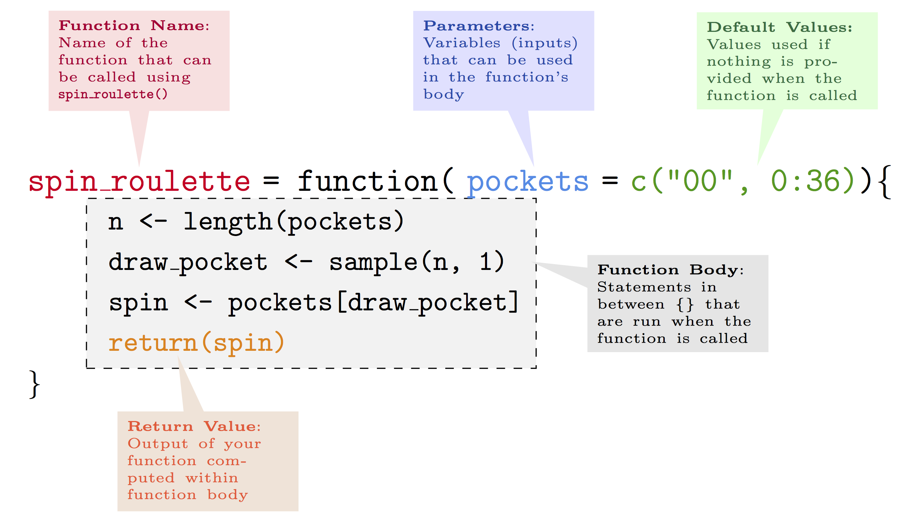

# Function
```{r,fig.align='center',echo=FALSE,out.height=400,out.width=600}
knitr::include_graphics("images/lego-674354_1280.jpg")
```

---
# ''Everything is a function call''
What does happen in `R`, or what does the `R` evaluator do once given an object? There are only three cases:
* Evaluating a constant
```{r}
18.10
```
* Parsing a syntactic name or any string within quoted marks
```{r}
sqrt
`+`
```

---
# ''Everything is a function call''
* A function call, **the vast majority**.
```{r}
1.1 + 2.1
`+`(1.1, 2.1)
```

---
```{r,fig.align='center',echo=F}

```

---
# Function components
A function has three components:

- **arguments**: the inputs the user gives to the function which will determine the value or type of output of a function;
- **body**: the code lines containing the commands and operations which deliver the desired output;
- **environment**: every R function is built within an environment of reference from which to source possible input values and/or other functions necessary for it to work.

---
# Function parts
You can verify these components using:

- `formals(fun)`: return a list of arguments for `fun`;
- `body(fun)`: return the code lines from within `fun`;
- `environment(fun)`: return a frame, i.e. a collection of named objects, where `fun` finds values associated with names. 

---
# Example
```{r}
my_div <- function (numerator, denominator) {
  div <- numerator / denominator
  return(div)
}

formals(my_div)
body(my_div)
environment(my_div)
```

---
# Note on the example
* The following implementation is also valid.
```{r}
my_div <- function (numerator, denominator) numerator / denominator
```
* Curly brackets would be needed if the body was taking more lines.
* If `return` is not specified, `R` returns the value of the last evaluated expression by default.

---
# Arguments
How arguments can be passed to a function in `R`?

* **positional matching**: arguments must be entered in the same order as defined in the function 
```{r}
my_div(1, 2)
my_div(2, 1)
```

---
# Arguments
* **perfect matching**: `R` searches for the arguments matching the exact name
```{r}
my_div(numerator = 1, denominator = 2)
my_div(denominator = 1, numerator = 2)
```

---
# Arguments
* **prefix matching**: `R` searches for the first letters matching the exact name
```{r}
my_div(n = 1, d = 2)
my_div(d = 1, n = 2)
```

---
# A note on assignment operators `=` `<-`

* Both `=` `<-` can be used to assign a value to a name.
* When used to assign function arguments, there is a major difference:
```{r, error=TRUE}
my_div(numerator = 2, denominator = 1)
numerator
my_div(numerator <- 2, denominator = 1)
numerator
```

---
# Body
The body of a function is simply the set of instructions and (possible) other functions that use the arguments provided by the user and computes the desired output.

<center>
<iframe src="https://giphy.com/embed/3oEdv9Y8md1SwyOMYE" width="360" height="360" frameBorder="0" class="giphy-embed" allowFullScreen></iframe><p><a href="https://giphy.com/gifs/animation-mechanical-3oEdv9Y8md1SwyOMYE">via GIPHY</a></p>
</center>

---
# Signalling conditions
As a programmer, it is important to give meaningful indications to the user. There three types of signalling conditions:

* **errors**: sever problem, indicated via `stop()`;
* **warnings**: mild problem, indicated via `warning()`;
* **messages**: informative, indicated via `message()`.

---
# Errors
Errors are related to the intentions behind the program. The programmer should ensure that the function is used within the scope of the intention.
```{r,error=TRUE}
# Is it possible to divide two characters?
my_div("numerator","denominator")
```

```{r,error=T}
# new definition
my_div <- function (numerator, denominator) {
  # verify that both arguments are numeric (double or integer)
  if(any(!is.numeric(numerator), !is.numeric(denominator))){ #<<
    stop("`numerator` and `denominator` must be numeric")
  }
  
  div <- numerator / denominator
  return(div)
}
my_div("numerator","denominator")
```

---
```{r,error=TRUE}
# a matrix is still numeric, does it work?
A <- matrix(1:9,ncol=3)
B <- matrix(1:12,ncol=3)
my_div(A,B)
```

At this point, the programmer has to decide whether arrays are allowed. If the answer is positive, then extra verification is necessary as the dimension must match. 

```{r}
# dimension for arrays
dim(A)
length(A)

# what happens for a vector?
a <- 1:3
dim(a)
length(a)
```


---
```{r,error=T}
# new definition
my_div <- function (numerator, denominator) {
  # verify that both arguments are numeric (double or integer)
  if(any(!is.numeric(numerator), !is.numeric(denominator))){
    stop("`numerator` and `denominator` must be numeric")
  }
  
  # verify length match
  if(length(numerator) != length(denominator)){ #<<
    stop("`numerator` and `denominator` must have the same length")
  }
  # verify dimension match
  if(length(dim(numerator)) != length(dim(denominator))){ #<<
    stop("`numerator` and `denominator` must have the same dimensions")
  }
  if(any(dim(numerator) != dim(denominator))){ #<<
    stop("`numerator` and `denominator` must have the same dimensions")
  }
  
  div <- numerator / denominator
  return(div)
}
my_div(A, B)
```

---
```{r}
A <- matrix(1:9,ncol=3)
B <- matrix(10:18,ncol=3)
my_div(A, B)
```

---
# Warnings
Suppose that when two arrays of different size but same dimensions are input, the programmer decide to return the division of a reduced form. The programmer should then warn the user.  

---
```{r,error=T}
# new definition
my_div <- function (numerator, denominator) {
  # verify that both arguments are numeric (double or integer)
  if(any(!is.numeric(numerator), !is.numeric(denominator))){
    stop("`numerator` and `denominator` must be numeric")
  }
  
  # verify dimension match
  if(length(dim(numerator)) != length(dim(denominator))){
    stop("`numerator` and `denominator` must have the same dimensions")
  }
  
  # verify length match
  new_num <- numerator
  new_den <- denominator
  num_len <- length(numerator)
  den_len <- length(denominator)
  if(num_len != den_len){
    # two cases
    if(num_len < den_len){
      new_den <- numerator # `new_den` has same dimension has `numerator`
      new_den[seq_len(num_len)] <- denominator[seq_len(num_len)]
      warning("Size of `denominator` is reduced to match `numerator`") #<<
    } else {
      new_num <- numerator # `new_num` has same dimension has `denominator`
      new_num[seq_len(num_len)] <- numerator[seq_len(num_len)]
      warning("Size of `numerator` is reduced to match `denominator`") #<<
    }
  }
  
  div <- new_num / new_den
  return(div)
}
```

---
```{r,error=TRUE}
A <- matrix(1:9,ncol=3)
B <- matrix(1:30,ncol=3)
A/B
my_div(A, B)
```

---
# Messages
The programmer optionally can print informative message.
```{r,error=T,eval=F}
# new definition
my_div <- function (numerator, denominator) {
  ...
  
  message("Starting the division") #<<
  
  div <- new_num / new_den
  return(div)
}
```

```{r,echo=FALSE}
my_div <- function (numerator, denominator) {
  # verify that both arguments are numeric (double or integer)
  if(any(!is.numeric(numerator), !is.numeric(denominator))){
    stop("`numerator` and `denominator` must be numeric")
  }
  
  # verify dimension match
  if(length(dim(numerator)) != length(dim(denominator))){
    stop("`numerator` and `denominator` must have the same dimensions")
  }
  
  # verify length match
  new_num <- numerator
  new_den <- denominator
  num_len <- length(numerator)
  den_len <- length(denominator)
  if(num_len != den_len){
    # two cases
    if(num_len < den_len){
      new_den <- numerator # `new_den` has same dimension has `numerator`
      new_den[seq_len(num_len)] <- denominator[seq_len(num_len)]
      warning("Size of `denominator` is reduced to match `numerator`")
    } else {
      new_num <- numerator # `new_num` has same dimension has `denominator`
      new_num[seq_len(num_len)] <- numerator[seq_len(num_len)]
      warning("Size of `numerator` is reduced to match `denominator`")
    }
  }
  
  message("Starting the division")
  div <- new_num / new_den
  return(div)
}
```
```{r}
my_div(A, B)
```

---
# Lexical scoping
Lexical scoping consists in how to find a value associated with a name. What do you think will be the output of the following command?
```{r,eval=F}
new_num <- 1
new_den <- 2
my_div(A, B)
```

---
# Lexical scoping
Lexical scoping consists in how to find a value associated with a name. What do you think will be the output of the following command?
```{r,eval=T}
new_num <- 1
new_den <- 2
my_div(A, B)
```

---
When looking for the value of a name, `R` follows some rules:

* **dynamic lookup**: `R` looks for a name when the function is run, not when it is created.
```{r,error=TRUE}
f <- function() x * x
f()
x <- 10
f()
```

* **name masking**: `R` looks for a name from the current environment, and if not supplied, to the parent environment and so on.
```{r,error=TRUE}
x <- 10
f <- function(){
  x <- 1
  x * x
} 
f()
```

---
# Environment
It is important to understand environment to understand where `R` finds names. Environment is a collection of named objects.

* Every name in an environment is unique
* Every environment has a parent

---
Special environment:

* **current**: this is where the code is currently running, usually the global environment.
```{r}
environment()
```
* **global**: this is your "workspace", where you interactively experiment some code in `R`
```{r}
globalenv()
```
* **empty**: every environment has a parent except the empty environment, which is empty
```{r}
emptyenv()
```


---
* **execution**: it usually exists only during function calls.
```{r}
f <- function() print(environment())
f()
f()
```

* **package**: when you attach a package with `library(pkg)`, the package becomes a parent of the global environment.

---
When looking for a binding, `R` follows a path
```{r}
search()
library(ggplot2)
search()
```

Be careful, if two packages have the same name for a function, which one is going to be called? You can use the operator `pkg::name` to make sure you make the right call.

---
<blockquote>
To understand computations in `R`, two slogans are helpful:

<ul>
<li>Everything that exists is an object.</li>
<li>Everything that happens is a function call.</li>
</ul>
.right[— John Chambers]
</blockquote>

---
# Special functions
Everything that happens is a function call, really?
```{r}
1 + 2
`+`(1,2)
`+`
```

---
Remarks:
* The `+` is a `.Primitive` function, it is implemented in `C` and is particularly efficient.
* `+` is an **infix** function: the name appears between two arguments. Other infix functions comprises `=`, `<-`, `+`, `-`, `*`, `/`, `!`, `<`, `%*%`, `&`, `|`,...
* You can create your own infix functions using `%operator%` pattern (e.g. `%>%` `magrittr` pipe operator).
* It is licit but bad practice to redefine already existing infix functions as they are not reserved words

```{r}
`+` <- function(x, y) 10 * x * y
1 + 2
environment(`+`)
base::`+`(1,2)
```

---
# Function composition
Everything is an object, so a function is an object too right? So you could pass an object as an argument? Yes!
```{r}
A <- matrix(rnorm(9),nc=3)
B <- matrix(rnorm(9),nc=3)
C <- matrix(rnorm(9),nc=3)
D <- matrix(rnorm(9),nc=3)

my_div(my_div(A,B),my_div(C,D))
```

This is called **nesting**.

---
You can also create intermediate objects.
```{r}
AB <- my_div(A,B)
CD <- my_div(C,D)
my_div(AB,CD)
```

---
or a final option is to use **piping** with for example `%>%` `magrittr` operator
(which works only for one argument)
```{r}
library(magrittr)
my_div(A,B) %>% my_div(CD)
```

---
class: sydney-blue, center, middle

# Question ?

.pull-down[
<a href="https://ptds.samorso.ch/">
.white[`r icons::fontawesome("file")` website]
</a>

<a href="https://github.com/ptds2023/">
.white[`r icons::fontawesome("github")` GitHub]
</a>
]

---
# Exercise
* What does the following code return?
```{r, eval=F}
x <- 2
f1 <- function(x) {
  function() {
    x + 3
  }
}
f1(1)()
```

* How would you usually write these codes?
```{r, eval=F}
`+`(1, `*`(2, 3))
`*`(3, `+`(2, 1))
```

* How could you make this function call easier to read?
```{r, eval=F}
mean(, TRUE, x = c(seq(10), rep(NA,3)))
```

---
* Does the following code throw an error when executed? Why or why not?
```{r, eval=F}
f2 <- function(a, b) {
  a * 3
}
f2(3, stop("This is an error!"))
f2(stop("This is an error!"), 3)
```

* Propose an infix function.