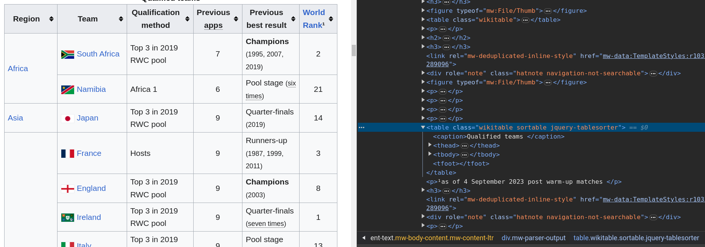
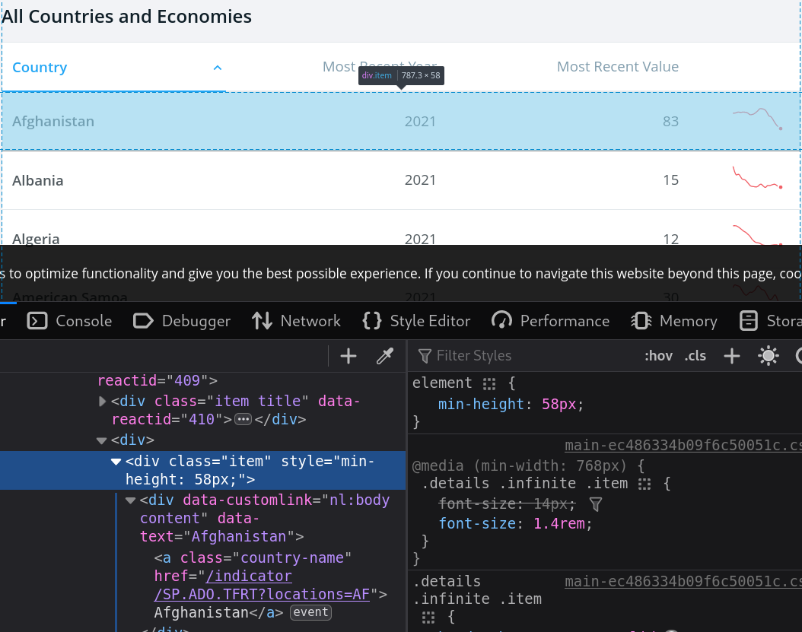

# Webscraping with R

```{r}
library(rvest)
url <- "https://ptds.samorso.ch/lectures/"

read_html(url) %>%
  html_table() %>%
  .[[1]] %>% 
  .[5:7,] %>%
  kableExtra::kable()
```

---
# API
* **A**pplication **P**rogramming **I**nterface are gold standard for fetching data from the web
* Data is fetched by directly posing HTTP requests.
* Data requests from `R` using `library(httr)` or API wrappers.
* Data fetched through the API is generally more reliable.

```{r, echo=FALSE}
tibble::tibble(Provider = c("Twitter","Financial Times","Open Weather Map","DeepL"),
               Registration = c(T,T,T,T),
               Wrapper = c(T,T,T,T)) %>% kableExtra::kable()
```

---
# API example: Wikipedia pageviews
```{r}
library(pageviews)

top_articles("en.wikipedia",
             start = (Sys.Date()-1)) %>%
  dplyr::select(article, views) %>%
  dplyr::top_n(10)
```

---
# API example: translation with Deepl

```{r,echo=FALSE}
my_key <- Sys.getenv("DEEPL_API_KEY")
```

```{r,cache=TRUE}
library(deeplr)
deeplr::translate2(
  text = "Mais quelle bonne traduction nom d'une pipe!",
  target_lang = "EN",
  auth_key = my_key
  )
```

This is what we obtain on Google translate:
> But what a good translation of the name of a pipe!

---
# API Example: ChatGPT
```{r}
library(chatgpt)
cat(ask_chatgpt("What do you think about the Programming Tools in Data Science class in R?"))
```


---
# Webscraping with R
* If API is not available, e.g. there is no `R` package on CRAN or GitHub, you could try to build your own API by following for example [this tutorial](https://colinfay.me/build-api-wrapper-package-r/) or [that one](https://httr2.r-lib.org/articles/wrapping-apis.html) (not covered in this class).
* Instead, we discuss webscraping, a method that is effective regardless of whether a website offers an API.

---
# Scraping?

<center>
<div style="width:800px"><iframe allow="fullscreen" frameBorder="0" height="450" src="https://giphy.com/embed/Q8VCAek0MGjRK" width="800"></iframe></div>
</center>

---
# HTTP request/response cycle
```{r,echo=F}
knitr::include_graphics("images/http_request_response.png")
```

---
# HyperText Markup Language

```{html}
<!DOCTYPE html>
<html>    
  <body>
    <h1 id='first'>Webscraping with R</h1>
    <p> Basic experience with <a href="www.r-project.org">R</a> and
    familiarity with the <em>Tidyverse</em> is recommended.</p>
    <h2>Technologies</h2>
    <ol>
      <li>HTML: <em>Hypertext Markup Language</em></li>
      <li>CSS: <em>Cascading Style Sheets</em></li>
    </ol>
    <h2>Packages</h2>
    <ul>
      <a href="https://github.com/tidyverse/rvest"><li>rvest</li></a>
    </ul>
    <p><strong>Note</strong>:
    <em>rvest</em> is included in the <em>tidyverse</em></p>
  </body>
</html>
```

.bottom[[Try it!](https://www.w3schools.com/html/tryit.asp?filename=tryhtml_default)]

---
# HTML
* **element** starts with `<tag>` and ends `</tag>`,
* it has optional **attributes** (`id=attribute`),
* **content** is everything between two tags.
* For example, add the attribute `style="background-color:DodgerBlue;"` to `h1` and try it.

---
# HTML elements

tag	| meaning
--- | ---
p |	Paragraph
h1 | Top-level heading
h2, h3, ... |	Lower level headings
ol | Ordered list
ul | Unorder list
li | List item
img |	Image
a |	Anchor (Hyperlink)
div |	Section wrapper (block-level)
span | Text wrapper (in-line)

Find out more tags [here](https://developer.mozilla.org/en-US/docs/Web/HTML) or [here](https://www.w3schools.com/tags/)

---
# Data extraction
Create a HTML page with `minimal_html` for experimenting
```{r}
html_page <- minimal_html('
  <body>
    <h1>Webscraping with R</h1>
    <p> Basic experience with <a href="www.r-project.org">R</a> and
    familiarity with the <em>Tidyverse</em> is recommended.</p>
    <h2>Technologies</h2>
    <ol>
      <li>HTML: <em>Hypertext Markup Language</em></li>
      <li>CSS: <em>Cascading Style Sheets</em></li>
    </ol>
    <h2>Packages</h2>
    <ul>
      <a href="https://github.com/tidyverse/rvest"><li>rvest</li></a>
    </ul>
    <p><strong>Note</strong>:
    <em>rvest</em> is included in the <em>tidyverse</em></p>
  </body>')
```

---
# Example: list item (li)
```{html}
...
    <h2>Technologies</h2>
    <ol>
      <li>HTML: <em>Hypertext Markup Language</em></li> #<<
      <li>CSS: <em>Cascading Style Sheets</em></li> #<<
    </ol>
    <h2>Packages</h2>
    <ul>
      <a href="https://github.com/tidyverse/rvest"><li>rvest</li></a> #<<
    </ul>
...
```
```{r}
html_page %>% html_nodes("li")
html_page %>% html_nodes("li") %>% html_text()
```

---
# Example: heading of order 2 (h2)
```{html}
...
    <h2>Technologies</h2> #<<
    <ol>
      <li>HTML: <em>Hypertext Markup Language</em></li> 
      <li>CSS: <em>Cascading Style Sheets</em></li> 
    </ol>
    <h2>Packages</h2> #<<
    <ul>
      <a href="https://github.com/tidyverse/rvest"><li>rvest</li></a> 
    </ul>
...
```
```{r}
html_page %>% html_nodes("h2") %>% html_text()
```

---
# Example: emphasized text (em)
```{html}
    <p> Basic experience with <a href="www.r-project.org">R</a> and
    familiarity with the <em>Tidyverse</em> is recommended.</p> #<<
    <h2>Technologies</h2>
    <ol>
      <li>HTML: <em>Hypertext Markup Language</em></li> #<<
      <li>CSS: <em>Cascading Style Sheets</em></li> #<<
    </ol>
    <h2>Packages</h2>
    <ul>
      <a href="https://github.com/tidyverse/rvest"><li>rvest</li></a>
    </ul>
    <p><strong>Note</strong>:
    <em>rvest</em> is included in the <em>tidyverse</em></p> #<<
```
```{r}
html_page %>% html_nodes("em") %>% html_text()
```

---
# Cascading Style Sheets (CSS)
* CSS is used to specify the style (appearance, arrangement and variations) of your web pages.

```{html}
<style>
body {
  background-color: lightblue;
}
h1 {
  color: white;
  text-align: center;
}
.content {
font-family: monospace;
font-size: 1.5em;
color: black;
}
#intro {
  background-color: lightgrey;
  border-style: solid;
  border-width: 5px;
  padding: 5px;
  margin: 5px;
  text-align: center;
}
</style>
...
```

---
# Combining commands with CSS selector

selector |	meaning
--- | ---
,	| grouping
space	| descendant
>	| child
+ | adjacent sibling
~ | general sibling
:first-child |	first element
:nth-child(n)	| n element
:last-child	| last element
.	| class selector
#	| id selector

.center[[CSS diner](https://flukeout.github.io/), 
[CSS selector](https://developer.mozilla.org/en-US/docs/Web/CSS/CSS_Selectors), 
[W3 School](https://www.w3schools.com/css/css_selectors.asp)]

---
# CSS Selector: grouping (`,`)
* The grouping selector selects all the HTML elements with the same style definitions.
* For example, `div, p` selects all `<div>` elements and all `<em>` elements.

---
# Example: grouping `li` and `em`
```{html}
    <p> Basic experience with <a href="www.r-project.org">R</a> and
    familiarity with the <em>Tidyverse</em> is recommended.</p> 
    <h2>Technologies</h2>
    <ol>
      <li>HTML: <em>Hypertext Markup Language</em></li> 
      <li>CSS: <em>Cascading Style Sheets</em></li>
    </ol>
    <h2>Packages</h2>
    <ul>
      <a href="https://github.com/tidyverse/rvest"><li>rvest</li></a>
    </ul>
    <p><strong>Note</strong>:
    <em>rvest</em> is included in the <em>tidyverse</em></p> 
```

---
# Example: grouping `li` and `em`
```{html}
    <p> Basic experience with <a href="www.r-project.org">R</a> and
    familiarity with the <em>Tidyverse</em> is recommended.</p> #<<
    <h2>Technologies</h2>
    <ol>
      <li>HTML: <em>Hypertext Markup Language</em></li> #<<
      <li>CSS: <em>Cascading Style Sheets</em></li> #<<
    </ol>
    <h2>Packages</h2>
    <ul>
      <a href="https://github.com/tidyverse/rvest"><li>rvest</li></a> #<<
    </ul>
    <p><strong>Note</strong>:
    <em>rvest</em> is included in the <em>tidyverse</em></p> #<<
```
```{r}
html_page %>% html_nodes("li, em") %>% html_text()
```

---
# CSS Selector: descendant selector (`space`)
* The descendant selector matches all elements that are descendants of a specified element.
* For example, `div p` selects all `<p>` elements inside `<div>` elements.

---
# Example: all `em` that are descendants of `li`
```{html}
    <p> Basic experience with <a href="www.r-project.org">R</a> and
    familiarity with the <em>Tidyverse</em> is recommended.</p> 
    <h2>Technologies</h2>
    <ol>
      <li>HTML: <em>Hypertext Markup Language</em></li> 
      <li>CSS: <em>Cascading Style Sheets</em></li> 
    </ol>
    <h2>Packages</h2>
    <ul>
      <a href="https://github.com/tidyverse/rvest"><li>rvest</li></a>
    </ul>
    <p><strong>Note</strong>:
    <em>rvest</em> is included in the <em>tidyverse</em></p>
```

---
# Example: all `em` that are descendants of `li`
```{html}
    <p> Basic experience with <a href="www.r-project.org">R</a> and
    familiarity with the <em>Tidyverse</em> is recommended.</p> 
    <h2>Technologies</h2>
    <ol>
      <li>HTML: <em>Hypertext Markup Language</em></li> #<<
      <li>CSS: <em>Cascading Style Sheets</em></li> #<<
    </ol>
    <h2>Packages</h2>
    <ul>
      <a href="https://github.com/tidyverse/rvest"><li>rvest</li></a>
    </ul>
    <p><strong>Note</strong>:
    <em>rvest</em> is included in the <em>tidyverse</em></p>
```
```{r}
html_page %>% html_nodes("li em") %>% html_text()
```

---
# CSS Selector: child selector (`>`)
* The child selector selects all elements that are the children of a specified element.
* For example, `div > p` selects all `<p>` elements that are children of a `<div>` element.

---
# Example: all `em` that are children of `p`
```{html}
    <p> Basic experience with <a href="www.r-project.org">R</a> and
    familiarity with the <em>Tidyverse</em> is recommended.</p> 
    <h2>Technologies</h2>
    <ol>
      <li>HTML: <em>Hypertext Markup Language</em></li> 
      <li>CSS: <em>Cascading Style Sheets</em></li> 
    </ol>
    <h2>Packages</h2>
    <ul>
      <a href="https://github.com/tidyverse/rvest"><li>rvest</li></a>
    </ul>
    <p><strong>Note</strong>:
    <em>rvest</em> is included in the <em>tidyverse</em></p>
```

---
# Example: all `em` that are children of `p`
```{html}
    <p> Basic experience with <a href="www.r-project.org">R</a> and
    familiarity with the <em>Tidyverse</em> is recommended.</p> #<<
    <h2>Technologies</h2>
    <ol>
      <li>HTML: <em>Hypertext Markup Language</em></li> 
      <li>CSS: <em>Cascading Style Sheets</em></li> 
    </ol>
    <h2>Packages</h2>
    <ul>
      <a href="https://github.com/tidyverse/rvest"><li>rvest</li></a>
    </ul>
    <p><strong>Note</strong>:
    <em>rvest</em> is included in the <em>tidyverse</em></p> #<<
```
```{r}
html_page %>% html_nodes("p > em") %>% html_text()
```

---
# CSS Selector: adjacent sibling selector (`+`)
* The adjacent sibling selector is used to select an element that is directly after another specific element.
* Sibling elements must have the same parent element, and "adjacent" means "immediately following".
* For example, `div + p` selects the first `<p>` element that is situated immediately after `<div>` elements.

---
# Example: `em` immediately after `p`
```{html}
    <p> Basic experience with <a href="www.r-project.org">R</a> and
    familiarity with the <em>Tidyverse</em> is recommended.</p> 
    <h2>Technologies</h2>
    <ol>
      <li>HTML: <em>Hypertext Markup Language</em></li> 
      <li>CSS: <em>Cascading Style Sheets</em></li> 
    </ol>
    <h2>Packages</h2>
    <ul>
      <a href="https://github.com/tidyverse/rvest"><li>rvest</li></a>
    </ul>
    <p><strong>Note</strong>:
    <em>rvest</em> is included in the <em>tidyverse</em></p>
```

---
# Example: `em` immediately after `p`
```{html}
    <p> Basic experience with <a href="www.r-project.org">R</a> and
    familiarity with the <em>Tidyverse</em> is recommended.</p>
    <h2>Technologies</h2>
    <ol>
      <li>HTML: <em>Hypertext Markup Language</em></li> 
      <li>CSS: <em>Cascading Style Sheets</em></li> 
    </ol>
    <h2>Packages</h2>
    <ul>
      <a href="https://github.com/tidyverse/rvest"><li>rvest</li></a>
    </ul>
    <p><strong>Note</strong>:
    <em>rvest</em> is included in the <em>tidyverse</em></p>
```
```{r}
html_page %>% html_nodes("p + em") %>% html_text()
```
No `em` are immediately after `p`. 

---
# Example: `em` immediately after `em`
```{html}
    <p> Basic experience with <a href="www.r-project.org">R</a> and
    familiarity with the <em>Tidyverse</em> is recommended.</p> 
    <h2>Technologies</h2>
    <ol>
      <li>HTML: <em>Hypertext Markup Language</em></li> 
      <li>CSS: <em>Cascading Style Sheets</em></li> 
    </ol>
    <h2>Packages</h2>
    <ul>
      <a href="https://github.com/tidyverse/rvest"><li>rvest</li></a>
    </ul>
    <p><strong>Note</strong>:
    <em>rvest</em> is included in the <em>tidyverse</em></p>
```

---
# Example: `em` immediately after `em`
```{html}
    <p> Basic experience with <a href="www.r-project.org">R</a> and
    familiarity with the <em>Tidyverse</em> is recommended.</p> 
    <h2>Technologies</h2>
    <ol>
      <li>HTML: <em>Hypertext Markup Language</em></li> 
      <li>CSS: <em>Cascading Style Sheets</em></li> 
    </ol>
    <h2>Packages</h2>
    <ul>
      <a href="https://github.com/tidyverse/rvest"><li>rvest</li></a>
    </ul>
    <p><strong>Note</strong>:
    <em>rvest</em> is included in the <em>tidyverse</em></p> #<<
```
```{r}
html_page %>% html_nodes("em + em") %>% html_text()
```

---
# CSS Selector: general sibling selector (`~`)
* The general sibling selector selects all elements that are next siblings of a specified element.
* Sibling elements must have the same parent element, and "general" means "any place".
* For example, `div ~ p` selects all `<p>` elements that are preceded by a `<div>` element.

---
# Example: `em` next sibling of `a`
```{html}
    <p> Basic experience with <a href="www.r-project.org">R</a> and
    familiarity with the <em>Tidyverse</em> is recommended.</p> 
    <h2>Technologies</h2>
    <ol>
      <li>HTML: <em>Hypertext Markup Language</em></li> 
      <li>CSS: <em>Cascading Style Sheets</em></li> 
    </ol>
    <h2>Packages</h2>
    <ul>
      <a href="https://github.com/tidyverse/rvest"><li>rvest</li></a>
    </ul>
    <p><strong>Note</strong>:
    <em>rvest</em> is included in the <em>tidyverse</em></p>
```

---
# Example: `em` next sibling of `a`
```{html}
    <p> Basic experience with <a href="www.r-project.org">R</a> and #<<
    familiarity with the <em>Tidyverse</em> is recommended.</p> #<<
    <h2>Technologies</h2>
    <ol>
      <li>HTML: <em>Hypertext Markup Language</em></li> 
      <li>CSS: <em>Cascading Style Sheets</em></li> 
    </ol>
    <h2>Packages</h2>
    <ul>
      <a href="https://github.com/tidyverse/rvest"><li>rvest</li></a>
    </ul>
    <p><strong>Note</strong>:
    <em>rvest</em> is included in the <em>tidyverse</em></p>
```
```{r}
html_page %>% html_nodes("a ~ em") %>% html_text()
```
(Here, we would have obtained the same result with `a + em`)

---
# CSS Selector: first child selector (`:first-child`)
* `:first-child` selects the specified element that is the first child of another element.
* For example, `p:first-child` selects all `<p>` elements that are the first child of any other element.

---
# Example: all `li` that are first children
```{html}
    <p> Basic experience with <a href="www.r-project.org">R</a> and
    familiarity with the <em>Tidyverse</em> is recommended.</p> 
    <h2>Technologies</h2>
    <ol>
      <li>HTML: <em>Hypertext Markup Language</em></li> 
      <li>CSS: <em>Cascading Style Sheets</em></li> 
    </ol>
    <h2>Packages</h2>
    <ul>
      <a href="https://github.com/tidyverse/rvest"><li>rvest</li></a>
    </ul>
    <p><strong>Note</strong>:
    <em>rvest</em> is included in the <em>tidyverse</em></p>
```

---
# Example: all `li` that are first children
```{html}
    <p> Basic experience with <a href="www.r-project.org">R</a> and
    familiarity with the <em>Tidyverse</em> is recommended.</p> 
    <h2>Technologies</h2>
    <ol>
      <li>HTML: <em>Hypertext Markup Language</em></li>  #<<
      <li>CSS: <em>Cascading Style Sheets</em></li> 
    </ol>
    <h2>Packages</h2>
    <ul>
      <a href="https://github.com/tidyverse/rvest"><li>rvest</li></a> #<<
    </ul>
    <p><strong>Note</strong>:
    <em>rvest</em> is included in the <em>tidyverse</em></p>
```
```{r}
html_page %>% html_nodes("li:first-child") %>% html_text()
```

---
# CSS Selector: nth child selector (`:nth-child(n)`)
* Remark: `:last-child` is completely symmetric to `:first-child`.
* `:nth-child(n)` selects the specified element that is the nth child of another element.
* For example, `p:nth-child(2)` selects all `<p>` elements that are the second child of any other element.

---
# Example: all `li` that are second children
```{html}
    <p> Basic experience with <a href="www.r-project.org">R</a> and
    familiarity with the <em>Tidyverse</em> is recommended.</p> 
    <h2>Technologies</h2>
    <ol>
      <li>HTML: <em>Hypertext Markup Language</em></li> 
      <li>CSS: <em>Cascading Style Sheets</em></li> 
    </ol>
    <h2>Packages</h2>
    <ul>
      <a href="https://github.com/tidyverse/rvest"><li>rvest</li></a>
    </ul>
    <p><strong>Note</strong>:
    <em>rvest</em> is included in the <em>tidyverse</em></p>
```

---
# Example: all `li` that are second children
```{html}
    <p> Basic experience with <a href="www.r-project.org">R</a> and
    familiarity with the <em>Tidyverse</em> is recommended.</p> 
    <h2>Technologies</h2>
    <ol>
      <li>HTML: <em>Hypertext Markup Language</em></li> 
      <li>CSS: <em>Cascading Style Sheets</em></li> #<<
    </ol>
    <h2>Packages</h2>
    <ul>
      <a href="https://github.com/tidyverse/rvest"><li>rvest</li></a>
    </ul>
    <p><strong>Note</strong>:
    <em>rvest</em> is included in the <em>tidyverse</em></p>
```
```{r}
html_page %>% html_nodes("li:nth-child(2)") %>% html_text()
```

---
# HTML attributes
* All HTML elements can have attributes, additional information about elements.
* Attributes are always specified in the start tag, usually in the format `name="value"`.
* For example, `<a href="www.r-project.org">R</a>`, `href` is an attribute of `a` that specifies an url.
* Attributes can be accessed with `html_attr` command.

---
# Example: `href` attributes
```{html}
    <p> Basic experience with <a href="www.r-project.org">R</a> and
    familiarity with the <em>Tidyverse</em> is recommended.</p> 
    <h2>Technologies</h2>
    <ol>
      <li>HTML: <em>Hypertext Markup Language</em></li> 
      <li>CSS: <em>Cascading Style Sheets</em></li> 
    </ol>
    <h2>Packages</h2>
    <ul>
      <a href="https://github.com/tidyverse/rvest"><li>rvest</li></a>
    </ul>
    <p><strong>Note</strong>:
    <em>rvest</em> is included in the <em>tidyverse</em></p>
```

---
# Example: `href` attributes
```{html}
    <p> Basic experience with <a href="www.r-project.org">R</a> and #<<
    familiarity with the <em>Tidyverse</em> is recommended.</p> 
    <h2>Technologies</h2>
    <ol>
      <li>HTML: <em>Hypertext Markup Language</em></li> 
      <li>CSS: <em>Cascading Style Sheets</em></li> 
    </ol>
    <h2>Packages</h2>
    <ul>
      <a href="https://github.com/tidyverse/rvest"><li>rvest</li></a> #<<
    </ul>
    <p><strong>Note</strong>:
    <em>rvest</em> is included in the <em>tidyverse</em></p>
```
```{r}
html_page %>% html_nodes("a") %>% html_attr("href")
```

---
# HTML tables

tag |	meaning
--- | ---
table |	Table section
tr |	Table row
td |	Table cell
th |	Table header

* Tables can be fetched by using the command `html_table()`

---
```{r}
basic_table <- minimal_html('
<body>
<table>
  <tr>
    <th>Month</th>
    <th>Savings</th>
  </tr>
  <tr>
    <td>January</td>
    <td>$100</td>
  </tr>
  <tr>
    <td>February</td>
    <td>$80</td>
  </tr>
</table>
</body>
')
```
```{r}
basic_table %>% html_table()
```

---
# Example: Wikipedia table
* We would like to fetch the table with Qualified teams of the Rugby World Cup 2023 on Wikipedia.
* A first solution: fetch all tables and select the correct one.
```{r wikipedia-example1}
url <- "https://en.wikipedia.org/wiki/2023_Rugby_World_Cup"
url %>% read_html() %>% html_table() %>% .[[5]] %>% kableExtra::kable()
```

---
# Example: Wikipedia table
* Inspect the HTML with the developer tools.
```{r wikipedia-fig, echo=FALSE}

```

---
# Example: Wikipedia table
* A better solution using CSS selectors: using the class selector (`.`).
* Select `class="wikitable"`.
```{r wikipedia-example2}
url <- "https://en.wikipedia.org/wiki/2023_Rugby_World_Cup"
url %>% read_html() %>% html_nodes(".wikitable") %>% html_table() %>% .[[3]] %>% kableExtra::kable() # equivalently html_nodes("table.wikitable")
```

---
# Example: Wikipedia table
* A better solution using CSS selectors: using the class selector (`.`).
* Select `class="wikitable sortable"`.
```{r wikipedia-example3}
url <- "https://en.wikipedia.org/wiki/2023_Rugby_World_Cup"
url %>% read_html() %>% html_nodes(".wikitable.sortable") %>% html_table() %>%  kableExtra::kable() # equivalently html_nodes("table.wikitable.sortable")
```

---
# Example: Wikipedia table
* An alternative solution: select `table` immediately after four `p`.
```{r wikipedia-example4}
url <- "https://en.wikipedia.org/wiki/2023_Rugby_World_Cup"
url %>% read_html() %>% html_nodes("p + p + p + p + table") %>% html_table() %>% kableExtra::kable()
```

---
# Why web scraping could be bad?
* Scraping increases web traffic.
* People ignore and violate `robots.txt` and Terms of Service (ToS) of websites.
* You should avoid those troubles by following these simple rules:
1. Read ToS of the website you want to scrap.
2. Inspect `robots.txt` (see <https://cran.r-project.org/robots.txt> for instance).
3. Use a reasonable frequency of requests (force your program to make some pauses).

---
# Dynamic sites (advanced)
* Sometimes, what you see in your browser is not what is returned by `read_html()`. In many cases, this is due to website that employs methods for dynamic data requests.
* A solution is to simulate a browser to cope with dynamically rendered webpages.
* _Selenium_ offers a solution. It is a project focused on automating web browsers.
* You have access to Selenium with the `RSelenium` package.
* An alternative is the `chromote` package (developped by Posit) that focuses on [Chrome DevTools Protocol](https://chromedevtools.github.io/devtools-protocol/).

---
# World bank data
```{r worldbank-site, echo=FALSE}
knitr::include_url("https://data.worldbank.org/indicator/SP.ADO.TFRT")
```

---
# World bank data
* Inspecting the "table".

```{r worldbank-pic, echo=FALSE, out.width="600px", fig.align='center'}

```

---
# World bank data
* Trying to fetch the data _non-dynamically_ using `class="item"`.
```{r worldbank-example1}
url <- "https://data.worldbank.org/indicator/SP.ADO.TFRT"
url %>% read_html() %>% html_nodes(".item") %>% html_text() # or html_nodes("div.item")
```
* Only the header is returned.

---
# World bank data
* A first dynamic solution with the `chromote` package.
```{r worldbank-example2, results='hide'}
library(chromote)
b <- ChromoteSession$new() # open a chromote session
url <- "https://data.worldbank.org/indicator/SP.ADO.TFRT"
b$Page$navigate(url) # navigate to the url
b$Runtime$evaluate("document.querySelector('html').outerHTML")$result$value %>%
  read_html() %>% html_nodes(".item") %>% html_text() %>% head()
b$close() # close the session
```
```{r, echo=FALSE}
# knitr not wokring interactively
print(c("CountryMost Recent YearMost Recent Value", "Afghanistan202183", "Albania202115", "Algeria202112", "American Samoa202130", "Andorra20216"))
```

---
# World bank data
Some comments on the `chromote` command:
* `b <- ChromoteSession$new()` create a new `ChromoteSession` object assigned to `b`.
* `b$Page$navigate(url)` navigates to the provided URL.
* The `Runtime$evaluate` command tells the browser to run JavaScript code.
* The JavaScript code `document.querySelector('html').outerHTML` selects the <html> element from the current web page's Document Object Model (DOM), and then retrieves its entire HTML content, including the element itself and everything inside it. 
* Essentially, it captures the entire structure of the HTML document, from the opening <html> tag to the closing </html> tag, as a string.
* Notice that the browser can be viewed using `b$view()`
* Check the package [site](https://github.com/rstudio/chromote) for more info.


---
# World bank data
* `chromote` is for `Chrome`, `Chromium` and the likes. `Selenium` is more general.
* Unfortunately, the solution using `RSelenium` is currently not running on my installation. But here is how a possible implementation would look like.
```{r worldbank-example5, eval=FALSE}
rD <- rsDriver(browser="firefox", port=4545L, verbose=F)
remDr <- rD[["client"]]
remDr$navigate(url)
html_page <- remDr$getPageSource()[[1]]
html_page %>% read_html() %>% html_nodes(".item") %>% html_text()
```

---
class: sydney-blue, center, middle

# Question ?

.pull-down[
<a href="https://ptds.samorso.ch/">
.white[`r icons::fontawesome("file")` website]
</a>

<a href="https://github.com/ptds2023/">
.white[`r icons::fontawesome("github")` GitHub]
</a>
]

---
# Exercises
1. Play with [CSS Diner](https://flukeout.github.io/) to get familiar with CSS Selectors.
2. Follow this [workflow](https://smac-group.github.io/ds/section-web-scraping.html#section-workflow). It uses the _SelectorGadget_. Propose an alternative solution using CSS selectors. You will probably need to use the developer tools of your browser.
3. Repeat exercise 2. using `RSelenium` or `chromote`. 
4. Extract the information from the World bank data example using regular expressions. 

---
# To go further
* More details and examples in the book [An Introduction to Statistical Programming Methods with R](https://smac-group.github.io/ds/section-web-scraping.html)
* <https://github.com/yusuzech/r-web-scraping-cheat-sheet/>
* Want to build your own R API wrapper? Have a look at <https://colinfay.me/build-api-wrapper-package-r/> and <https://httr2.r-lib.org/articles/wrapping-apis.html>
* [Datacamp](https://www.datacamp.com/courses/web-scraping-in-r) class on webscraping with R
* [Automated Data Collection with R: A Practical Guide to Web Scraping and Text Mining](https://www.wiley.com/en-us/Automated+Data+Collection+with+R%3A+A+Practical+Guide+to+Web+Scraping+and+Text+Mining-p-9781118834817)
* See also the chapters on [webscraping](https://r4ds.hadley.nz/webscraping) and [regular expression](https://r4ds.hadley.nz/regexps) of R for Data Science.
* W3School for [HTML](https://www.w3schools.com/html/default.asp) and [CSS](https://www.w3schools.com/css/default.asp).
