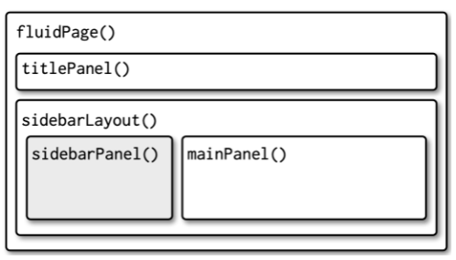

# Shiny web app

* **Communication**: allows users to interact with data and analysis.
* Shiny allows fast development of web application with `R` without the need of having a background in HTML, CSS and JavaScript (also it could be useful).
* Increasingly used within industry for collaboration and/or communication

---
# Example: interacte with graphics
```{r}
knitr::include_url("https://gallery.shinyapps.io/095-plot-interaction-advanced/")
```

Source: <https://shiny.posit.co/r/gallery>

---
# Example: download a report
```{r}
knitr::include_url("https://gallery.shinyapps.io/016-knitr-pdf/")
```

Source: <https://shiny.posit.co/r/gallery>

---
# Example: rental cashflow calculator 
```{r}
knitr::include_url("https://cashflowcalc.com/")
```

Source: <https://deanattali.com/>

---
# Example: Movie explorer
```{r}
knitr::include_url("https://gallery.shinyapps.io/051-movie-explorer/")
```

Source: <https://shiny.posit.co/>

---
# Example: Be a DJ

```{r,eval=FALSE}
OSUICode::run_example("intro/dj-system",package = "OSUICode")
```

Ref: <https://github.com/DivadNojnarg/OSUICode>

---
# Hello, world!

```{r,eval=FALSE}
library(shiny)
# User interface
ui <- fluidPage(
  "Hello, world!"
)
server <- function(input, output, session) {}
shinyApp(ui, server)
```
```{r,echo=FALSE}
library(shiny)
ui <- fluidPage(
  "Hello, world!"
)
```

```{r,fig.align='center',echo=FALSE}

```

---
* User interface: HTML web page users interface with
```{r,eval=FALSE}
ui
```
```{r,echo=FALSE}
print(ui)
```
* Server back-end: `R` implementation and server specification
* Execute the app with `shinyApp(ui, server)`


---
# Step 1: `R` code in the back-end
* Before building the interface of the web application, we need to focus on the `R` code or back-end
* Suppose we would like to create a histogram based on the waiting time between eruptions of the Old Faithful geyser in Yellowstone National Park (that can be found in the R dataset `faithful`)
```{r}
x <- faithful[, 2] 
```

---
* We would like to allow the user to define the number of (equi-spaced) cells 
```{r,fig.align='center',fig.height=5,fig.width=5}
cells <- 10

# Histogram with input cells
breaks <- seq(min(x), max(x), length.out = cells + 1)
hist(x, breaks = breaks)
```

---
* We also would like to allow the user to define the title and x-label
```{r,fig.align='center',fig.height=5,fig.width=5}
label_x <- "Waiting time to next eruption (in mins)"
title <- "Old Faithful Geyser Data"
cells <- 10

# Histogram with input cells
breaks <- seq(min(x), max(x), length.out = cells + 1)
hist(x, breaks = breaks, xlab = label_x, main = title)
```

---
# Step 2: User Interface (UI) / frontend 
Once we have determined the structure of the code we can develop the UI.

---
# Content creation

| Function        | Description                              |
|-----------------|------------------------------------------|
| fluidPage()     | Create a fluid page layout.              |
| titlePanel()    | The title of the application             |
| sidebarLayout() | Creates a sidebar layout for fluidPage() |
| sidebarPanel()  | Makes a sidebar menu                     |
| mainPanel()     | Main content area for different outputs  |

* Alternative to `fluidPage()`: `fixedPage()` (fixed maximum width) and `fillPage()` (uses the full height of the browser).
* `sidebarLayout()` uses `fluidRow()` that can be directly called for multi-row layout.

---
.pull-left[
```{r,echo=FALSE,fig.align='center'}

```
]
.pull-right[
```{r,eval=FALSE}
fluidPage(
  titlePanel(),
  sidebarLayout(
    sidebarPanel(),
    mainPanel()
  )
)
```
]

---
.pull-left[
```{r,echo=FALSE,fig.align='center'}

```
]
.pull-right[
```{r,eval=FALSE}
fluidPage(
  fluidRow(
    column(4, ...),
    column(8, ...)
  ),
  fluidRow(
    column(6, ...),
    column(6, ...)
  )
)
```
]

---
# Input control
* Users provide their inputs through input controls
* Input controls share the same structure `someInput(inputId, ...)`
* `inputId` is accessed by the server (`input$inputId`)

---
Here are some input controls

| Function        | Description               |
|-----------------|---------------------------|
| numericInput()  | Number entry input        |
| radioButtons()  | Radio button selection    |
| selectInput()   | Dropdown menu             |
| sliderInput()   | Range slider (1/2 values) |
| submitButton()  | Submission button         |
| textInput()     | Text input box            |
| checkboxInput() | Single checkbox input     |
| dateInput()     | Date Selection input      |
| fileInput()     | Upload a file to Shiny    |
| helpText()      | Describe input field      |

---
# Output render control
* Output controls create placeholder later filled by the server
* Output controls share the same structure `someOutput(outputId, ...)`
* `outputId` is accessed by the server (`output$outputId`)
* Output controls are paired with a `render` function

---
Here are some output controls 

| Output               |  Render            | Description   |
|----------------------|-------------------------|-------------------------|
| plotOutput()         | renderPlot()    | Display a rendered plot |
| tableOutput()        | renderTable()     | Display in Table        |
| textOutput()         | renderText()     | Formatted Text Output   |
| uiOutput()           | renderUI()   | Dynamic UI Elements     |
| verbatimTextOutput() | renderPrint()    | "as is"" Text Output"   |
| imageOutput()        | renderImage()    | Render an Image         |
| htmlOutput()         | renderUI() | Render Pure HTML        |

---
.pull-left[
```{r, eval=FALSE}
# Define UI for application that draws a histogram
ui <- fluidPage(
   
   # Application title
   titlePanel("Old Faithful Geyser Data"),
   
   # Sidebar with a slider input for number of cells 
   sidebarLayout(
      sidebarPanel(
         sliderInput(inputId = "cells",
                     label = "Number of cells:",
                     min = 1,
                     max = 50,
                     value = 30),
         textInput(inputId = "label_x",
                   label = "Label for the x-axis:"),
         textInput(inputId = "title",
                   label = "Title for the graph:")
      ),
      
      # Show a plot of the generated distribution
      mainPanel(
         plotOutput(outputId = "distPlot")
      )
   )
)
```
]

.pull-right[
```{r,echo=FALSE}

```
]

---
# Step 3: Implementing the back-end
* The goal of the server is to respond to user actions.
* The server logic follows **reactive programming**: when an input is modified, all related output are updated.
* The server prototype always looks like: `server <- function(input, output, session)`.
* `input` and `output` are list-like objects.

---
```{r,eval=FALSE}
```{r, eval=FALSE}
ui <- fluidPage(
  sliderInput(inputId = "cells"),
  textInput(inputId = "label_x"),
  textInput(inputId = "title"),
  plotOutput(outputId = "distPlot")
)

# Define server logic required to draw a histogram
server <- function(input, output, session) {

    `output$distPlot` <- renderPlot({
        # generate cells based on input$cells from ui.R
        x    <- faithful[, 2]
        breaks <- seq(min(x), max(x), length.out = `input$cells` + 1)

        # draw the histogram with the specified number of cells
        hist(x, breaks = breaks, col = 'darkgray', border = 'white', xlab = `input$label_x`, main = `input$title`)
    })
}
```

---
# Declarative programming
* Shiny uses the declarative programming paradigm: you express the logic of a computation without describing its control flows.
* Execution order does not follow lines of code but the **reactive graph**: a display of the reactions. For example,
```{r,fig.align='center',echo=FALSE}

```

---
# Reactive expression
* Every time the user modifies any of the input (`cells`, `label_x`, `title`), Shiny assigns the `faithful` dataset to `x` and computes the `breaks` variable (for example, even if only `label_x` is modified).
* Therefore, the app is inefficient as it does more computation as needed.
* As we increase the number of inputs, the reactive graph becomes harder to read.
* In order to tackle these issues, we create **reactive expressions** (using for example `reactive()`): Shiny computes values only when it might have changed (as opposed to every time or only once).

---
```{r,eval=FALSE}
server <- function(input, output) {
  # generate cells based on input$cells from ui.R
  x <- reactive(faithful[, 2]) #<<
  breaks <- reactive(seq(min(x()), max(x()), length.out = input$cells + 1)) #<<
  
  output$distPlot <- renderPlot({
    # draw the histogram with the specified number of cells
    hist(x(), breaks = breaks(), col = 'darkgray', border = 'white', xlab=input$label_x, main=input$title)
  })
}
```

Alternatively
```{r,eval=FALSE}
server <- function(input, output) {
  output$distPlot <- renderPlot({
    hist(x(), breaks = breaks(), col = 'darkgray', border = 'white', xlab=input$label_x, main=input$title)
  })
  breaks <- reactive(seq(min(x()), max(x()), length.out = input$cells + 1))
  x <- reactive(faithful[, 2])
}
```
* Order of reactive expressions does not matter, but mind human-readability!
* Here `x` could have been assigned outside the `server` without `reactive`, but maybe you will want the possibility to change the dataset.

---
New reactive graph

```{r,echo=FALSE,fig.align='center'}

```
* `breaks` is computed only when the `cells` input is modified (or `x`)

---
* When working with Shiny, it is essential to understand the reactive environment.
* **You cannot access input values outside of a reactive context**. For instance, we could imagine creating the `breaks` variable outside `renderPlot`...
```{r,eval=FALSE}
server <- function(input, output) {
  breaks <- seq(min(x), max(x), length.out = input$cells + 1) #<<
  output$distPlot <- renderPlot(...)
}
```
... but you may get an error, `breaks` will be assigned only once at the beginning of the session.
* If you use a function instead, 
```{r,eval=FALSE}
server <- function(input, output) {
  breaks <- function() seq(min(x), max(x), length.out = input$cells + 1) #<<
  output$distPlot <- renderPlot(...)
}
```
it will be called every time an input is modified.
* Once again, with **reactive expressions**, Shiny computes values only when it might have changed (as opposed to every time or only once)


---
# Controlling the time of evaluation
* Until now, the Shiny app makes some computation as soon as an input is modified.
* If the computation is cumbersome, it might be a good idea to ask the user to trigger it using an `actionButton`: the computation is done only when a button is clicked on.
* The `actionButton` is paired with an event handler, usually `eventReactive`: they react when an expression representing an event is modified (for example `input$click`). 

---
First, we need to add the `actionButton` to the UI
```{r,eval=FALSE}
# Define UI for application that draws a histogram
ui <- fluidPage(

    # Application title
    titlePanel("Old Faithful Geyser Data"),

    # Sidebar with a slider input for number of bins 
    sidebarLayout(
        sidebarPanel(
            sliderInput("cells",
                        "Number of bins:",
                        min = 1,
                        max = 50,
                        value = 30),
            textInput(inputId = "label_x",
                      label = "Label for the x-axis:"),
            textInput(inputId = "title",
                      label = "Title for the graph:"),
            actionButton(inputId = "make_graph", #<<
                         label = "Make the plot!",#<<
                         icon = icon("drafting-compass"))#<<
        ),

        # Show a plot of the generated distribution
        mainPanel(
           plotOutput("distPlot")
        )
    )
)
```

---
Then, add the `eventReactive` into the backend
```{r,eval=FALSE}
# Define server logic required to draw a histogram
server <- function(input, output) {
  # generate cells based on input$cells from ui.R
  x <- reactive(faithful[, 2])
  breaks <- eventReactive(input$make_graph, {seq(min(x()), max(x()), length.out = input$cells + 1)}) #<<
  xlab <- eventReactive(input$make_graph, {input$label_x}) #<<
  title <- eventReactive(input$make_graph, {input$title}) #<<
  
  output$distPlot <- renderPlot({
    # draw the histogram with the specified number of cells
    hist(x(), breaks = breaks(), col = 'darkgray', border = 'white', xlab=xlab(), main=title())
  })
}
```

---
Alternatively, since Shiny 1.6.0 it is recommended to use `reactive %>% bindEvent` (you need `magrittr`)
```{r,eval=FALSE}
server <- function(input, output) {
  # generate cells based on input$cells from ui.R
  x <- reactive(faithful[, 2])
  breaks <- reactive(seq(min(x()), max(x()), length.out = input$cells + 1)) %>% bindEvent(input$make_graph) #<<
  xlab <- reactive(input$label_x) %>% bindEvent(input$make_graph) #<<
  title <- reactive(input$title) %>% bindEvent(input$make_graph) #<<
  
  output$distPlot <- renderPlot({
    # draw the histogram with the specified number of cells
    hist(x(), breaks = breaks(), col = 'darkgray', border = 'white', xlab=xlab(), main=title())
  })
}
```

---
`eventReactive` only works when `input$make_graph` is modified (the user click on the button). First nothing.

```{r,echo=FALSE}

```

---
The user modifies the inputs, no graph is shown.

```{r,echo=FALSE}

```

---
Until the user clicks on the `actionButton`

```{r,echo=FALSE}

```

---
# Observers
* Sometimes, you need some side-effects to happen (updating a database, sending data to the web browser, printing a message in the console, ...), you need to use **observers**.
* **Observers** are similar to **reactive expressions** in that they can access reactive values and reactive expressions, however they do not return any value.
* For instance, `observeEvent` works like `eventReactive`. However it does not return a value and therefore cannot be used by other reactive expressions.

---
Suppose we'd like to print a message in the console every time a graph is made
```{r,eval=FALSE}
server <- function(input, output) {
  ...
  observeEvent(input$make_graph, message("Make a new graph"))
  ...
}
```

---
# Step 4: Connecting frontend and back-end 
* Simply calling `shinyApp(ui = ui, server = server)` connects the UI and the back-end and run the app.
* More precisely, `shinyApp` creates a Shiny app object and printing it to the console run the app.
* Alternatively, you could use `runApp`
```{r,eval=FALSE}
my_app <- shinyApp(ui = ui, server = server)
runApp(my_app)
```

---
# Workflow
.pull-left[
1. Write UI and server in a single `app.R` file.
2. Launch the app (`Ctrl/Cmd` + `Shift` + `Enter`).
3. Experiment the app.
4. Close the app and go to 1.]
.pull-right[
Minimal `app.R`
```{r,eval=FALSE}
ui <- fluidPage()
server <- function(input, output, session){}
shinyApp(ui, server)
```
]

You can decide of the view you prefer 

---
# To go further
* More details and examples in the book [An Introduction to Statistical Programming Methods with R](https://smac-group.github.io/ds/section-shiny-web-applications.html)
* More material and details in [Mastering Shiny](https://mastering-shiny.org/index.html), especially the first chapters.
* See also [Shiny RStudio articles](https://shiny.rstudio.com/articles/)

---
# Exercise
1. Develop the app seen in class by adding a second tab with a data table that reports summary statistics of the Old Faithful Geyser (see the UI of the [Buffon's needle example](https://smac-group.github.io/ds/section-shiny-web-applications.html#section-step-2-frontend))

2. Draw the new reactive graph. Can you make the app more efficient? How?

3. Play with different themes using the following code and checkout your console.
```{r,eval=FALSE}
library(shiny)
library(bslib)
thematic::thematic_shiny(font = "auto")

ui <- fluidPage(
  theme = bs_theme(),
  ...
)

server <- function(input, output) {
  bs_themer()
  ...
}

shinyApp(ui, server)
```

---
class: sydney-blue, center, middle

# Question ?

.pull-down[
<a href="https://ptds.samorso.ch/">
.white[`r icons::fontawesome("file")` website]
</a>

<a href="https://github.com/ptds2023/">
.white[`r icons::fontawesome("github")` GitHub]
</a>
]