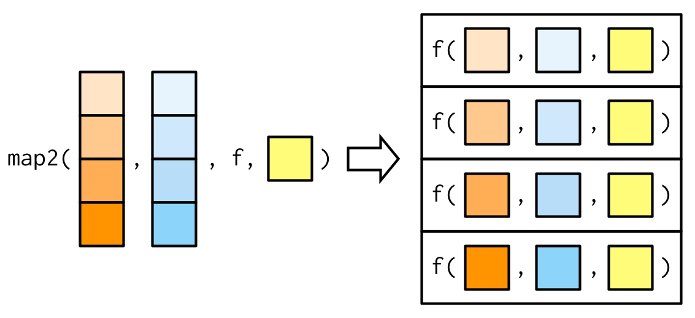

# S3 OOP system
* Object-oriented programming (OOP) is one of the most popular programming paradigm. 
* The type of an object is a **class** and a function implemented for a specific class is a **method**.
* It is mostly used for **polymorphism**: the function interface is separated from its implementation. In other words, the function behaves differently according to the class.
* This is related to the idea of **encapsulation**: the object interface is separated from its internal structure. In other words, the user doesn't need to worry about details of an object. Encapsulation avoids spaghetti code (see [Toyota 2013 case](http://archive.wikiwix.com/cache/index2.php?url=https%3A%2F%2Fwww.usna.edu%2FAcResearch%2F_files%2Fdocuments%2FNASEC%2F2016%2FCYBER%2520-%2520Toyota%2520Unintended%2520Acceleration.pdf)).
* `R` has several OOP systems: S3, S4, R6, ...
* S3 OOP system is the first R OOP system, it is rather informal (easy to modify) and widespread.

---
# Functional programming
* Functional programming is a programming paradigm that generally means writing computer programs by following strict rules, using simple functions (*pure*) that don't change things around (*immutability*, or no side effects).
* Benefits are more maintainable, predictable, and scalable (parallel) code.
* There are several key concepts, including:  
   + *Pure* function: always produces the same output for the same input and has no side effects.
   + *First-class* function: like any other data structure, functions can be passed as arguments to other functions, returned from other functions, and assigned to variables.
   + *Higher-order* function: functions that take one or more functions as arguments or return them as results.

---
# Pure function
* A pure function always produces the same output for the same input.
* Is `rnorm` a *pure* function?
```{r}
set.seed(123)
rnorm(10)
```

---
# Pure function
* A pure function always produces the same output for the same input.
* Is `rnorm` a *pure* function?
```{r}
set.seed(123)
rnorm(10)
set.seed(124)
rnorm(10)
```
* Same input, different output $\Rightarrow$ `rnorm` is not a *pure* function.

---
# First-class function
* A function can be passed as an argument.
```{r}
f <- function(g) g(rnorm(10))
f(sum)
f(max)
f(mean)
```

---
# First-class function
* A function can be returned from other functions.
```{r}
# Define a function that returns another function
makeMultiplier <- function(factor) {
  # Define the inner function
  multiplier <- function(x) {
    return(x * factor)
  }
  # Return the inner function
  return(multiplier)
}

# Create a new function that multiplies by 5
timesFive <- makeMultiplier(5)

# Use the returned function
timesFive(10)
```

- See [Function factories](https://adv-r.hadley.nz/function-factories.html).

---
# First-class function
* A function can be passed as an argument and returned from other functions.

```{r}
# Define a function operator that takes a function as an argument
applyTwice <- function(func) {
  return(function(x) {
    return(func(func(x)))
  })
}

# Define a simple function
addTwo <- function(x) {
  return(x + 2)
}

# Use the function operator to create a new function
applyTwiceAddTwo <- applyTwice(addTwo)

# Apply the new function to a value
applyTwiceAddTwo(3)
```
- See [Function operators](https://adv-r.hadley.nz/function-operators.html).

---
# Functional
- Functionals are frequently used in `R` as a more efficient alternative to `for` loops.
- A `for` loop indicates iteration but not the specific operation to perform on each element whereas functionals are specialized for specific tasks.
- Transitioning from `for` loops to functionals is often a matter of finding a functional that matches the basic structure of the loop.
- If there isn't an appropriate functional, it's advisable to stick with a `for` loop rather than trying to adapt an existing functional.
- After repeating the same loop several times, it might be worth considering creating a custom functional tailored to the task.

---
# Transitioning from `for` loops to functionals

.pull-left[
```{r}
# Using a for loop to calculate the squares of numbers from 1 to n
n <- 5
result <- vector("list", n)
for (i in 1:n) {
    result[[i]] <- i^2
}
result
```
]

.pull-right[
```{r}
# Using a functional approach with map
library(purrr)

sequence <- 1:n
squares <- map(sequence, ~ .^2)
squares
```
]

---
# Transitioning from `for` loops to functionals

.pull-left[
```{r}
# Using a for loop to calculate the sum of numbers from 1 to n
n <- 5
result <- 0
for (i in 1:n) {
  result <- result + i
}
result
```
]

.pull-right[
```{r}
# Using a functional approach with Reduce
sequence <- 1:n
result <- Reduce(function(x, y) x + y, sequence)
result
```
]

---
# `purrr::map()`

.pull-left[
- `map` takes a vector `v` and a function `f` as input and return the evaluation of `f` at each element of `v` in a list.
```{r}
# Using map to calculate the exponential of a vector of numbers
map(1:2, exp)

# Or equivalently 
lapply(1:2, exp)
```
]


.pull-right[

]

---
# Returning atomic vectors
- `map` / `lapply` return a `list`, you may want to return an atomic vector.
- For this task, there exist `map_lgl()`,` map_int()`, `map_dbl()`, `map_chr()` instead of `map`, and `vapply`, `sapply` instead of `lapply`.

.pull-left[
`purrr::map` approach
```{r}
map_dbl(1:4, exp)
```
]

.pull-right[
base `R` approach
```{r}
sapply(1:4, exp)
# Type of output must be specified for `vapply`
vapply(1:4, FUN=exp, FUN.VALUE=double(1))
```
]

---
# Inline anonymous functions
There are situations where the function you would like to pass as an argument does not exist. Instead of creating it, you can pass it as an _inline anonymous function_ (aka _lambda function_).


.pull-left[
`purrr::map` approach
```{r}
map_int(1:4, function(x) if (x %% 2 == 0) return(x^2) else 
  return(x^3))
map_int(1:4, ~ if (.x %% 2 == 0) return(.x^2) else 
  return(.x^3))
```
]

.pull-right[
base `R` approach
```{r}
sapply(1:4, 
       function(x) if (x %% 2 == 0) return(x^2) else 
         return(x^3))
vapply(1:4, 
       FUN=function(x) if (x %% 2 == 0) return(x^2) else 
         return(x^3), FUN.VALUE=double(1))
```
]

---
# Variants to `purrr::map()`
There several variants to `map` in `purrr`. For example `map2` allows for 2 arguments. See [Map variants](https://adv-r.hadley.nz/functionals.html#map-variants) for others.
.pull-left[
`map2` takes two vectors `v1`, `v2` and a function `f` as input, plus some additional arguments, and return the evaluation of `f` at each pair of elements of `v1` and `v2` in a list.
```{r}
# Using map2 to calculate a weighted mean
wt <- c(5,  5,  4,  1)/15
x <- c(3.7,3.3,3.5,2.8)
map2_dbl(x, wt, weighted.mean)
```
]


.pull-right[

]

---
# Variants to `purrr::map()`
- `pmap` generalizes `map` to any number of inputs.  

.pull-left[
```{r}
l1 <- as.list(1:3)
l2 <- as.list(4:6)
l3 <- as.list(7:9)

# Define a function that takes three arguments and calculates their sum
calculate_sum <- function(e1, e2, e3) e1 + e2 + e3

# Use pmap to apply the function element-wise to the lists
pmap(list(l1, l2, l3), calculate_sum)
```
]

.pull-right[

]

---
# Variants to `sapply`
- Similar to `pmap`, `mapply` generalizes `sapply` to any number of inputs.
- There is also `Map`, but it vectorizes over all arguments: it is not possible to supply extra non-vectorized input.

.pull-left[
```{r}
# Using mapply to calculate a weighted mean
wt <- c(5,  5,  4,  1)/15
x <- c(3.7,3.3,3.5,2.8)
mapply(FUN = weighted.mean, x, wt)
```
]
.pull-right[
```{r}
# Using Map to calculate a weighted mean
wt <- c(5,  5,  4,  1)/15
x <- c(3.7,3.3,3.5,2.8)
Map(f = weighted.mean, x, wt)
```
]

---
# `outer` product
- `outer(X, Y, FUN, ...)` produce an array (or matrix) with the same dimension as the outer product of `X` and `Y` applied to a vectorized `FUN`.

```{r}
outer(X = c("a","b","c"), Y = c("1", "2", "3", "4"), FUN = paste0)
```


---
# Common Higher-Order functions in FPL
- *Higher-order* function: functions that take one or more functions as arguments or return them as results.
- `Reduce` employs a binary function `f` to iteratively merge the elements of a provided vector `x`, potentially starting with an initial value `init`.

.pull-left[
```{r}
# Using a functional approach with Reduce
sequence <- 1:10
Reduce(function(x, y) x + y, sequence)

# or shorter
Reduce(`+`, 1:10)
```
]

.pull-right[

]


---
# `R`'s vectorization
- Many functions are already _vectorized_ in `R`.

.pull-left[
```{r}
# Using map to calculate the exponential of a vector of numbers
map(1:2, exp)

# Or equivalently 
lapply(1:2, exp)
```
]
.pull-right[
```{r}
# Exp is already vectorized
exp(1:2)
```
]

---
# Vectorizing a function
- There is a dedicated function `Vectorize` that vectorizes a function.

```{r, error=TRUE}
# return square if even, cube if otherwise
# `purrr::map` approach
map_int(1:4, ~ if (.x %% 2 == 0) return(.x^2) else 
  return(.x^3))

f <- function(x) if (x %% 2 == 0) return(x^2) else 
  return(x^3)
f(1:4)
```

---
# Vectorizing a function
- There is a dedicated function `Vectorize` that vectorizes a function.

```{r}
# return square if even, cube if otherwise
f <- function(x) if (x %% 2 == 0) return(x^2) else 
  return(x^3)
vf <- Vectorize(FUN = f, vectorize.args = "x") #<<
vf(1:4)
```

---
# Vectorizing a function
- There is a dedicated function `Vectorize` that vectorizes a function.

```{r}
# return square if even, cube if otherwise
vf <- Vectorize(FUN = f, vectorize.args = "x")

# `ifelse` is a specific vectorized function
g <- function(x) ifelse(x %% 2 == 0, x^2, x^3)
g(1:4)
```
 
---
# Parallelism 
* Benefits of FP are more maintainable, predictable, and scalable (*parallel*) code.
* Many problems are *embarrassingly parallel*: the task can be split with little (or no) 
efforts into independent parallel subtasks.
* `R`'s library `parallel` comes with your `R` installation and offers several parallelized version of the different `apply` functions.

```{r}
# how many cores on the current host?
library(parallel)
detectCores()
```
- This is not physical cores but rather the total number of threads. In short, Hyper Threading allows a physical Core to work on different thread simultaneously.

---
# Forking with `mclapply`
- `mclapply` is a parallelized version of `lapply` that uses forking. (There are also `mcMap` and `mcmapply`).
- Forking is the Unix-based (might not work on Windows) process of creating new child process, which is an identical copy of the parent process, allowing for concurrent execution of multiple tasks.

```{r}
measure_time <- function(x){
  t1 <- Sys.time()
  Sys.sleep(x)
  t2 <- Sys.time()
  difftime(t2,t1,units="secs")
}
```

---
# Forking with `mclapply`
```{r mcapply}
t1 <- Sys.time()
mclapply(1:5, measure_time, mc.cores = 5)
t2 <- Sys.time()
sprintf("In total, it took %.1f seconds to run", difftime(t2,t1,units="secs"))
```


---
# Building a Socket Cluster with `parLapply`
- A socket enables interprocess communication between concurrent applications running on the computer. This is an alternative to forking mechanism.
```{r parLapply}
cl <- makeCluster(5)
t1 <- Sys.time()
parLapply(cl, 1:5, measure_time)
t2 <- Sys.time()
```

---
# Building a Socket Cluster with `parLapply`
```{r}
stopCluster(cl)
sprintf("In total, it took %.1f seconds to run", difftime(t2,t1,units="secs"))
```


---
class: sydney-blue, center, middle

# Question ?

.pull-down[
<a href="https://ptds.samorso.ch/">
.white[`r icons::fontawesome("file")` website]
</a>

<a href="https://github.com/ptds2023/">
.white[`r icons::fontawesome("github")` GitHub]
</a>
]

---
# Exercise
You work for a retail company, and you have a list of products with their daily sales for each day of the month. 
```{r, eval=FALSE}
product_sales <- list(
  product1 = c(50, 45, 60, 55, 70, 80, 75, 90, 85, 60, 70, 65, 70, 75, 80, 85, 90, 95, 85, 70, 75, 80, 60, 45, 55, 50, 45, 60, 65),
  product2 = c(30, 35, 40, 45, 50, 55, 60, 65, 70, 75, 80, 85, 90, 95, 100, 105, 110, 115, 120, 125, 130, 135, 140, 145, 150, 155, 160, 165, 170, 175),
  product3 = c(20, 22, 24, 26, 28, 30, 32, 34, 36, 38, 40, 42, 44, 46, 48, 50, 52, 54, 56, 58, 60, 62, 64, 66, 68, 70, 72, 74, 76, 78)
)
```

1. Using a for loop, calculate the total monthly sales for each product.
2. Repeat 1. using `map`.
3. Repeat 1. using `lapply`.
4. Repeat 1. using `sapply`.
5. Repeat 1. using `vapply`.
6. Repeat 1. using `mclapply` or `parLapply`.

---
# To go further
* See [Functionals](https://adv-r.hadley.nz/functionals.html), [Function factories](https://adv-r.hadley.nz/function-factories.html) and [Function operators](https://adv-r.hadley.nz/function-operators.html) chapters of [Advanced R](https://adv-r.hadley.nz/index.html) written by H. Wickham.
* See [`purrr` cheatsheet](https://maraaverick.rbind.io/banners/purrr_apply_cheatsheet_rstudio.png).
* See [Loop Functions](https://bookdown.org/rdpeng/rprogdatascience/loop-functions.html) and [Parallel Computation](https://bookdown.org/rdpeng/rprogdatascience/parallel-computation.html) chapters of [R Programming for Data Science](https://bookdown.org/rdpeng/rprogdatascience/) written by R.D. Peng.
* The article [Cleaner R Code with Functional Programming](https://towardsdatascience.com/cleaner-r-code-with-functional-programming-adc37931ef7a) by Tim Book.
