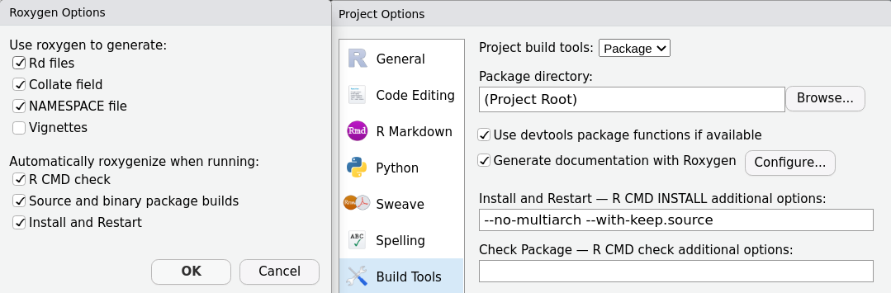
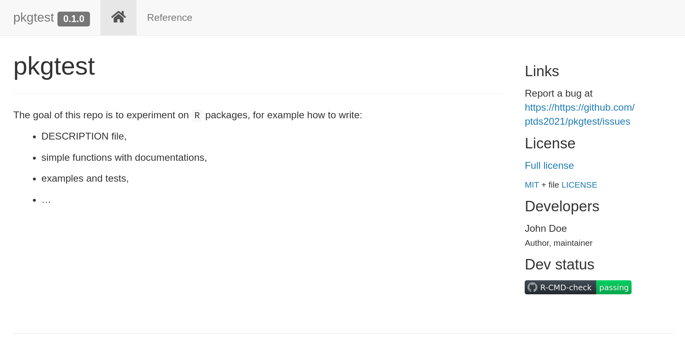

# Why making an R package?
* Distributing code with other users. It encourages to write documentation.
* Forces to follow strict coding convention and work processes.
* Stability of the code with longer term maintenance and testing.
* Ease of use when accumulating many functions.

---
# Setup
* You will need (at least) the following packages:
```{r,eval=FALSE}
install.packages(c("devtools", "knitr", "pkgdown", "roxygen2", "testthat"))
```

* Make sure your system is ready!
```{r}
devtools::has_devel()
```
(otherwise visit <https://r-pkgs.org/setup.html>)

---
class: sydney-blue, center, middle

# Demo

---
# DESCRIPTION file
* DESCRIPTION contains metadata of your package (authors, description, dependencies, contact, ...)
* It should look like
```{r, eval=F}
Package: pkgtest
Type: Package
Title: What the Package Does (Title Case)
Version: 0.1.0
Authors@R: person("John", "Doe", email = "john.doe@example.com",
                  role = c("aut", "cre"))
Maintainer: The package maintainer <yourself@somewhere.net>
Description: More about what it does (maybe more than one line)
    Use four spaces when indenting paragraphs within the Description.
License: MIT + file LICENSE
Encoding: UTF-8
LazyData: true
URL: https://https://github.com/ptds2023/pkgtest
BugReports: https://https://github.com/ptds2023/pkgtest/issues
RoxygenNote: 7.1.2
```

---
* Use the `person` function for `Authors@R`, role includes:
  a. `"cre"`: (creator) for package maintainer;
  b. `"aut"`: (author) those who made substantial contributions to the package;
  c. `"ctb"`: (contributor) those who made smaller contribution;
  d. `"cph"`: (copyright holder) used for legal name for an institution or corporate body.
* `License`: since the point of a package is to be distributed to others, you need to [choose a licence](https://choosealicense.com/licenses/). For example, [MIT](https://choosealicense.com/licenses/mit/) is permissive and can be called
```{r,eval=FALSE}
usethis::use_mit_license()
```

---
# Dependencies
* DESCRIPTION lists all the packages needed for your package to work.
* `Depends` specifies the version of `R`; e.g.
```{r,eval=FALSE}
Depends: R (>= 4.0.0) # don't forget the space!
```
* `Imports` lists the package that must be present (best practice is to write `pkg::fct()`); for example, suppose you need `ggplot2` and `dplyr`
```{r,eval=FALSE}
Imports:
    dplyr (>= 1.1.2),
    ggplot2 (>= 3.4.3)
```
Versioning ensures that users have the right version of the package.

* `Suggests` lists packages that can be used (for vignettes, test, datasets,...) but are not required.


---
# Documenting your package
* Documentation appears in the `man/` (manual) subfolder as `*.Rd` files.
* We will generate documentation automatically using `roxygen2`.
* You can either use `devtools::document()` or maybe simpler
```{r,echo=FALSE,fig.align='center'}

```


---
* It uses the syntax `#'` with tags `@` and is placed right before functions, e.g.
```{r,eval=FALSE}
#' @title hello world function
#' @return print a message
#' @export
hello <- function() {
  print("Hello, world!")
}
```
* Main tags should for functions are `@title`, `@param`, `@author`, `@seealso`, `@details`, `@examples`, `@return` (click [here](https://r-pkgs.org/man.html) for more details)
* **All** functions should be documented. **Some** should be exported (`#' @export`)
* **Do repeat yourself**

---
.pull-left[
```{r,echo=F,fig.align='center'}
knitr::include_graphics("images/pkgtest_hello_world.png")
```
]
.pull-right[
```{r,eval=FALSE}
#' `@title` hello world function
#' `@author` John Doe
#' `@details`
#' A super fancy function to print Hello World!
#' `@return` print a message
#' `@examples`
#' \dontrun{hello()}
#' `@export`
hello <- function() {
  print("Hello, world!")
}
```
]

---
# Adding data
* It is common to add data to a package.
* Data should be placed in `data/` folder.
* It is recommended to add data in the form of `*.rda` file.
* Easiest way to achieve that is using the command `usethis::use_data()`

---
# Data preparation
* Most of the data you will want to add is not in the `*.rda` format.
* You may have some raw data that will require some manipulation prior to obtaining the final clean data that will be made available to users.
* It is highly recommended to keep the raw data and the code used for data wrangling. 
* Easiest way to achieve that is by using the command `usethis::use_data_raw()`, it creates a new folder `data-raw/` which is added to `.Rbuildignore`.

---
# R Packages, Hadley Wickham and Jenny Bryan
[8.2.1 Preserve the origin story of package data](https://r-pkgs.org/data.html#sec-data-data-raw)
> ggplot2: A cautionary tale
> 
> We have a confession to make: the origins of many of ggplot2's example datasets has been lost in the sands of time. In the grand scheme of things, this is not a huge problem, but maintenance is certainly more pleasant when a package's assets can be reconstructed de novo and easily updated as necessary.

---
# A simple example
* Suppose you want to make the `snipes.csv` data available to the users.
* One straightforward way to achieve that is with this code:
```{r, eval=F}
## code to prepare `snipes.csv` dataset
snipes <- read.csv(file = "data-raw/snipes.csv")
usethis::use_data(snipes, overwrite = TRUE)
```
* The code is placed in `data-raw/` folder and kept for future usage (but omitted from package building).

---
# Documenting dataset
* There are two tags useful for documenting a dataset: 
* `@format` provides an overview of the dataset,
* `@source` gives details on where the data was obtained.
```{r, eval=FALSE}
#' Snipes price data
#'
#' @format ## `snipes`
#' A data frame with 48 rows and 3 columns:
#' \describe{
#'   \item{discount}{Discounted price of sneakers}
#'   \item{brand}{Brand of sneakers}
#'   \item{price}{Original price of sneakers}
#' }
#' @source <https://www.snipes.ch/>
"snipes"
```

---
# `.Rbuildignore`
* `.Rbuildignore` is the analog of `.gitignore` for `R` package: it is where you can specify files and folders that should be ignored when building a package. 
```{r, eval=FALSE}
^.*\.Rproj$
^\.Rproj\.user$
^LICENSE\.md$
^\.github$
^data-raw$
```

---
# Vignettes
* A vignette is a RMarkdown document that provides more insights into your package.
* Simply call `usethis::use_vignette("my-vignette")` to create `my-vignette`.
* Add required packages in DESCRIPTION under `Suggests`

---
# Namespace
> Writing R extension, [Sec. 1.5](https://cran.r-project.org/doc/manuals/r-release/R-exts.html#Package-namespaces)
>
> The namespace controls the search strategy for variables used by functions in the package. If not found locally, R searches the package namespace first, then the imports, then the base namespace and then the normal search path (so the base namespace precedes the normal search rather than being at the end of it).

* NAMESPACE is generated automatically by `roxygen2`

---
# Testing with examples
* Testing ensures that your code is good and pays-off in the long-run.
* Examples are good way to make sure the function work and are displayed to the user.
* You can put more complex examples in `inst/examples/my_example.R` and test it using `@example inst/examples/my_example.R`

---
# Example
In `R/`
```{r,eval=FALSE}
#' @title Compute regression coefficients
#' @param x design \code{matrix}
#' @param y \code{vector} of responses
#' @details
#' Compute the regression coefficients using \link[stats]{lm}.
#' @importFrom stats lm coef
#' @seealso \code{\link[stats]{lm}}, \code{\link[stats]{coef}}
#' @example /inst/examples/eg_reg_coef.R
#' @export
`%r%` <- function(y, x) {
  fit <- lm(y ~ x)
  coef(fit)
}
```

In `/inst/examples/eg_reg_coef.R`
```{r,eval=FALSE}
## linear regression
cars$speed %c% cars$dist
```

---
If you click on `check`

```{r,echo=FALSE,out.width=606,out.height=505}

```

---
Now suppose there is a mistake in the code, for instance in `/inst/examples/eg_reg_coef.R`
```{r,eval=FALSE}
## linear regression
cars$speed %c% cars
```
```{r,echo=FALSE,out.width=600,out.height=500}

```

---
# Testing with `testthat` 
* Examples help to detect errors in the code, but their primary goals is informative for the users.
* Examples are displayed to the users and concerns final end functions.
* It is good practice to have broader and automated tests.
* We are going to use `testthat`. Simply call `usethis::use_testthat()`.
* When should you test a function?
> Whenever you are tempted to type something into a print statement or a debugger expression, write it as a test instead. — Martin Fowler

---
# Structure of `testthat`
* `testthat` is organised hierarchically:
1. An **expectation**: it is a single test using `expect_some_fct`, these are functions that test an expression and throw an error if the result disagree with what was expected.
2. A **test**: regroup one or several **expectations** and is created with `test_that`.
3. A **test file**: regroup one or several **test**. It is an `R` file and its name and structure conventions follows this example: `tests/testthat/test_something.R`.

---
For example, the file `tests/testthat/test_reg_coef.R`

```{r,eval=FALSE}
test_that("regression coefficient input check",{
  expect_error(cars$speed %r% cars)
})

test_that("regression coefficient output",{
  expect_type(cars$speed %r% cars$dist, "double")
})
```

---
# Automated checking
* It is not because you and your team does not experiment any bug that everything is okay.
* `R` users have different configurations, different OS.
* It is good practice to use GitHub actions: every time you push changes to the main repo, GitHub launches some action according to your spec.
* To begin with, use `usethis::use_github_action_check_standard()`
* More examples are displayed at <https://github.com/r-lib/actions/tree/master/examples>

---
and if everything passes
```{r,echo=FALSE}

```

---
# pkgdown

* It is quick and automated way to create a website around your package.
* To build your first website, this is as simple as
```{r,eval=FALSE}
# Run once to configure your package to use pkgdown
usethis::use_pkgdown()
# Run to build the website
pkgdown::build_site()
```
* It is also a good idea to add a Github action:
```{r,eval=FALSE}
usethis::use_github_action("pkgdown")
```
* Checkout <https://pkgdown.r-lib.org/> for more details.

---
```{r,echo=FALSE,fig.align='center'}

```

---
Find all the code presented here: <https://github.com/ptds2023/pkgtest>

---
# To go further
* More details and examples in the book [An Introduction to Statistical Programming Methods with R](https://smac-group.github.io/ds/section-r-packages.html)
* More material and details in [R Packages](https://r-pkgs.org/).
* A lot of details (really!) in [Writing R extension](https://cran.r-project.org/doc/manuals/r-release/R-exts.html#Creating-R-packages)

---
class: sydney-blue, center, middle

# Question ?

.pull-down[
<a href="https://ptds.samorso.ch/">
.white[`r icons::fontawesome("file")` website]
</a>

<a href="https://github.com/ptds2023/">
.white[`r icons::fontawesome("github")` GitHub]
</a>
]

---
# Exercise
* Create a package from RStudio new project with the following function:
  ```{r, eval=FALSE}
`%r%` <- function(y, x) {
  fit <- lm(y ~ x)
  coef(fit)
}
```
* Modify the DESCRIPTION: add an author, a license, dependencies, ...
* Document the function using roxygen2 (verify your `Build tools` options).
* Create and add a `snipes` dataset from HW3 to the package (keep the raw data, create a `.rda` file, document the dataset).
* Construct a vignette.
* Add examples on how to use the function.
* Add tests with `testthat`.

---
* Add automated check with GitHub action.
* Create a website with `pkgdown` and add a GitHub action to build the website.
