# Modularizing Shiny
<blockquote>
Modules are one of the most powerful tools for building shiny applications in a maintainable and sustainable manner.
.right[<cite>Engineering Production-Grade Shiny Apps</cite>]
</blockquote> 

---
# Motivations
* When your code grows in complexity, it is convenient to use a *divide and conquer* strategy by writing small pieces of code into functions.
* It makes the code more readable and small pieces are easier to inspect/fix.
* It allows parts of the code to be reusable. A good rule of thumb is: "*if you copy and paste something more than twice, you should make a function*".

---
# Motivations
* In Shiny, functions don't fully address the problem since **IDs are global**: each ID must be unique!
* Shiny **modules** create small namespaces where IDs can be safely defined  without conflicting with other IDs in the app.

---
# Namespace
* Every environment has a parent, which varies according to the order in which packages are loaded.
* Suppose that we load a package that includes a function `var`, would the following function behaves as intended by their programmer? 
```{r, eval=F}
> sd
function (x, na.rm = FALSE) 
sqrt(var(if (is.vector(x) || is.factor(x)) x else as.double(x), #<<
    na.rm = na.rm)) 
<bytecode: 0x561216821400>
<environment: namespace:stats>
```

---
# Namespace
* Fortunately, yes.
* The goal of namespaces is to ensure that every package works the same way regardless of what package has been attached.
* The package environment is the external interface to a package, it provides only function that are exported.
* The namespace is the internal interface to a package. It controls how the function finds its variables.

---
# Namespace
* Each namespace has an imports environment controlled by the package developer (see previous lecture).
* The parent of the imports environment is the base namespace.
* The parent of the base namespace is the global environment.

---
# Simple example
```{r, eval=FALSE}
# Shiny App
library(shiny)

ui <- fluidPage(
  selectInput("var", "Variable", names(mtcars)),
  numericInput("bins", "bins", 10, min = 1),
  plotOutput("hist")
)
server <- function(input, output, session) {
  data <- reactive(mtcars[[input$var]])
  output$hist <- renderPlot({
    hist(data(), breaks = input$bins, main = input$var)
  }, res = 96)
}
# Run the application 
shinyApp(ui = ui, server = server)
```
* As an app, one usually creates a pair of UI and server modules.

---
# UI module
```{r,eval=FALSE}
histogramUI <- function(id) {
  # This ns <- NS structure creates a 
  # "namespacing" function, that will 
  # prefix all ids with a string
  ns <- NS(id) #<<
  tagList(
    selectInput(ns("var"), "Variable", choices = names(mtcars)),
    numericInput(ns("bins"), "bins", value = 10, min = 1),
    plotOutput(ns("hist"))
  )
}
```
* The UI code is inside a function with `id` argument.
* There are two new things: 
  1. `ns <- NS(id)` creates a *namespacing* function.
  2. All `inputId` are now wrapped in `ns(inputId)`.
* You return a `htmltools::tagList`, a `list()` of HTML tags, instead of a `fluidPage` for example. It's a fragment that could be combined with other fragments in the app.

---
# Server module
```{r, eval=FALSE}
histogramServer <- function(id) {
  moduleServer(id, function(input, output, session) {
    data <- reactive(mtcars[[input$var]])
    output$hist <- renderPlot({
      hist(data(), breaks = input$bins, main = input$var)
    }, res = 96)
  })
}
```
* The server code is inside the `moduleServer` function, itself inside a function with (at least) the `id` argument.
* We have `moduleServer(id, module, session = getDefaultReactiveDomain())` where `module` is the *usual* server function.

---
# Back to the app
```{r,eval=FALSE}
# Main application
ui <- fluidPage(
  histogramUI("hist1")
)
server <- function(input, output, session) {
  histogramServer("hist1")
}
# Run the application 
shinyApp(ui, server) 
```
* Note that you need to use the same `id` in `histogramUI` and `histogramServer`.
* The application looks much simpler, and you could imagine adding as many modules as you like. 

---
# Namespacing in Shiny
* For UI module, the namespacing is explicit with calls to `ns <- NS(id)` and `ns(inputId)`.
* For server module, the namespacing is implicit. Shiny automatically namespaces input and output following the same convention as UI module.
* In the following example, the `input$bins` from the `sliderInput` is never used, even though it "appears" in the server module.
```{r,eval=FALSE}
# Recall server function has this line:
...
hist(data(), breaks = input$bins, main = input$var)
...

# Main app
ui <- fluidPage(
  histogramUI("hist1"),
  sliderInput("bins", "Another bins:",0,10,5)
)
server <- function(input, output, session) {
  histogramServer("hist1")
}
# Run the application 
shinyApp(ui, server)
```

---
# Communication between modules
* Very often, you will need to share data among modules.
* A common approach is to return a `reactive()` from a module, and pass it as an argument to another module. 

---
# Example
```{r,eval=FALSE}
# New server module
histogramServer <- function(id, data, title = reactive("Histogram")) { #<<
  stopifnot(is.reactive(data))
  moduleServer(id, function(input, output, session) {
    output$hist <- renderPlot({
      hist(data(), breaks = input$bins, main = title())
    }, res = 96)
  })
}

ui <- fluidPage(
  histogramUI("hist1")
)
server <- function(input, output, session) {
  data <- reactive(mtcars$mpg) #<<
  histogramServer("hist1", data)
}
# Run the application 
shinyApp(ui, server)
```

.bottom[See <https://mastering-shiny.org/scaling-modules.html#inputs-and-outputs> for a more complete example]

---
# Communication between modules
* This approach becomes hard to maintain with a lot of reactive function calls.
* An alternative is the ["stratégie du petit r"](https://engineering-shiny.org/structuring-project.html#b.-the-strat%C3%A9gie-du-petit-r): a global `reactiveValues` list is created and passed to along modules.
* Another alternative is the ["stratégie du grand R6"](https://engineering-shiny.org/structuring-project.html#c.-the-strat%C3%A9gie-du-grand-r6), which is similar, but uses [R6 object-oriented programming](https://adv-r.hadley.nz/r6.html).
* See also [tidymodules](https://opensource.nibr.com/tidymodules/articles/tidymodules.html) based on R6 OOP.

---
# Structuring your application
* It is highly recommended to structure an application as a package.
* Benefits are multiple: structure, documentation, tests, deployment, work flow, check, ...
* The idea is similar to a `R` package: `R` functions and modules are documented, tested and go into `R/`.
* The app is wrapped into a function, for example:
```{r, eval=FALSE}
# Run the application
#' @title App for bacteria mobility
#' @importFrom shiny shinyApp
#' @export
run_app <- function(...){
  shinyApp(ui = ui, server = server, ...)
}
```
* See <https://github.com/ptds2022/bacteria> for a minimal example.

---
# Exercise
* (from last week) Develop a Shiny app with two tabs: the first to draw an histogram and the second to report summary statistics. Inputs are: number of cells, label for x-axis, title for the graph and an action button.
* Using the `mtcars` dataset, allow the user to select a variable.
* Rewrite the app using Shiny modules.
* Structure the app into a package.

---
class: sydney-blue, center, middle

# To go further

---
# `{golem}`
```{r,echo=FALSE,fig.align='center'}
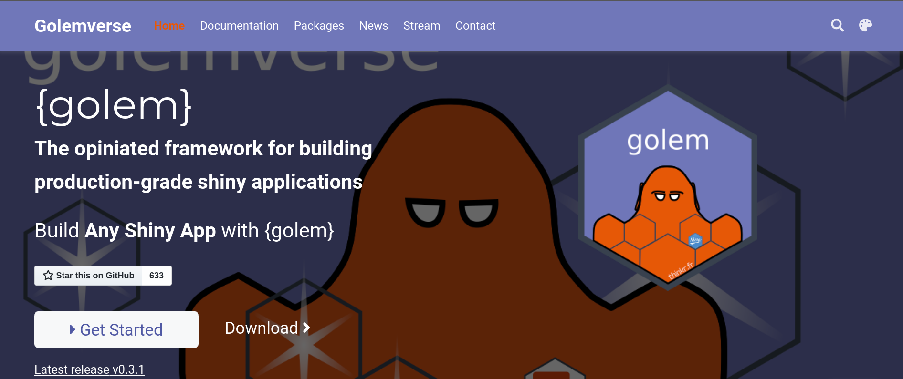
```

---
# `{golem}`
* A `{golem}` application is a R package.
* Everything you know about package development can be applied to `{golem}`.
* A `{golem}` app works better with Shiny modules.

---
# `{golem}` structure
* A `{golem}` application is a R package, so you find the usual files and folders.
* Create a `{golem}` application using `New project... > Package for Shiny App using golem`.
* `R/` contains several default files. This is where you create the different modules.
* `dev/` contains a series of files that can be useful for the project development.
* `inst/app/www/` contains all files made available to the application at run time (CSS, JavaScript,...).

---
# `golem-config`
* `{golem}` uses [config](https://github.com/rstudio/config) to manage environment specific configuration values. 
* There are two ways `{golem}` app are configured:
  1. Runtime configuration using the `golem_opts` in `run_app()`. It is convenient for testing.
  2. Backend configuration using the `inst/golem-config.yml` file. It is convenient for VCS and deployment.

.bottom[Checkout golem [cheatsheet](https://thinkr.fr/golem_cheatsheet_v0.1.pdf)]

---
# Naming convention in `{golem}`
<blockquote>
Using a convention allows everyone to know where to look when <b>debugging</b>, <b>refactoring</b>, or <b>implementing new features</b>.
.right[<cite>Engineering Production-Grade Shiny Apps</cite>]
</blockquote> 

---
# Refactoring

A simple system with input and output
```{r,fig.align='center',echo=FALSE,out.width=640,out.height=160}
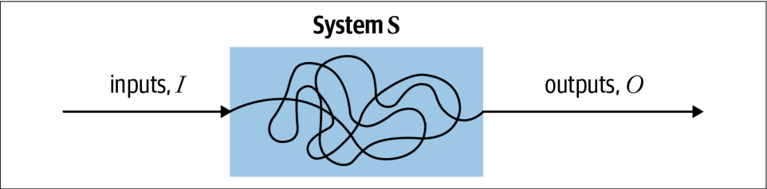
```

A simple **refactored** system with input and output 
```{r,fig.align='center',echo=FALSE,out.width=640,out.height=160}
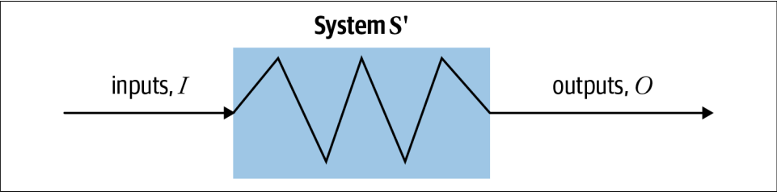
```

.bottom[
Source: Lemaire, Maude. 2020. [*Refactoring at Scale*](https://learning.oreilly.com/library/view/refactoring-at-scale/9781492075523/)
]

---
# Naming convention in `{golem}`
* `app_*` (`app_ui.R`, `app_server.R`) contain the top-level functions defining user interface and server function.
* `fct_*` contain general functions that can be used by several modules.
* `mod_*` contain unique modules.
* `utils_*` contain utilities: small helper functions.
* `*_ui_*` and `*_server_*` refer to UI or server specific, e.g. `utils_ui.R` contains utilities specific for UI.

.bottom[
See for example the [`{hexmake}`](https://github.com/ColinFay/hexmake/tree/master/R) Shiny App.
]

---
# Save development time with snippets
```{r,echo=FALSE,fig.align='center',out.height=500,out.width=500}
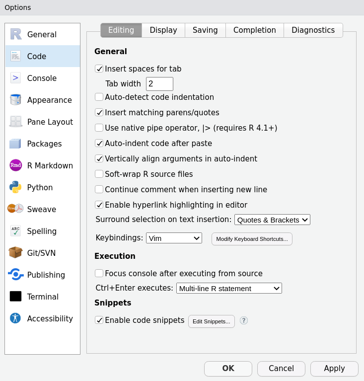
```
---
# Save development time with snippets
```{r,echo=FALSE,fig.align='center',out.height=500,out.width=750}
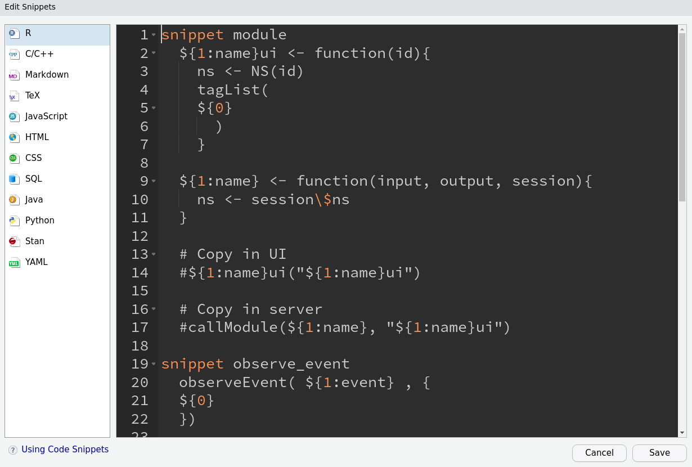
```

---
# Save development time with `{shinysnippets}`
* You can install `{shinysnippets}` from GitHub:
```{r,eval=FALSE}
remotes::install_github("Thinkr-open/shinysnippets")
```
* Then run:
```{r,eval=FALSE}
shinysnippets::add_snippets()
```
and confirm.

&nbsp;

.bottom[
See also [RStudio article](https://support.rstudio.com/hc/en-us/articles/204463668-Code-Snippets?version=2021.09.1%2B372&mode=desktop)   
]
---

```{r,echo=F,fig.align='center'}
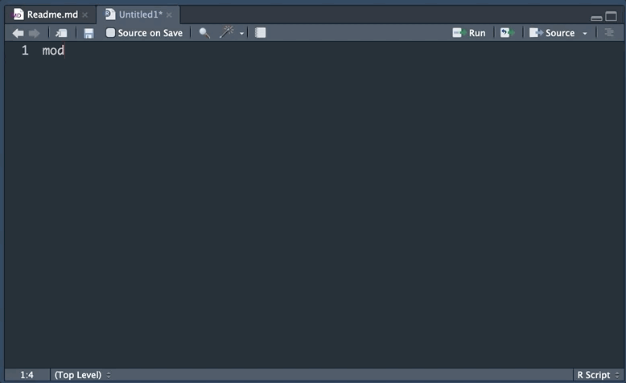
```

---
# Performance: identify the bottleck
```{r,echo=F,fig.align='center',out.height=300,out.width=600}
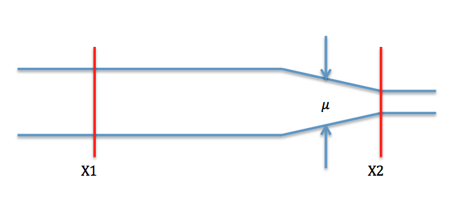
```


<blockquote>
This bottleneck is the very thing you should be optimizing: having faster code anywhere else except this bottleneck will not make your app faster: you will just make your app reach the bottleneck faster, but there will still be this part of your app that slows everything down.
.right[<cite>Engineering Production-Grade Shiny Apps</cite>]
</blockquote>

---
# Profiling Shiny App
* A good way to profile R code is to use the [profvis](https://rstudio.github.io/profvis/) package.
* For a Shiny App, you could use simply use it as follows:
```{r,eval=FALSE}
# Note the explicit call to runApp() here: this is important
# as otherwise the app won't actually run.
profvis::profvis(runApp(shinyApp(ui, server)))
```

---
# Example
```{r,eval=FALSE}
library(profvis)

f <- function() {
  pause(0.2)
  g()
  10
}
g <- function() {
  pause(0.1)
  5
}
profvis::profvis(f())
```
```{r,echo=FALSE,fig.align='center',out.height=240,out.width=800}
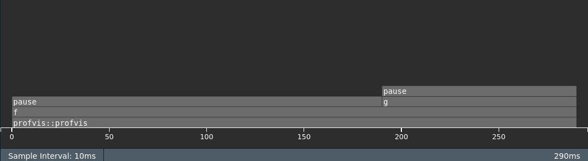
```


---
# Example
```{r,eval=FALSE}
library(shiny)
ui <- fluidPage(
  actionButton("x", "Click on me"),
  textOutput("y")
)
server <- function(input, output, session) {
  output$y <- eventReactive(input$x, f())
}
profvis::profvis({runApp(shinyApp(ui, server))})
```

---
```{r,echo=FALSE,fig.align='center'}
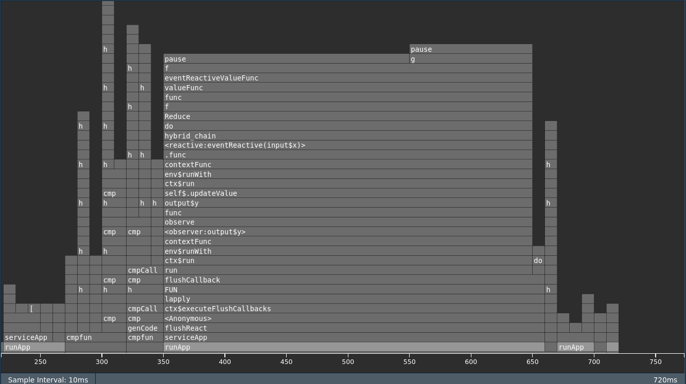
```

---
* Much more processes are involved and it becomes not so easy to read.
* `f()` and `g()` calls are called by an event reactive handler.
* The profiling is performed locally, so it does not necessarily reflected on how the typical user experience.
* Nowadays, more than half of all the web traffic comes from smartphone.
* See <https://mastering-shiny.org/performance.html#profiling-a-shiny-app> for more details
* See [RStudio article](https://rstudio.github.io/profvis/examples.html#example-3---profiling-a-shiny-application) for other examples

---
# Profiling UI with Google Lighthouse

* [Google Lighthouse](https://developers.google.com/web/tools/lighthouse) allows to perform a profiling from the user's perspective via Google Chrome web browser.
* To use this tool:
  1. Open Chrome-based browser in incognito mode (so the experience is as neutral as possible).
  2. Enter the Shiny App url.
  3. Open the `Developer tools`.
  4. Click on `Lighthouse`.
  5. Click on `Generate report`.

---
```{r,echo=FALSE}
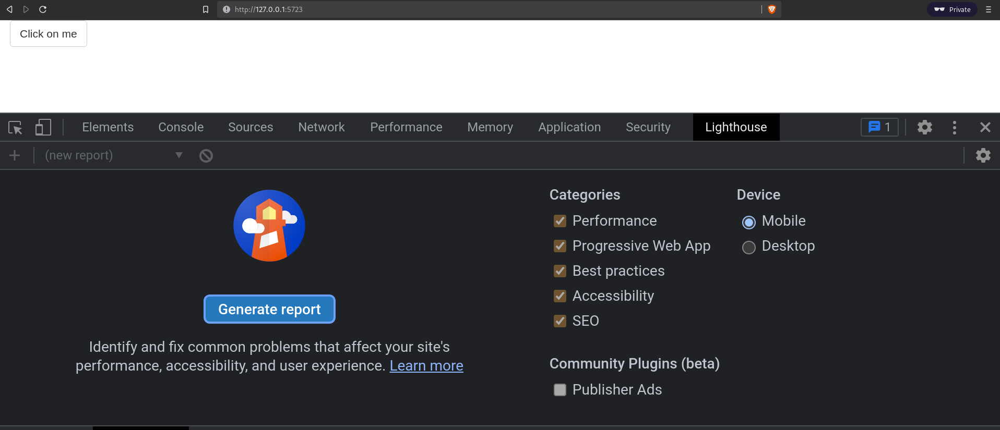
```
---
```{r,echo=FALSE}
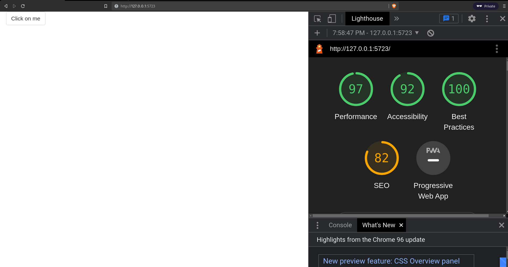
```

---
# Key audit measures
* You can use the report to enhance your application.
* Performance: measure the time for rendering a page. Unfortunately, "opportunities" are not always possible to address as you depend on `Shiny`.
* Accessibility: it relates to UI: some tests are performed to make sure the application is universally accessible (see Accessibility chapter [here](https://engineering-shiny.org/ux-matters.html#web-accessibility)).
* Best Practices: it tests some misc best practices around web applications.
* SEO (Search Engine Optimization): it tests how the application performs in terms of search engine.

.bottom[
Other sources:
* <https://web.dev/why-speed-matters/>
* <https://web.dev/learn/#lighthouse>
* <https://developer.mozilla.org/en-US/docs/Web/Performance>
]

---
# This lecture was prepared using
* Chapters 3 to 5 and 14 of [Engineering Production-Grade Shiny Apps](https://engineering-shiny.org/index.html)
* Chapters 17 to 23 of [Mastering Shiny](https://mastering-shiny.org/index.html)
* RStudio articles [Modularizing Shiny app code](https://shiny.rstudio.com/articles/modules.html)

---
# To go further
* Checkout other Chapters of [Engineering Production-Grade Shiny Apps](https://engineering-shiny.org/index.html) and [Mastering Shiny](https://mastering-shiny.org/index.html)
* Refer to the [Golemverse](https://golemverse.org/)
* Checkout [shinymodules](https://github.com/Novartis/tidymodules)
* Become an expert of UI following [Outstanding User Interfaces with Shiny](https://unleash-shiny.rinterface.com/index.html)

---
class: sydney-blue, center, middle

# Question ?

.pull-down[
<a href="https://ptds.samorso.ch/">
.white[`r icons::fontawesome("file")` website]
</a>

<a href="https://github.com/ptds2023/">
.white[`r icons::fontawesome("github")` GitHub]
</a>
]

---
# Exercise
1. Create a `{golem}` application project.
2. For the UI:   
  a. a user should input a tibble,   
  b. a user should select two columns from the columns names,   
  c. a user should see a plot with the two selected columns as an output.   
3. Write the UI and backend using shiny modules and respect the `{golem}` conventions.
4. Use everything you know from package development (tests, documentation, check, ...).
5. Profile your app with Google Lighthouse.