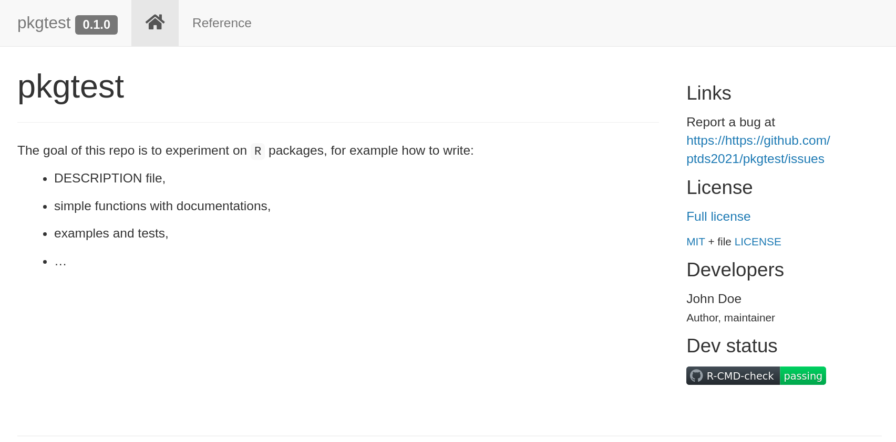
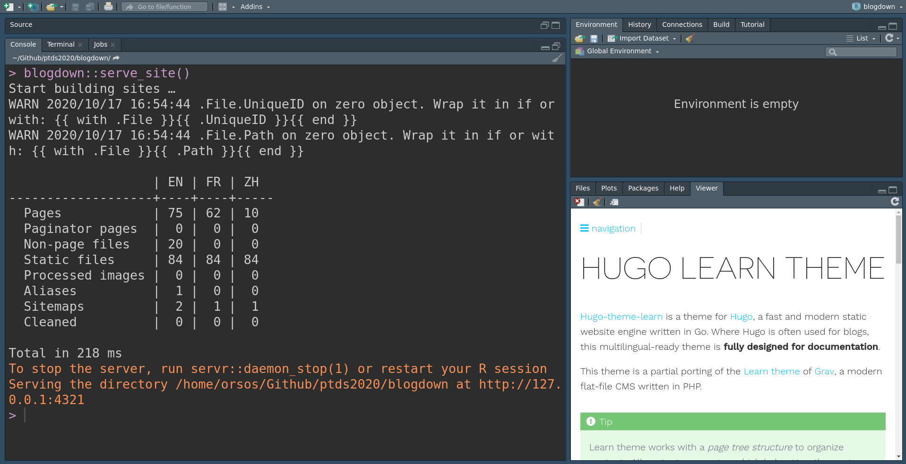
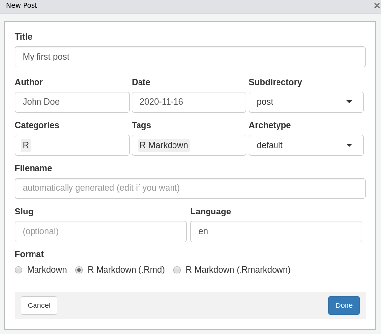
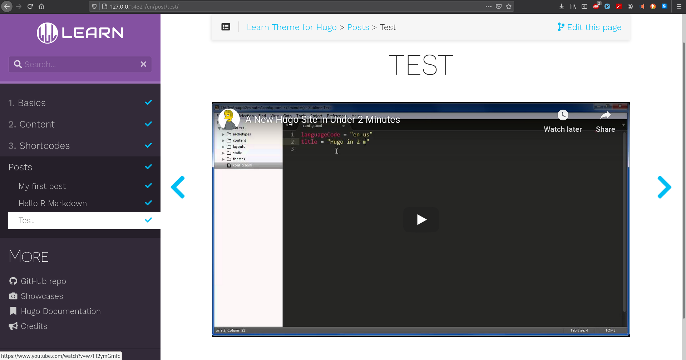

# Website with R
* Website is a good way to showcase your work.
* RStudio provides a nice set of tools to quickly build a website.

---
# Setup
* For this class, you will need (at least) the following packages:
```{r,eval=FALSE}
install.packages(c("pkgdown", "blogdown"))
```
* Check that your package version is up-to-date
```{r}
packageVersion("blogdown")
blogdown::hugo_available()
blogdown::hugo_version()
```


---
# pkgdown

* It is quick and automated way to create a website around your package.
* To build your first website, this is as simple as
```{r,eval=FALSE}
# Run once to configure your package to use pkgdown
usethis::use_pkgdown()
# Run to build the website
pkgdown::build_site()
```
* It is also a good idea to add a Github action:
```{r,eval=FALSE}
usethis::use_github_action("pkgdown")
```
* Checkout <https://pkgdown.r-lib.org/> for more details.

---
```{r,echo=FALSE,fig.align='center'}

```

---
# blogdown

* [blogdown](https://bookdown.org/yihui/blogdown/) offers a more flexible way to create a website.
* It is based on the static site generator [Hugo](https://gohugo.io/).
```{r,echo=FALSE,fig.align='center',out.width=600,out.height=400}

```

---
# Static vs dynamic
* **dynamic website generator**: when a user visit a website and a HTTP server generates a HTML file that is sent to the browser to be viewed.
* This is resource consuming, and over time HTML pages started to be cached.
* **static website generator**: all HTML files are rendered and cached locally (could be a server), before being sent to a HTTP server.
* It translates into high performance.

---
# Getting started
Create a new project selecting `Website using blogdown`. 

```{r, echo = FALSE,fig.align='center',out.height=300,out.width=400}
    knitr::include_graphics("images/bg_new_project.png")
```

---
# Choosing a theme
* The choice of a theme is essential: themes have different ways to create content, structures, features and provide more or less user documentation.
* A list of themes is at <https://themes.gohugo.io/>.
* By default, `blogdown` proposes the simple [hugo-lithium](https://github.com/yihui/hugo-lithium) theme.
* [Learn](https://themes.gohugo.io/hugo-theme-learn/): it is a great theme to start with.
* [Academic](https://themes.gohugo.io/academic/): this a very complete theme.
* [Tranquilpeak](https://themes.gohugo.io/hugo-tranquilpeak-theme/): a beautiful and neat theme for blogging.

---
* You need to specify under `Hugo theme:` the `USER_NAME/REPOSITORY_NAME` from the GitHub repository of the theme. 
* For example, the `Learn` theme is at <https://github.com/matcornic/hugo-theme-learn> so we enter:

```{r, echo = FALSE,fig.align='center',out.height=300,out.width=400}
    knitr::include_graphics("images/bg_theme.png")
```

---
# Rendering the website
* Since Hugo is a static website generator, you can render it live locally.
```{r, eval=FALSE}
blogdown::serve_site()
```

Or alternatively, use directly the `Rstudio` `Addins`.

```{r, echo = FALSE,fig.align='center'}
knitr::include_graphics("images/bg_addins1.png")
```

---
* It creates the website in the viewer panel.

```{r, echo = FALSE,fig.align='center'}

```

* To stop the rendering
```{r, eval = FALSE}
blogdown::stop_server()
```

---
# Creating content 
* You need to decide whether you want to create a plain Markdown document (`.md`) or a RMarkdown document (`.Rmd`) as there are noticeable differences.
* A good rule of thumb is: always write a post with plain Markdown unless you need to *run* `R` code.

---
* The easiest way to create a document is to click on `Addins > Blogdown > New post` which generates a windows through a shiny app. Here is an example:

```{r, echo = FALSE, fig.align='center',out.height=300,out.width=400}

```

---
- *Archetype* is a pre-configured skeleton page. The [Learn](https://learn.netlify.app/en/) theme has two archetypes: chapter or default (see [here](https://learn.netlify.app/en/cont/archetypes/)).  

- *Format*: there is a third format, `.Rmarkdown`. This format will be compiled to a Markdown document (not HTML) so you keep the files clean, however it does not use Pandoc as the `rmarkdown` package does (see [Blogdown output format](https://bookdown.org/yihui/blogdown/output-format.html) for more details).   

---
* Alternatively you can simply create a document as usual and then fill the header and the content. For example here with a plain Markdown document
```{r, eval = FALSE}
---
title: Some title
date: 2021-11-15T09:00:00+01:00
weight: 5
description: some description
---
```
* You can find [here](https://gohugo.io/content-management/front-matter/) a complete list of variables
* Note that Hugo renders Markdown document using `Goldmark` (click [here](https://gohugo.io/getting-started/configuration-markup) for more info) as opposed to `Pandoc`.

---
# Shortcodes
> Hugo loves Markdown because of its simple content format, but there are times when Markdown falls short. Often, content authors are forced to add raw HTML (e.g., video iframe’s) to Markdown content. We think this contradicts the beautiful simplicity of Markdown’s syntax.
>
> [What a shortcode is](https://gohugo.io/content-management/shortcodes/)

---
* The idea of shortcodes is to circumvent some of Markdown's limitations. For example, if you want to embed a Youtube video, say

```{r, eval=FALSE}
https://www.youtube.com/watch?v=w7Ft2ymGmfc
```

you can simply use the following syntax

```{r, eval = FALSE}
#
```

* Here is how it looks on the website:

```{r, echo = FALSE}

```

* Check this [link](https://gohugo.io/content-management/shortcodes/#use-hugos-built-in-shortcodes) for other Hugo's built-in shortcodes.

---

* [Learn](https://learn.netlify.app/en/shortcodes/) theme proposes several shortcodes. For instance, we can add an info notice using 

```{r, eval = FALSE}
#{}
#An information disclaimer
#{}
```
---
# Website structure and content organization
* Here is a simplified view of a website organization:
```{r, eval = FALSE}
my-website/
├─ my-website.Rproj
├─ config.toml
├─ content/
│  ├─ _index.md
│  ├─ post/
│  │  ├─ 2021-11-15-my-first-post.html
│  │  ├─ 2021-11-15-my-first-post.Rmd
├─ layouts/
├─ public/
├─ static/
│  ├─ images/
│  │  ├─ showcase/
│  │  │  ├─ tat.png
├─ themes/
│  ├─ hugo-theme-learn/
```

---
- `config.toml` is where you have configuration directives. Some themes such as Academic have `config/` directory. These directives could also be stored in `JSON` or `YAML` syntax.   
- With `blogdown`, it is recommended to ignore some files by adding to `config.toml`
```{r, eval = FALSE}
ignoreFiles = ["\\.Rmd$", "\\.Rmarkdown$", "_files$", "_cache$"]
```

- The `content/` folder is where you add the content for your website. Hugo follows the logic of this folder to construct the website. The organization between different pages at the same level can be specified using the `weight` variable.  Usually a section begins with a `_index.md` file.  

- The `layouts/` folder contains templates in HTML.  If empty, it uses the theme defaults. You need to copy such a file from the theme before modifying it, it is a bad habit to modify files from the `theme/` directory.   

- `static/` stores all the static content such as CSS, JavaScript, ... This content is served as-is, meaning without modification to the website. For example, the image in `static > images > showcase > tat.png` can be directly accessed at <https://learn.netlify.app/images/showcase/tat.png>.

- See this [link](https://gohugo.io/getting-started/directory-structure/) for other directories and further information.

---
# Customizing the theme
* Customization depends on the theme you pick.
* For example, with the [Learn](https://learn.netlify.app/en/) theme, you can easily modify the color variants (see [here](https://learn.netlify.app/en/basics/style-customization/#theme-variant)).
* To create your own variant, you have to create a CSS file in `static > css` with your own setup following [this example](https://learn.netlify.app/en/basics/style-customization/#yours-variant).
* You have many more options such as Google Analytics, Disqus, Twitter, Google News, etc. See <https://gohugo.io/templates/internal/> for templates.
* To add **LaTeX** equations for `.md` file, a solution is to use [MathJax](https://www.mathjax.org) but you will need some tweaks following for example this [blog](https://geoffruddock.com/math-typesetting-in-hugo/).

---
# Deployment
* Once your website is on a GitHub repository, t is easy, quick and free of charge to publish your website online using for example the service of [Netlify](https://netlify.app/).
* See [Blogdown: deployment with netlify](https://bookdown.org/yihui/blogdown/netlify.html) for more details.

---
# To go further
* More details and examples in the book [An Introduction to Statistical Programming Methods with R](https://smac-group.github.io/ds/section-blogdown-websites-and-blogs-creation.html)
* More material and details in [blogdown: Creating Websites with R Markdown](https://bookdown.org/yihui/blogdown/).
* Checkout <https://gohugo.io/>

---
class: sydney-blue, center, middle

# Question ?

.pull-down[
<a href="https://ptds.samorso.ch/">
.white[`r icons::fontawesome("file")` website]
</a>

<a href="https://github.com/ptds2021/">
.white[`r icons::fontawesome("github")` GitHub]
</a>
]