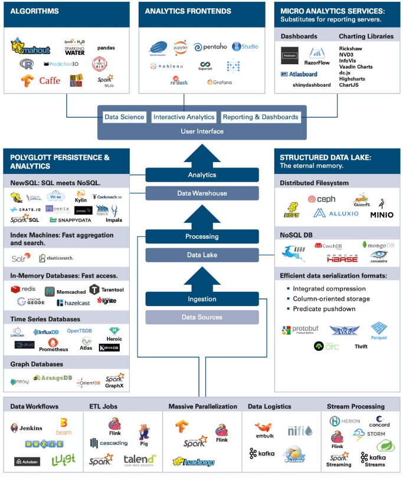
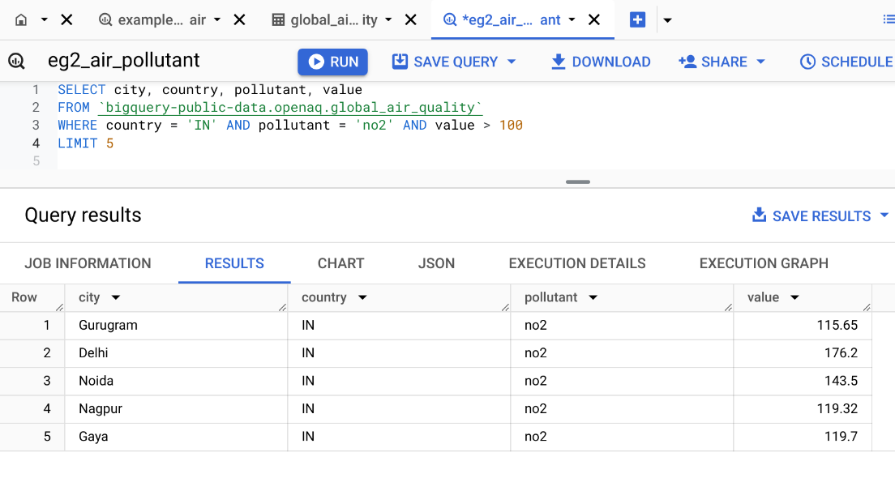

# Introduction to Google Cloud for Data Science

**Google Cloud** provides a suite of tools that enhance data science workflows:

- **BigQuery**: A fully managed and serverless data warehouse, ideal for processing large datasets with SQL.
- **Vertex AI Workbench**: A unified development environment for building and managing machine learning models.

---

# Why use Google Cloud?

- **Scalable infrastructure**: Manage massive datasets with no concern about storage limits.
- **Serverless environment**: Focus on data analysis without worrying about the underlying infrastructure.
- **Integrated with R**: Use your favorite R libraries alongside Google Cloud’s services.


---


class: sydney-blue, center, middle

# BigQuery SQL


---

## Typical Data for a Project


| **Type**         | **Description**        |
|------------------|------------------------|
| **Transactional**| Your data              |
| **Behavioral**   | Your data              |
| **Public Data**  | Open datasets          |
| **Premium Data** | Paid datasets          |

---
## Data Warehouse

In an organization, data is typically stored in:

1. Several computers: **operational databases**
2. A central place for analysis: a **data warehouse** for **analytical data**.

---

## Flow of Data Processing

1. Formulate business questions
2. Select DB/NoSQL and set it up
3. ETL (Extract - Transform - Load)
4. Query Data/Create predictive models
5. Present/Visualize Data


---

## Tools for Big Data Analysis

.pull-left[
There exist many tools for
Big Data analysis. Some of them are:
- Databases (SQL)
- NoSQL platforms
- Cloud storage options (AWS, Google Cloud, etc.)
- The easiest one of all (and the oldest!) is a database.
]

.pull-right[
</img>
<!-- { width=10% } -->
]

---

## Data Management on...
Most common data management platforms:

- **Relational Databases (RDBMS)** – Structure-based, SQL support.
- **NoSQL** – Flexible schema, good for unstructured data.

**On-Premises or Cloud-Based**

---

## SQL / NoSQL

.pull-left[
### SQL Databases (relational databases)
- Structured query language
- Suited for structured data
- Relationships and tables

### NoSQL Databases (non-relational databases)
- Dynamic schema for unstructured data
- Flexible for creating unique structures
- Unstructured or semi-structured data
- Document, graph, column, KeyValue structures
]

.pull-right[
</img>
]

---

## Relational Systems

.pull-left[
### Advantages of Relational Systems:
- Mature technology:
  + Well-defined interfaces (SQL)
  + Structured and organized
  + Provides meta-data in the form of a schema
- Built-in multi-user synchronization for data integrity
- Good at basic statistics and reporting
- Built-in query processing engines
]

.pull-right[
</img>
]

---
## Object-relational mapping


---

## SQL = Structured Query Language

- It is a compact language to express complex questions. For example:
```sql
SELECT country, pollutant, particles  
FROM `air_quality`  
WHERE country = 'India' AND pollutant = 'NO2' AND particles > 100
```

- You don't need to specify the steps for accomplishing this task (another example of **declarative programming**).
- The SQL runtime decomposes the query into subroutines and picks the best way to execute it (i.e., which subroutine to do first, which second, etc).

---

.pull-left[
```sql
SELECT country, pollutant, particles  
FROM `air_quality`  
WHERE country = 'India' AND pollutant = 'NO2' AND particles > 100
```

Suppose that:
- `country` = {India, ...} is of length 1,000,
- `pollutant` = {NO2, ...} is of length 100,
- `particles` = {100, 90, ...} is of length 10,000.

Which filter in the `WHERE` clause would you run first? 

*The query scheduler takes care of it, we don‘t have to worry about this.*
]

.pull-right[
| Country     | Pollutant | Particles |
|-------------|-----------|-----------|
| USA         | NO2       | 90        |
| USA         | CO2       | 100       |
| ...         | ...       | ...       |
| India       | NO2       | 200       |
| India       | NO2       | 210       |
| India       | CO2       | 110       |
| ...         | ...       | ...       |
| Switzerland | CO2       | 20        |
| Switzerland | CO2       | 20        |
| ...         | ...       | ...       |
]


---

## SQL recap using BigQuery
[25 coupons available her](https://gcp.secure.force.com/GCPEDU?cid=Ncm9el8tbkERzXbkPJpMgwaJx94HFlJ%2B04qxXz5pNPkUhvORKP5Oh8G%2FQGh2zYfC/), 
[15 coupons available here](https://gcp.secure.force.com/GCPEDU?cid=N1VtxV7gWWtgMIkI%2Bf8N83G%2FnZnaHK4biN2is7y2vVU3%2Bku4WRTzwuLtVLk2V4hb/)

</img>

---

### Practicing SQL with BigQuery

Before to begin:
1. In the Google Cloud console, select or create a Google Cloud project.
2. BigQuery has lots of public data available. To access it, click on ADD towards top left:

3. Enter "public dataset" in the search bar:

---
<ol start=4> <li>Then we propose to use the `bigquery-public-data.openaq.global_air_quality` dataset:</li></ol>


---
<ol start=5><li> You can preview the dataset by clicking on the table name:</li></ol>


---
<ol start=6><li> To start querying the dataset, you can click on "Home" button then click on "SQL QUERY":</li></ol>
</img>

<ol start=7><li> Now you write SQL commands in the query windows and click on "RUN" to execute.</li></ol>

---

## Select, From, Where

.pull-left-2[
```sql
SELECT city  
FROM `bigquery-public-data.openaq.global_air_quality`  
WHERE country = 'CH'
```

Asked ChatGPT for comment on SQL query:

- **`SELECT city`**: Specifies that we want to retrieve only the values in the **city** column.

- **`FROM 'bigquery-public-data.openaq.global_air_quality'`**: Indicates the source table where the data is stored. In this case, it’s the **global_air_quality** table, which is part of the **openaq** dataset within **bigquery-public-data** on Google BigQuery.

- **`WHERE country = 'CH'`**: This is a filter condition that limits the results to only those rows where the **country** column has the value **'CH'** (the country code for Switzerland).

]

.pull-right-1[
</img>
]

---

## Select, From, Where with Distinct

.pull-left[
```sql
SELECT DISTINCT city, country  
FROM `bigquery-public-data.openaq.global_air_quality`  
WHERE country = 'CH'
```

Note: Capitalization is not required for SQL commands but it is a common convention to make SQL keywords stand out. It is considered best practice.
]

.pull-right[
</img>
]

---

## Filtering with Conditions

> **Query:** Records in India with no2 value more than 100.

```sql
SELECT city, country, pollutant, value  
FROM `bigquery-public-data.openaq.global_air_quality`  
WHERE country = 'IN' AND pollutant = 'no2' AND value > 100
```
</img>

---
## LIMIT the Number of Results
</img>

---
## Select all columns with `*`
</img>

---

## Counting Records with COUNT()

```sql
SELECT COUNT(*)  
FROM `bigquery-public-data.openaq.global_air_quality`  
WHERE country = 'IN' AND pollutant = 'no2' AND value > 100
```
</img>

---

## Aggregate Functions: MIN(), MAX(), SUM(), AVG()

> **Query:** What is the average no2 pollutant value in US? In India? 

.pull-left[
```sql
SELECT AVG(value) AS avg_no2  
FROM `bigquery-public-data.openaq.global_air_quality`  
WHERE country = 'US' AND pollutant = 'no2'
```
</img>
]

.pull-right[
```sql
SELECT AVG(value) AS avg_no2  
FROM `bigquery-public-data.openaq.global_air_quality`  
WHERE country = 'IN' AND pollutant = 'no2'
```
</img>
]

What about Switzerland? What about the max?

---

## WITH Clause

> **Query:** Number of bitcoin transactions per date, sorted by date.

</img>

---

```sql
WITH time AS (  
    SELECT DATE(block_timestamp) AS trans_date  
    FROM `bigquery-public-data.crypto_bitcoin.transactions`  
)  
SELECT COUNT(trans_date) AS transactions, trans_date  
FROM time  
GROUP BY trans_date  
ORDER BY trans_date
```

</img>

---

## Limiting Results with LIMIT

- Sometimes you want to return only part of the results. This can be useful for instance when you run queries on the cloud and you want to preview the results before downloading the entire dataset. LIMIT is used for this purpose. It avoids you pay money for bringing back all the results.

</img>

---

## GROUP BY – Operations by Category

> **Query:** What is the average no2 pollutant for each city in the US?

.pull-left[
```sql
SELECT city, AVG(value) AS avg_value  
FROM `bigquery-public-data.openaq.global_air_quality`  
WHERE country = 'US' AND pollutant = 'no2'  
GROUP BY city
```

**`GROUP BY city`**:
   - This groups the results by **city**. For each unique city in the dataset, the query calculates the average NO2 pollutant value based on the rows that belong to that city.
   - Without `GROUP BY`, the `AVG()` function would calculate the average across all rows in the dataset, rather than for each individual city.
]

.pull-right[
</img>
]

---

## Filtering Categories with GROUP BY and HAVING

> **Query:** Which cities in India have an average no2 pollutant > 50?

.pull-left[
```sql
SELECT city, AVG(value) AS avg_value  
FROM `bigquery-public-data.openaq.global_air_quality`  
WHERE country = 'IN' AND pollutant = 'no2'  
GROUP BY city
HAVING avg_value > 50
```
]

.pull-right[
</img>
]

---
## Practice Query


> **Query:** What is the average time rent per station of bike share program in San Franciso?

*(Look for the San Francisco Bikeshare dataset)*


> **Query:** Which day of the week has the most fatal motor accidents in 2020?

*(Look for the NHTSA Traffic Fatalities dataset)*

---
## Practice Query - Answer from ChatGPT

> **Query:** What is the average time rent per station of bike share program in San Franciso?

.pull-left[
```sql
SELECT stations.name AS station_name, 
       AVG(trips.duration_sec / 60) AS avg_rent_time_minutes
FROM `bigquery-public-data.san_francisco.bikeshare_trips` AS trips
JOIN `bigquery-public-data.san_francisco.bikeshare_stations` AS stations
ON trips.start_station_id = stations.station_id
GROUP BY station_name
ORDER BY avg_rent_time_minutes DESC
```
- It uses the `JOIN` operation to merge the two tables (we will see `JOIN` in the next slides). We could simply return the station_id instead.
- It uses the `bigquery-public-data.san_francisco` instead of `bigquery-public-data.san_francisco_bikeshare` dataset.
]
.pull-right[
</img>
]

---
## Practice Query - Answer from ChatGPT

> **Query:** Which day of the week has the most fatal motor accidents in 2020?

.pull-left[
```sql
SELECT FORMAT_TIMESTAMP('%A', TIMESTAMP(timestamp_of_crash)) AS day_of_week,
       COUNT(*) AS total_fatalities
FROM `bigquery-public-data.nhtsa_traffic_fatalities.accident_2020`
WHERE EXTRACT(YEAR FROM TIMESTAMP(timestamp_of_crash)) = 2020
GROUP BY day_of_week
ORDER BY total_fatalities DESC
LIMIT 1
```
- Error in the dataset. ChatGPT is not able to type the correct dataset name (even after trying to correct the prompt).
- No need to extract for the year, as the dataset is already filtered for 2020.
- It imposes a limit of 1, but it is not necessary.
]
.pull-right[
</img>


- It uses more advanced SQL commands such as `FORMAT_TIMESTAMP`, `TIMESTAMP` and `EXTRACT`. These might not always be available in all SQL databases.

]

---

## SQL Joins

Joins allow merging results from different tables. It is required to specify the "key" linking the tables.


---

## Types of Joins
- **(INNER) JOIN**: Returns records that have matching values in both tables.
- **LEFT/RIGHT (OUTER) JOIN**: Returns all records from the left/right table and the matched records from the right/left table.
- **FULL (OUTER) JOIN**: Returns all records when there is a match in either left or right table.

```{r venn diagram, echo=FALSE, fig.align='center', cache=TRUE, out.width="35%", out.height="35%"}
# Load the necessary libraries
library(ggVennDiagram)
library(ggplot2)
library(gridExtra)

# Define the data representing two tables with overlapping elements
data_list <- list(
  T1 = c("A", "B", "C"),
  T2 = c("B", "C", "D")
)

# 1. Inner Join (Intersection only)
inner_join_plot <- ggVennDiagram(data_list, label_alpha = 0, label = "none") +
  scale_fill_gradientn(colors = c("white", "lightgreen")) +
  ggtitle("INNER JOIN") +
  theme(plot.title = element_text(hjust = 0.5, face = "bold"), legend.position = "none")

data_list <- list(
  T1 = c("A", "B", "C"),
  T2 = c("C")
)

# 2. Left Join (All of table1 and intersection with table2)
left_join_plot <- ggVennDiagram(data_list, label_alpha = 0, label = "none") +
  scale_fill_gradientn(colors = c("white", "lightgreen")) +
  ggtitle("RIGHT JOIN") +
  theme(plot.title = element_text(hjust = 0.5, face = "bold"), legend.position = "none")

data_list <- list(
  T1 = c("B"),
  T2 = c("B", "C", "D")
)

# 3. Right Join (All of table2 and intersection with table1)
right_join_plot <- ggVennDiagram(data_list, label_alpha = 0, label = "none") +
  scale_fill_gradientn(colors = c("white", "lightgreen")) +
  ggtitle("LEFT JOIN") +
  theme(plot.title = element_text(hjust = 0.5, face = "bold"), legend.position = "none")

data_list <- list(
  T1 = c("A", "B", "C"),
  T2 = c("B", "C", "D")
)

# 4. Full Outer Join (All areas of both tables)
full_outer_join_plot <- ggVennDiagram(data_list, label_alpha = 0, label = "none") +
  scale_fill_gradientn(colors = c("lightgreen", "white", "lightgreen")) +
  ggtitle("FULL OUTER JOIN") +
  theme(plot.title = element_text(hjust = 0.5, face = "bold"), legend.position = "none")

# Display the plots in a 2x2 grid
grid.arrange(inner_join_plot, left_join_plot, right_join_plot, full_outer_join_plot, ncol = 2)
```


---

## Example INNER JOIN

> **Query:** Find the top 5 longest bike rides in Austin, including informations about stations.


Which field name should we use to join the two tables?


---

## Example INNER JOIN - option 1

```sql
SELECT *
FROM `bigquery-public-data.austin_bikeshare.bikeshare_trips` AS A
INNER JOIN `bigquery-public-data.austin_bikeshare.bikeshare_stations` AS B  
ON A.start_station_id = B.station_id  
ORDER BY duration_minutes DESC  
LIMIT 5
```
</img>


You can simplify the query by using the following syntax:
```sql
JOIN `bigquery-public-data.austin_bikeshare.bikeshare_stations` AS B  
```


---

## Example INNER JOIN - option 2

```sql
SELECT *  
FROM `bigquery-public-data.austin_bikeshare.bikeshare_trips` AS A,
     `bigquery-public-data.austin_bikeshare.bikeshare_stations` AS B
WHERE A.start_station_id = B.station_id  
ORDER BY duration_sec DESC  
LIMIT 5 
```
</img>

---

## Practice Query

> **Query:** Which bike start station has the longest duration rides?


> **Query:** How many bikes were reported as stolen?

---

## Additional SQL Resources

- [SQL Tutorial (W3Schools)](https://www.w3schools.com/sql/)
- [Intro to SQL (Kaggle)](https://www.kaggle.com/learn/intro-to-sql)
- [Advanced SQL (Kaggle)](https://www.kaggle.com/learn/advanced-sql)


---

# Connecting R to BigQuery

To connect R to BigQuery, use the `bigrquery` package:

```r
# Install the bigrquery package
install.packages("bigrquery")

# Load the library and authenticate
library(bigrquery)
bq_auth()

# Run a query
query <- "SELECT country, pollutant, value 
          FROM `bigquery-public-data.openaq.global_air_quality` 
          WHERE country = 'US'
          LIMIT 5"
result <- bq_project_query("your-project-id", query)
data <- bq_table_download(result)
head(data)
```

```{r bigquery, echo=FALSE}
load("~/Github/ptds2024/class/docs/lecture13_bigquery1.rds")
data
```


---
## Example - Number of Bitcoin Transactions Over time

.pull-left[
```r
query <- "WITH time AS (  
    SELECT DATE(block_timestamp) AS trans_date  
    FROM `bigquery-public-data.crypto_bitcoin.transactions`  
)  
SELECT COUNT(trans_date) AS transactions, trans_date  
FROM time  
GROUP BY trans_date  
ORDER BY trans_date DESC"
result <- bq_project_query("your-project-id", query)
data <- bq_table_download(result)

library(ggplot2)
library(hrbrthemes)
p <- ggplot(data, aes(x=trans_date, y=transactions)) +
  geom_line( color="#69b3a2") + 
  xlab("Time") + ylab("Number of Transactions") +
  theme_ipsum() +
  theme(axis.text.x=element_text(angle=60, hjust=1)) +
  ggtitle("Number of Bitcoin Transactions Over Time")
p
```
]

.pull-right[
```{r, echo=FALSE}
load("~/Github/ptds2024/class/docs/lecture13_bigquery2.rds")
library(ggplot2)
library(hrbrthemes)
p <- ggplot(data, aes(x=trans_date, y=transactions)) +
  geom_line( color="#69b3a2") + 
  xlab("Time") + ylab("Number of Transactions") +
  theme_ipsum() +
  theme(axis.text.x=element_text(angle=60, hjust=1)) +
  ggtitle("Number of Bitcoin Transactions Over Time")
p

```
]

---

# Overview of BigQuery

- **BigQuery** is a highly scalable data warehouse designed to store and analyze terabytes of data using SQL.
- **Benefits**:
  - High-speed querying over large datasets.
  - Scalable storage and computing power.
  - Integration with public datasets for broader analysis.

---

# Key Features of BigQuery

- **Serverless architecture**: You don't manage infrastructure, it scales automatically.
- **SQL-based queries**: Standard SQL allows you to extract, transform, and analyze data.
- **Built-in machine learning**: You can train and deploy machine learning models directly within BigQuery using SQL.
- **Integration with R**: Use the `bigrquery` package to connect R with BigQuery.


---

class: sydney-blue, center, middle

# Vertex AI Workbench


---

## Vertex AI Workbench

**Vertex AI Workbench** provides a managed Jupyter notebook environment tailored for machine learning workflows:

- **Supports R and Python**: Work with your preferred language.
- **Pre-configured environments**: No need to install dependencies manually.
- **Scalable computing resources**: Access GPUs and TPUs when needed.
- **Integration with BigQuery**: Fetch data directly from BigQuery and train machine learning models.


---

## Setting up a Vertex AI Workbench

1. Open **Google Cloud Console**.
2. Navigate to **Vertex AI > Workbench**. Or click on this [link](https://console.cloud.google.com/vertex-ai/workbench).
3. On the "Instances" tab, click on "Create New".
4. On the "New instance" window, click "Create". For simplicity, keep everything by default. It may take 2-3 minutes.
5. Once the instance is ready, click on "Open JupyterLab".

---

## Open JupyterLab and install R

1. In the JupyterLab environment, click on "New Launcher", and then on the Launcher tab, click Terminal.
2. In the terminal, install R by running the following command:
```bash
conda create -n r
conda activate r
conda install -c r r-essentials r-base=4.4.1
```
This step may take a few minutes. You may to accept the installation by typing `y` and pressing Enter.

---

## Complete the EDA with R and BigQuery walkthrough

1. Once the installation is finished, reopen the Terminal and run the following command to clone AI Vertex samples:
```bash
git clone https://github.com/GoogleCloudPlatform/vertex-ai-samples.git
```

1. Once the samples are cloned, open the `vertex-ai-samples`>`notebooks` >`community`>`exploratory_data_analysis`>`eda_with_r_and_bigquery.ipynb` notebook and complete it.

See the [official documentation](https://cloud.google.com/vertex-ai/docs/workbench/eda-with-r-and-bigquery) for more details.

---
## What else could be of interest on Google Cloud?

- **Cloud Run**: Deploy and manage containerized applications such as Shiny app (see [this](https://towardsdatascience.com/dockerizing-and-deploying-a-shiny-dashboard-on-google-cloud-a990ceb3c33a) tutorial).
- **BigQuery ML**: Train machine learning models using SQL.
- **AI Platform**: Deploy and manage machine learning models.
- **Dataflow**: Process data in real-time using Apache Beam.


---

## Terminology

| Term         | Definition |
|--------------|------------|
| **Join**     | Combine tables |
| **Inner Join** vs **Outer Join** | Types of joins |
| **Group By** | Aggregate data |
| **BigQuery** | Cloud-based SQL platform |


---

class: sydney-blue, center, middle

# Questions?

.pull-down[
<a href="https://ptds.samorso.ch/">
.white[`r icons::fontawesome("file")` website]
</a>

<a href="https://github.com/ptds2024/">
.white[`r icons::fontawesome("github")` GitHub]
</a>
]