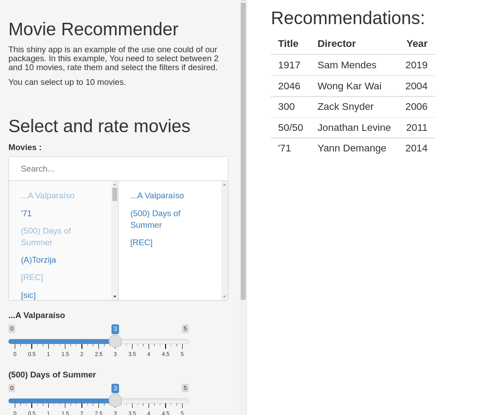

&nbsp;

```{r,echo=F,out.height="70%",out.width="70%",fig.align='center'}

```

---
The project comprises
1. A well formatted and complete **R-package** with a **shiny app**.
2. A well documented and well organized **GitHub repository**.
3. A `pkgdown` **website** showcasing your work and your package.

---
class: sydney-blue, center, middle

# 50% of your grade!

---
class: sydney-blue, center, middle

# Examples of 2022

---
class: sydney-blue, center, middle

# Examples of 2021

---
# HEC Time Table
```{r,echo=FALSE,out.height="90%",out.width="90%",fig.align='center'}
knitr::include_graphics("images/timetable.png")
```

---
# Industrial production controlling mechanism
```{r,echo=FALSE,out.height="90%",out.width="90%",fig.align='center'}
knitr::include_graphics("images/nestle.png")
```

---
class: sydney-blue, center, middle

# Examples of 2020

---
# Nutrition calculator
```{r,echo=FALSE,out.height="90%",out.width="90%",fig.align='center'}
knitr::include_graphics("images/mcdonald.png")
```

---
# Movie recommandation
```{r,echo=FALSE,out.height="90%",out.width="90%",fig.align='center'}

```

---
# Beer recommandation
```{r,echo=FALSE,out.height="90%",out.width="90%",fig.align='center'}
knitr::include_graphics("images/beer.png")
```

---
class: sydney-blue, center, middle

# Further examples

---
# Covid dashboard 

```{r,echo=FALSE}
knitr::include_url("https://infocovid.smc.unige.ch/")
```

.right[<https://infocovid.smc.unige.ch/>]

---
# Hexmaker
```{r,echo=FALSE}
knitr::include_url("https://connect.thinkr.fr/hexmake/")
```

.right[<https://connect.thinkr.fr/hexmake/>]

---
Source of inspiration:
* <https://www.r-bloggers.com/>
* <https://shiny.rstudio.com/gallery/#user-showcase>
* <https://posit.co/blog/winners-of-the-3rd-annual-shiny-contest/>
* <https://attalitech.com/#portfolio>
* <https://connect.thinkr.fr/connect/>

---
# Proposal
To facilitate the organization of your project: project proposal. The proposal must comprise:
1. **Goals and impacts**: describe briefly the rationale of your project, you overall objectives and potential impacts.   
2. **Plan**: detail your approach and your specific objectives:
  + Explain the methods (`R` packages, ...) to be used and the methods to be developed. Give potential
  + Explain existing sources of inspirations (other classes, stackoverflow, R-blogger, blogs, chatGPT, ...) and the potential overlaps with your project.
  + Explain your data collection strategy, the risks as well as possible alternative strategies.

---
3. **Timeline and milestones**: describe the time line of your project and indicate key intermediary goals in a Gantt chart (see [this package](https://github.com/giocomai/ganttrify) for example).
4. **Management plan**: explain how you plan to collaborate (weekly meeting on Zoom, ...) and indicate responsibilities (each member of the team should be at least responsible for one part of the project).

---
Gantt chart example

```{r,echo=FALSE}
knitr::include_graphics("images/gantt.png")
```


---
The project comprises
1. A well formatted and complete **R-package** with a **shiny app**.
2. A well documented and well organized **GitHub repository**.
3. A `pkgdown` **website** showcasing your work and your package.

---
The project comprises
1. A well formatted and complete **R-package** with a **shiny app**:
  + Functions are documented with examples and tested.
  + The app can be called from one of the package function.
  + Data sets are placed in `data/` and wrangling steps in `data-raw/`.
  + The package passes all the checks (both locally and on GitHub).
  + There is at least one vignette showcasing the package/app.
  + The package can seamlessly be installed from the GitHub repo.
2. A well documented and well organized **GitHub repository**.
3. A `pkgdown` **website** showcasing your work and your package.

---
The project comprises
1. A well formatted and complete **R-package** with a **shiny app**.
2. A well documented and well organized **GitHub repository**:
  + The repo must be on the organization `ptds2023`.
  + Edit the `README.md` to make the package as clear as possible.
  + Comprehensive commit messages and clear issues (closed once done).
  + Up-to-date GitHub projects that demonstrate your current organization for the project: TODOs, tasks in progress of resolution, tasks that have been completed.
  + Clean repo: do not add unnecessary files to the repo.
  + Put your presentation in a dedicated folder.
  + 
3. A `pkgdown` **website** showcasing your work and your package.

---
The project comprises
1. A well formatted and complete **R-package** with a **shiny app**.
2. A well documented and well organized **GitHub repository**.
3. A `pkgdown` **website** showcasing your work and your package:
  + Motivate the package and how to use it (think of using vignettes).
  + Build automatically the website using GitHub action.

---
class: sydney-blue, center, middle

# Question ?

.pull-down[
<a href="https://ptds.samorso.ch/">
.white[`r icons::fontawesome("file")` website]
</a>

<a href="https://github.com/ptds2023/">
.white[`r icons::fontawesome("github")` GitHub]
</a>
]

